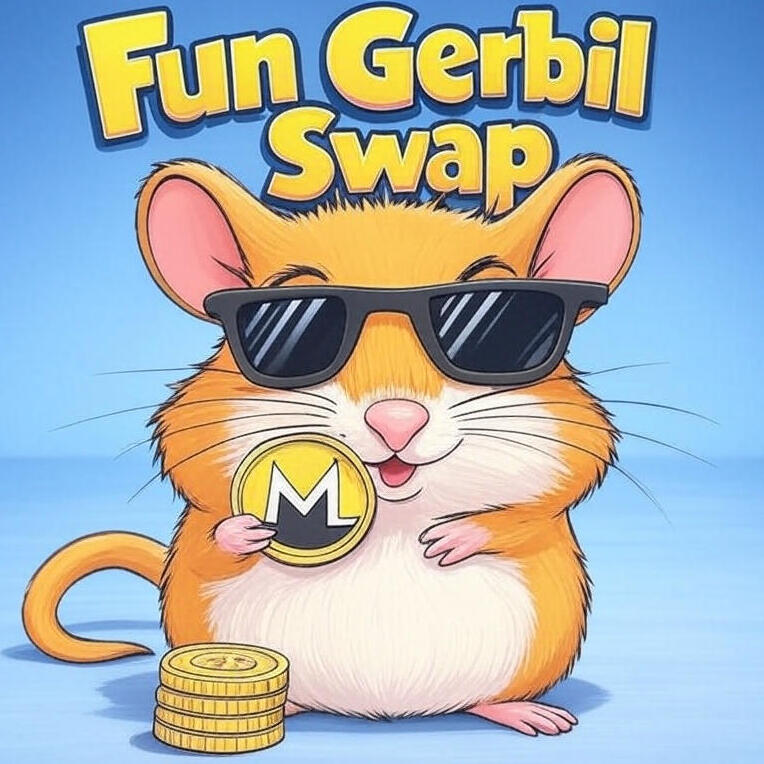

# Fun Gerbil - XMR/USDC Atomic Swap Platform

A decentralized platform for atomic swaps between Monero (XMR) and USDC on Base Sepolia. This project enables trustless cross-chain exchanges without requiring a third-party intermediary.



## Overview

Fun Gerbil implements atomic swaps between Monero (XMR) on Monero Mainnet and USDC on Base Sepolia using a two-phase commit protocol with timeouts. The platform ensures that either both parties receive their exchanged assets or both parties keep their original assets, eliminating counterparty risk.

### Key Features

- **Trustless Atomic Swaps**: Exchange XMR and USDC without trusting a third party
- **User-Friendly Interface**: Simple web interface for creating and managing swaps
- **Security First**: Cryptographic commitments and timeouts protect both parties
- **Relayer Support**: Optional relayer functionality for improved UX
- **Self-Trading Support**: Test the platform by swapping between your own wallets

## Architecture

The project consists of three main components:

### 1. Smart Contracts

Located in the `/contracts` directory:

- **SwapCreator.sol**: The main contract that handles the EVM side of the atomic swap
  - Creates and manages swap instances
  - Handles locking and releasing of ERC20 tokens (USDC)
  - Implements a two-phase commit protocol with timeouts
  - Supports direct claims and relayed claims

- **Secp256k1.sol**: Helper contract for cryptographic operations
  - Verifies secp256k1 curve operations for secure key exchanges

### 2. Frontend

Located in the `/frontend` directory:

- **index.html**: Main user interface for the swap platform
- **constants.js**: Configuration file with contract addresses and ABIs
- **style.css**: Styling for the web interface
- **assets/**: Contains images and other static resources

The frontend allows users to:
- Select swap direction (XMR→USDC or USDC→XMR)
- Enter swap amounts and recipient addresses
- Create, monitor, and complete swaps
- View swap history and status

### 3. Server

Located in the `/server` directory:

- **Monero Integration**: Uses monero-ts library to interact with the Monero blockchain
- Handles XMR wallet operations including:
  - Wallet creation and management
  - Transaction monitoring
  - Funds transfer

## Network Configuration

- **EVM Network**: Base Sepolia
  - USDC Contract Address: 0x036CbD53842c5426634e7929541eC2318f3dCF7e
  - SwapCreator Contract Address: 0x5C9450561e28741c5C76aE863a65AC7215fcAEDc

- **XMR Network**: Monero Mainnet
  - Default Node: https://node.sethforprivacy.com

## How It Works

The atomic swap follows these steps:

1. **Swap Creation**: Alice initiates a swap by locking USDC in the SwapCreator contract
2. **XMR Lock**: Bob locks the corresponding XMR amount on the Monero blockchain
3. **Swap Readiness**: Alice verifies Bob's XMR lock and marks the swap as ready
4. **Claim Phase**: Bob claims the USDC by revealing a secret, which also allows Alice to claim the XMR
5. **Timeout Protection**: If either party fails to complete their steps, timeouts ensure funds can be reclaimed

## Getting Started

### Prerequisites

- MetaMask or compatible Web3 wallet
- Monero wallet (official GUI/CLI or compatible)
- Small amount of ETH on Base Sepolia for gas fees

### Installation

1. Clone the repository:
   ```
   git clone https://github.com/madschristensen99/fungerbil.git
   cd fungerbil
   ```

2. Set up the server (optional, for XMR operations):
   ```
   cd server
   npm install
   npm run build
   ```

3. Deploy the web interface to your preferred hosting solution or run locally.

## Usage

1. Visit the web interface
2. Connect your Web3 wallet
3. Select swap direction and enter amounts
4. Provide your receiving address
5. Follow the guided process to complete the swap

## Development

### Smart Contract Deployment

Contracts are deployed using Remix IDE to the Base Sepolia network.

### Server Development

```
cd server
npm install
npm run start
```

### Frontend Development

Serve the frontend directory using your preferred web server.

## Security Considerations

- The contract has timeouts to prevent funds from being locked indefinitely
- Cryptographic commitments ensure the atomicity of the swap
- Warning: Fee-on-transfer tokens are not supported

## License

This project is licensed under the Apache License 2.0 - see the LICENSE file for details.

## Disclaimer

This software is provided for educational and testing purposes only. Use at your own risk. Always verify contract addresses and test with small amounts first.
