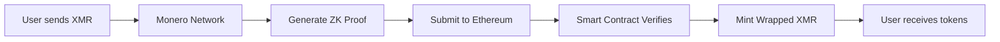

# Zero XMR

**Zero-knowledge, permissionless wrapped Monero on Ethereum**

Zero XMR enables trustless bridging of Monero to Ethereum through zero-knowledge proofs. Send XMR to a liquidity provider's address, generate a ZK proof of payment, and receive wrapped XMR tokens—all without revealing transaction details or requiring intermediaries.

🌐 **[zeroxmr.com](https://zeroxmr.com)**

---

## How It Works

Zero XMR uses a circom circuit to cryptographically prove you sent Monero to a specific address without revealing:

- Transaction secret keys
- Exact amounts (until claim)
- Your identity or addresses

The circuit verifies:

1. **Knowledge of transaction secret** (`r`) by proving`R = r·G`
2. **Correct destination address** by validating stealth address derivation
3. **Payment to LP's address** through shared secret`S = 8·r·A` (prevents fraud)
4. **Encrypted amount** via ECDH decryption using Keccak256-derived keys

### Security Model

- **Ed25519 curve operations** for Monero compatibility
- **Keccak256 hashing** matching Monero's cryptographic primitives
- **Public verification** of LP view/spend keys prevents address spoofing
- **On-chain verification** via Solidity smart contract

---

## The Circuit

The core of Zero XMR is`monero_bridge.circom`—a circom 2.1.0 zero-knowledge circuit implementing Monero's stealth address and ECDH encryption schemes:

```circom
pragma circom 2.1.0;

template MoneroBridge() {
    // Private inputs (never revealed)
    signal input r[255];              // Transaction secret key
    signal input v;                   // Amount in piconero
    signal input H_s_scalar[255];     // Keccak256(8·r·A || i) mod L
    signal input P_extended[4][3];    // Stealth address

    // Public inputs (verified on-chain)
    signal input R_x;                 // Transaction public key
    signal input P_compressed;        // Destination address
    signal input ecdhAmount;          // Encrypted amount
    signal input A_compressed;        // LP view public key
    signal input B_compressed;        // LP spend public key
    signal input monero_tx_hash;      // Transaction uniqueness

    signal output verified_amount;

    // 1. Prove R = r·G (knowledge of secret)
    // 2. Verify destination address compression
    // 3. Compute S = 8·r·A (prove correct recipient)
    // 4. Decrypt amount via XOR with Keccak256("amount" || H_s_scalar)
}
```

**Key Features:**

- **Curve Operations:** Ed25519 scalar multiplication, point addition, compression/decompression
- **Cofactor Clearing:**`8·(r·A)` ensures prime-order subgroup security
- **Domain Separation:**`"amount"` prefix prevents hash collision attacks
- **Constraint Efficiency:** ~500k constraints (exact count depends on optimization)

---

## Architecture



**Components:**

- **Circom Circuit:** Generates SNARK proof of Monero transaction
- **Solidity Verifier:** On-chain verification using Groth16
- **LP Network:** Decentralized liquidity providers with published view/spend keys
- **Token Contract:** ERC-20 wrapped XMR with mint/burn capabilities

---

## Why Zero XMR?

### For Users
- **No KYC** or trusted intermediaries
- **Privacy preserved** through zero-knowledge proofs
- **Permissionless** access to DeFi with Monero

### For Liquidity Providers
- **Transparent operations** via published public keys
- **Fraud-proof** through cryptographic verification
- **Fee revenue** from bridge operations

### For Developers
- **Composable** ERC-20 token on Ethereum
- **Auditable** proof system (circom + Groth16)
- **Open source** circuit and contracts

---

## Status

⚠️ **Experimental Software** — Not audited for production use.

Current implementation includes:
- Complete circom circuit with Ed25519 operations
- Keccak256-based ECDH amount decryption
- Public input verification for LP addresses
- Stealth address and shared secret derivation

**Next Steps:**
- Trusted setup ceremony for production parameters
- Solidity verifier contract deployment
- LP registry and token contracts
- Frontend proof generation interface

---

## Technical Details

### Dependencies

- **circom 2.1.0** - Circuit compiler
- **ed25519-circom** (Electron-Labs) - Curve operations
- **keccak-circom** - Hash functions
- **circomlib** - Utility circuits
- **snarkjs** - Proof generation/verification

### Cryptographic Primitives

- **Curve:** Ed25519 (matches Monero)
- **Hash:** Keccak256 (Monero standard)
- **Proof System:** Groth16 SNARK
- **Encoding:** Base 2^85 for field elements

### Circuit Constraints

The circuit performs:
- Ed25519 scalar multiplications (2x:`r·G`,`r·A`)
- Point additions (3x for cofactor clearing)
- Point compression/decompression (3x)
- Keccak256 hash (304-bit input)
- 64-bit XOR decryption

---

## Community

Zero XMR is built for privacy-first cross-chain DeFi. Join us:

- **Website:** [zeroxmr.com](https://zeroxmr.com)
- **Docs:** Coming soon
- **Audit Status:** Unaudited - use at your own risk

---

## License

SPDX-License-Identifier: MIT

**Security Notice:** This is experimental cryptographic software. Do not use with funds you cannot afford to lose. Independent security audits are required before production deployment.

---

*Bringing Monero's privacy to Ethereum through zero-knowledge cryptography.*