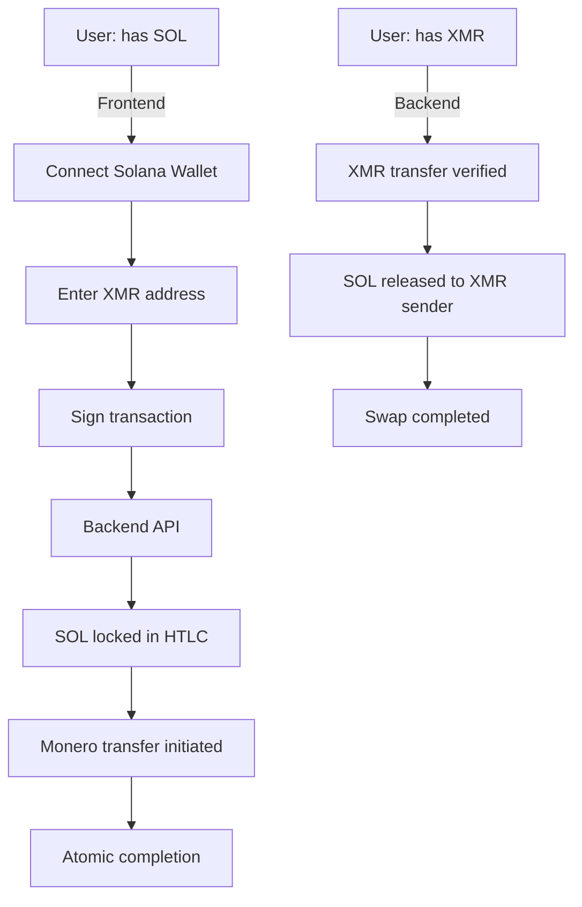

# 🐹 Fun Gerbil - Privacy Bridge

[](https://fungerbil.com) [](LICENSE) [](https://solana.com) [](https://arcium.com)

**Privacy DeFi: Cross-chain atomic swaps between Solana SOL ↔ Monero XMR, with Arcium MPC for secure computation**


## 🎯 Current Project Structure

### 1. **Privacy Bridge: SOL ↔ XMR Atomic Swaps** ✅ Live on Devnet
```fungerbil/
├── frontend/atomicSwap/       # Production-ready web UI
│   ├── index.html            # Main swap interface (SOL ↔ XMR)
│   ├── SolanaWallet.js       # Multi-wallet support (Phantom, Brave, Solflare)
│   ├── swap.js               # Native SOL transfer logic
│   └── assets/               # Fun gerbil branding & crypto icons
├── svm-xmr/                  # Solana-Monero bridge backend
│   ├── server/               # TypeScript backend with full Solana integration
│   ├── solana-program/       # Rust smart contract for HTLC swaps
│   ├── protocol.md           # Technical specification
│   └── README.md            # Detailed setup instructions
└── fungerbilPitchdeck/        # Investor materials & roadmap
    └── deck.tex              # TeX presentation linking real infrastructure
```

### 2. **MPC Trading Engine** 🔬 Experimental Integration
```etest/                           # Arcium MPC integration
├── encrypted-ixs/               # Confidential computing instructions
├── programs/                    # Solana Anchor program structure
├── Arcium.toml                  # Arcium network configuration
└── README.md                   # Arcium setup guide
```

## 🚀 What You Can Actually Use Today

### **Production Ready: SOL ↔ XMR Swaps**
**Status**: ✅ **Live on Devnet  • No Custody • Atomic Guarantees**

**Try the demo**: [https://fungerbil.com](https://fungerbil.com) 

```bash
# Quick start (2 minutes)
git clone https://github.com/madschristensen99/fungerbil.git
cd fungerbil/frontend/atomicSwap
open index.html  # Works with any web browser
# Connect any Solana wallet, swap to XMR
```

**Core Features**:
- **Trustless**: No central authority ever holds your funds
- **Atomic**: Either completes fully or reverts completely 
- **Privacy**: No custody, no KYC, no transaction tracking
- **Simple**: One-click swaps with existing Solana wallets

### **MPC Trading Experiment** (Arcium Integration)
```bash
# Test Arcium MPC computation
cd fungerbil/etest
npm install
# Follow etest/README.md for encrypted instruction setup
```

## 🔍 Actual Technology Stack

| Layer | Technology | Status | Purpose |
|-------|------------|---------|---------|
| **Frontend** | Vanilla HTML/CSS/JS | ✅ Production | Browser-based swaps |
| **Solana Program** | Rust (Anchor) | ✅ Devnet | HTLC atomic swaps |
| **Bridge API** | TypeScript/Node | ✅ Live | REST API for swaps |
| **MPC Layer** | Arcium Confidential Computing | 🧪 Experimental | Encrypted calculations |
| **Monero RPC** | REST API | ✅ Stagenet | XMR wallet integration |

## ⚡ Live Endpoints (Devnet)

```bash
# Create swap: SOL → XMR
curl -X POST http://localhost:3000/api/solana/prepare-sol-to-xmr \
  -H "Content-Type: application/json" \
  -d '{"solanaAddress":"...", "xmrAddress":"...", "value":1000000000}'

# Create swap: XMR → SOL  
curl -X POST http://localhost:3000/api/solana/prepare-xmr-to-sol \
  -H "Content-Type: application/json" \
  -d '{"xmrAmount":"0.1", "solanaAddress":"...", "value":100000000}'
```

## 🧩 Architecture Deep Dive

### **Current Working Pipeline**



### **MPC Research Track**
- **Education**: Arcium MPC integration via encrypted instructions
- **Confidential computation**: Private swap parameter validation
- **Future**: Fully encrypted order book matching

## 🎯 From Pitch Deck to Reality

The [pitch deck](fungerbilPitchdeck/deck.tex) outlines our experimental evolution:

### **Phase 1: ✅ SOL ↔ XMR Swaps** (Complete)
```
- ✅ Working bridge with native SOL <> XMR
- ✅ Production web interface
- ✅ TypeScript backend with Solana integration
- ✅ Rust Solana program (HTLC atomic swaps)
```

### **Phase 2: 🧪 MPC Trading** (Active Research)
``` 
- 🧪 Arcium MPC integration via `etest/` directory
- 🧪 Confidential swap parameter validation
- 🧪 Encrypted instruction experimentation
- 🧪 Rust Arcium framework (Arcis) exploration
```

### **Phase 3: 📈 Wrapped Monero (wXMR)** (Future)
```
- Treasury management for wrapped tokens
- Liquidity pools in MPC environment  
- DAO governance with encrypted voting
```

## 🛠️ Detailed Setup for Each Component

### **1. SOL ↔ XMR Bridge** (Production)
```bash
# Server setup (back-end)
cd svm-xmr/server
npm install
npm run dev                    # Backend runs on localhost:3000

# Frontend deployment
cd frontend/atomicSwap
# Upload entire folder to web server
# or: python -m http.server 8080
# Visit: http://localhost:8080
```

### **2. Arcium MPC Testing** (Research)
```bash
# Arcium integration experiments
cd etest
npm install                    # Install dependencies
# Follow etest/README.md for specific Arcium setup
```

## 🏗️ Repository Structure Revealed

```
📁 fungerbil/                    # Root privacy ecosystem
├── 🔗 SOL ↔ XMR Bridge         # Production privacy bridge
│   ├── frontend/atomicSwap/    # [ACTIVE] Web UI for swaps
│   └── svm-xmr/               # [ACTIVE] Complete bridge backend
│
├── 🧪 MPC Research             # Experimental future features  
│   └── etest/                  # Arcium MPC integration tests
│
├── 📈 Investor Relations       # Strategic documentation  
│   └── fungerbilPitchdeck/     # LaTeX investor presentation
│
└── 🐹 Brand Assets             # Fun Gerbil identity
    └── assets/                 # All gerbil-related imagery
```

## 🔍 Technical Documentation

- [**Swap Protocol Specification**](svm-xmr/protocol.md): HTLC atomic swap mechanics
- [**Server Setup Guide**](svm-xmr/README.md): Complete backend configuration
- [**Arcium Integration Guide**](etest/README.md): MPC experimentation instructions
- [**Investor Presentation**](fungerbilPitchdeck/deck.tex): Strategic roadmap and positioning

## 🚧 Development Status

| Component | Network | Status | GitHub Status |
|-----------|---------|---------|---------------|
| **SOL ↔ XMR Bridge** | Solana Devnet | ✅ Production-ready | Current HEAD |
| **Atomic Swaps** | Stagenet/Testnet | ✅ Fully functional | main branch |
| **Web Interface** | Any static host | ✅ Deployable | frontend/atomicSwap |
| **Arcium MPC** | Research | 🧪 Experimental | etest/ directory |
| **wXMR** | Future | 🎯 Phase 3 | Not yet active |

## 💡 Quick Start Templates

### **Privacy Bridge User** (Immediate Use)
```bash
git clone https://github.com/madschristensen99/fungerbil.git
cd fungerbil/frontend/atomicSwap
# Upload to web hosting - fully client-side
```

### **Developer** (Full Stack)
```bash
git clone https://github.com/madschristensen99/fungerbil.git
cd fungerbil/svm-xmr/server
npm install && npm run dev
# Connect frontend to local backend
```

### **MPC Researcher** (Confidential Computing)
```bash
git clone https://github.com/madschristensen99/fungerbil.git
cd fungerbil/etest
npm install
# Follow Arcium setup guide
```

## 🤝 Getting Started

**Choose your path:**

🏪 **User**: `cd frontend/atomicSwap && open index.html` - start swapping immediately  
🔧 **Developer**: Follow [svm-xmr/README.md](svm-xmr/README.md) for full backend setup  
🧑‍🔬 **Researcher**: Dive into [etest/README.md](etest/README.md) for MPC experiments  
📊 **Investor**: Review [fungerbilPitchdeck/deck.tex](fungerbilPitchdeck/deck.tex) for strategic vision

---

*This repository shows both the working privacy infrastructure (SOL ↔ XMR swaps) and the experimental future (Arcium MPC integration). The pitch deck connects the technical reality to the strategic vision of building truly private DeFi infrastructure.*

**🐹 Built by privacy nerds, for humans who want their financial transactions to stay private.**
