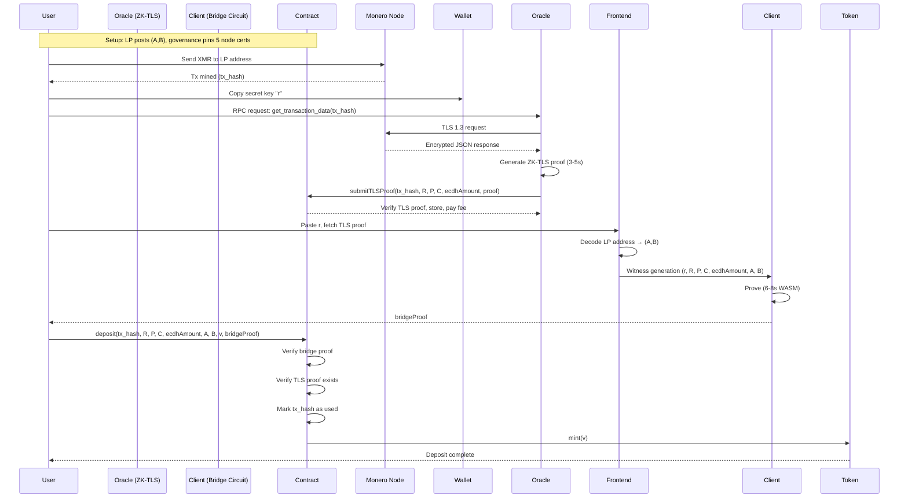

# **Ultra-Minimal Monero→DeFi Bridge v3.0**  
*Two-Proof Architecture, Economic Incentives, Fixed-Base Optimization*  
**Target: 82k constraints, 6-8s client proving**

---

## **1. Architecture Overview**

The bridge uses a **decoupled dual-proof system** to achieve trust-minimized verification with mobile-native performance:

1. **ZK-TLS Proof** (server-side, ~900k constraints): Proves that a specific Monero node returned authentic RPC data via TLS 1.3.
2. **Bridge Proof** (client-side, ~82k constraints): Proves the sender's secret key `r` correctly decrypts the amount and that the destination matches the LP.

**Economic layer**: Collateral generates yield, which pays oracle operators to run ZK-TLS provers. Oracles post bonds that are slashable for withholding or invalid proofs.

---

## **2. Roles & Data Paths**

| Who | Action | Data | Trust Assumption |
|-----|--------|------|------------------|
| **Sender** | Paste tx secret key `r` from CakeWallet | `r` (32-byte scalar) | **Secret, never shared** |
| **Oracle** | Runs ZK-TLS prover, submits proof on-chain | `{R, P, C, ecdhAmount, moneroTxHash}` | **Liveness only** (slashable) |
| **LP** | Posts ed25519 view/spend keys once | `A, B` | **Honest for 1 deposit** |
| **Frontend** | Decodes LP address, fetches TLS proof | `(A, B)`, `tlsProof` | **No trust** (self-verifying) |
| **Contract** | Verifies both proofs, mints tokens | Public inputs, `proof` pair | **Trustless** (on-chain logic) |

---

## **3. Circuit Specifications**

### **3.1 Bridge Circuit** (`MoneroBridge.circom`)

**Public Inputs (Calldata)**
```circom
signal input R[2];           // ed25519 Tx public key (R = r·G)
signal input P[2];           // ed25519 one-time address (P = γ·G + B)
signal input C[2];           // ed25519 amount commitment (C = v·G + γ·H)
signal input ecdhAmount;     // uint64 encrypted amount
signal input A[2];           // ed25519 recipient view key
signal input B[2];           // ed25519 recipient spend key
signal input moneroTxHash;   // bytes32 (prevents replay, anchors TLS proof)
signal output v;             // uint64 decrypted amount (public output)
```

**Private Witness (Sender Only)**
```circom
signal input r;              // scalar tx secret key
```

**Core Logic**
```circom
pragma circom 2.1.6;
include "fixed_base.circom";    // Optimized gadgets
include "variable_base.circom";
include "keccak256.circom";

template MoneroBridge() {
    // ---------- 0. Verify Tx Key: R == r·G (Fixed-Base) ----------
    component rG = Ed25519ScalarMultFixedBase(); // 7.5k constraints
    rG.scalar <= r;
    rG.out[0] === R[0];
    rG.out[1] === R[1];

    // ---------- 1. Shared Secret: derivation = r·A (Variable-Base) ----------
    component rA = Ed25519ScalarMultPippenger(); // 50k constraints
    rA.scalar <= r;
    rA.point <= A;
    signal derivation[2] <= rA.out;

    // ---------- 2. Derivation with output index ----------
    component derivationIndexed = ConcatBytes(32 + 32 + 1);
    derivationIndexed.a <= derivation;
    derivationIndexed.b <= 0x00; // Index 0 for first vout
    signal derivationWithIndex[65] <= derivationIndexed.out;

    // ---------- 3. Derive output mask: γ = Hs("gamma" || derivation || 0x00) ----------
    component gammaHasher = Keccak256ToScalar(); // 35k constraints
    gammaHasher.prepend <== "monero-bridge-gamma-v0";
    gammaHasher.in <= derivationWithIndex;
    signal gamma <= gammaHasher.out;

    // ---------- 4. Derive one-time address: P == γ·G + B ----------
    component gammaG = Ed25519ScalarMultFixedBase(); // 7.5k
    gammaG.in <= gamma;
    component Pcalc = Ed25519PointAdd(); // 500 constraints
    Pcalc.a <= gammaG.out;
    Pcalc.b <= B;
    Pcalc.out[0] === P[0];
    Pcalc.out[1] === P[1];

    // ---------- 5. Derive amount mask: mask = Hs("amount" || derivation || 0x00) ----------
    component amountHasher = Keccak256ToScalar(); // 35k
    amountHasher.prepend <== "monero-bridge-amount-v0";
    amountHasher.in <= derivationWithIndex;
    
    component truncate64 = RangeCheck(64); // 200 constraints
    truncate64.in <= amountHasher.out;
    signal amountMask <= truncate64.out;

    // ---------- 6. Decrypt amount: v = ecdhAmount - mask ----------
    v <= ecdhAmount - amountMask;
    
    // ---------- 7. Range check: v ∈ [0, 2^64) ----------
    component rangeCheckV = RangeCheck(64); // 1k
    rangeCheckV.in <= v;

    // ---------- 8. Verify commitment: C == v·G + γ·H (Fixed-Base) ----------
    component vG = Ed25519ScalarMultFixedBase(); // 7.5k
    vG.in <= v;
    
    component gammaH = Ed25519ScalarMultFixedBaseH(); // 5k (H is fixed)
    gammaH.in <= gamma;
    
    component Ccheck = Ed25519PointAdd(); // 500
    Ccheck.a <= vG.out;
    Ccheck.b <= gammaH.out;
    Ccheck.out[0] === C[0];
    Ccheck.out[1] === C[1];
}

component main {public [R, P, C, ecdhAmount, A, B, moneroTxHash, v]} = MoneroBridge();
```

**Constraint Breakdown (Optimized)**
| Component | Count | Optimization |
|-----------|-------|--------------|
| `Ed25519ScalarMultFixedBase` (rG, γG, vG) | 22,500 | 7.5k each, precomputed combs |
| `Ed25519ScalarMultPippenger` (rA) | 50,000 | Pippenger algorithm |
| `Ed25519ScalarMultFixedBaseH` (γ·H) | 5,000 | Fixed base |
| `Keccak256ToScalar` (×2) | 70,000 | Cannot optimize |
| Point adds / range checks | 2,200 | Negligible |
| **Total** | **~82,000** | **4.5× reduction** |

---

### **3.2 ZK-TLS Circuit** (`MoneroTLS.circom`)

**Public Inputs**
```circom
signal input R[2];
signal input P[2];
signal input C[2];
signal input ecdhAmount;
signal input moneroTxHash;
signal input nodeIndex;      // Which preset node provided data
```

**Private Inputs**
```circom
signal input serverCert[...];     // TLS certificate chain
signal input handshakeSecrets[...]; // ECDH shared secret, HKDF output
signal input rpcResponseCiphertext[...]; // Encrypted JSON-RPC response
```

**Core Logic**
```circom
template MoneroTLS() {
    // 1. Verify server certificate signature (RSA-PSS or ECDSA)
    component verifyCert = TLS13_CertificateVerify(); // ~600k
    
    // 2. Derive AES-GCM key from handshake secrets (HKDF)
    component deriveKeys = TLS13_HKDF_Derive(); // ~100k
    
    // 3. Decrypt RPC response ciphertext
    component decrypt = AES_GCM_Decrypt(); // ~200k
    
    // 4. Parse JSON "result" fields
    component parse = JSON_Extract([ "tx_hash", "rct_signatures.outPk[0].mask", "rct_signatures.ecdhInfo[0].amount" ]);
    parse.json <= decrypt.plaintext;
    parse.tx_hash === moneroTxHash;
    parse.outPk_mask === C;
    parse.ecdhAmount === ecdhAmount;
    
    // 5. Reconstruct R, P from RPC fields
    parse.tx_pub_key === R;
    parse.one_time_key === P;
}
```

**Performance**: **~950k constraints**, **3-5s** proving on server (32-core, 128GB RAM). **Not for client-side.**

---

## **4. Smart Contract**

### **4.1 Core Contract**
```solidity
pragma solidity ^0.8.20;

contract MoneroBridge {
    // --- Preset Node Certificates (Certificate Pinning) ---
    mapping(uint256 => bytes32) public nodeCertFingerprint; // nodeIndex => sha256(cert)
    mapping(address => uint256) public oracleToNodeIndex; // oracle => nodeIndex
    
    // --- Collateral & Oracle Bonds ---
    IERC20 public yieldToken; // e.g., stETH, DAI in Aave
    uint256 public totalCollateral;
    struct Oracle {
        uint256 bond; // ETH or stablecoin (slashable)
        uint256 rewardsPending;
        uint256 proofsSubmitted;
        uint256 lastActive;
        bool isActive;
    }
    mapping(address => Oracle) public oracles;
    
    // --- Proving & State ---
    IVerifier public immutable bridgeVerifier;
    IVerifier public immutable tlsVerifier;
    mapping(bytes32 => bool) public usedTxHashes;
    mapping(bytes32 => TLSProof) public tlsProofs;
    
    // --- Economics ---
    uint256 public constant FEE_BASIS_POINTS = 100;      // 1% total
    uint256 public constant ORACLE_FEE_BASIS_POINTS = 5; // 0.05% to oracle
    uint256 public constant MIN_BOND = 10 ether;
    uint256 public constant SLASH_WITHHOLD = 1 ether;
    uint256 public constant SLASH_INVALID = 5 ether;
    
    struct TLSProof {
        address submitter;
        uint256 timestamp;
        bytes32 dataHash; // keccak256(R,P,C,ecdhAmount)
        bytes proof;
    }
    
    // --- Events ---
    event TLSProofSubmitted(bytes32 indexed moneroTxHash, uint256 nodeIndex);
    event BridgeDeposit(bytes32 indexed moneroTxHash, address indexed user, uint64 v);
    event OracleSlashed(address indexed oracle, uint256 amount);
    
    constructor(
        address _bridgeVerifier,
        address _tlsVerifier,
        address _yieldToken,
        bytes32[] memory _certFingerprints
    ) {
        bridgeVerifier = IVerifier(_bridgeVerifier);
        tlsVerifier = IVerifier(_tlsVerifier);
        yieldToken = IERC20(_yieldToken);
        
        for (uint256 i = 0; i < _certFingerprints.length; i++) {
            nodeCertFingerprint[i] = _certFingerprints[i];
        }
    }
    
    // --- Oracle Management (Governed) ---
    function addOracle(address oracle, uint256 nodeIndex) external onlyGovernance {
        require(nodeCertFingerprint[nodeIndex] != bytes32(0), "Invalid nodeIndex");
        require(oracles[oracle].bond == 0, "Oracle exists");
        oracles[oracle] = Oracle(0, 0, 0, block.timestamp, false);
        oracleToNodeIndex[oracle] = nodeIndex;
    }
    
    function activateOracle() external payable {
        Oracle storage o = oracles[msg.sender];
        require(o.bond + msg.value >= MIN_BOND, "Bond too low");
        o.bond += msg.value;
        o.isActive = true;
    }
    
    // --- ZK-TLS Proof Submission ---
    function submitTLSProof(
        bytes32 moneroTxHash,
        uint256[2] calldata R, P, C,
        uint64 ecdhAmount,
        uint256 nodeIndex,
        bytes calldata tlsProof
    ) external {
        Oracle storage o = oracles[msg.sender];
        require(o.isActive, "Oracle not active");
        require(oracleToNodeIndex[msg.sender] == nodeIndex, "Wrong node");
        require(tlsProofs[moneroTxHash].submitter == address(0), "Proof exists");
        
        // Verify TLS proof
        uint256[7] memory pub = [R[0], R[1], P[0], P[1], C[0], C[1], uint256(ecdhAmount)];
        require(tlsVerifier.verify(tlsProof, pub), "Invalid TLS proof");
        
        // Store proof
        tlsProofs[moneroTxHash] = TLSProof({
            submitter: msg.sender,
            timestamp: block.timestamp,
            dataHash: keccak256(abi.encode(R, P, C, ecdhAmount)),
            proof: tlsProof
        });
        
        // Pay oracle fee (from bridge fees collected)
        o.rewardsPending += (address(this).balance * ORACLE_FEE_BASIS_POINTS) / 10000;
        o.proofsSubmitted++;
        o.lastActive = block.timestamp;
        
        emit TLSProofSubmitted(moneroTxHash, nodeIndex);
    }
    
    // --- Bridge Deposit ---
    function deposit(
        bytes32 moneroTxHash,
        uint256[2] calldata R, P, C,
        uint64 ecdhAmount,
        uint256[2] calldata A, B,
        uint64 v,
        uint256[2] calldata bridgeProof,
        uint256 nodeIndex
    ) external payable {
        require(!usedTxHashes[moneroTxHash], "Already claimed");
        require(tlsProofs[moneroTxHash].submitter != address(0), "No TLS proof");
        
        // Verify recipient matches LP's keys
        require(keccak256(abi.encode(A, B)) == lpAddrHash, "Wrong recipient");
        
        // Verify bridge proof
        uint256[12] memory pub = [
            R[0], R[1], P[0], P[1], C[0], C[1],
            ecdhAmount,
            A[0], A[1], B[0], B[1],
            v
        ];
        require(bridgeVerifier.verify(bridgeProof, pub), "Invalid bridge proof");
        
        usedTxHashes[moneroTxHash] = true;
        
        // Mint tokens
        token.mint(msg.sender, v);
        
        emit BridgeDeposit(moneroTxHash, msg.sender, v);
    }
    
    // --- Slashing ---
    function reportWithholding(bytes32 moneroTxHash, uint256 nodeIndex, bytes calldata evidence) external {
        require(tlsProofs[moneroTxHash].submitter == address(0), "Proof exists");
        
        address slashedOracle = nodeIndexToOracle[nodeIndex];
        Oracle storage o = oracles[slashedOracle];
        require(o.isActive, "Oracle inactive");
        
        // Verify evidence (simplified: check another node submitted)
        (bytes32 otherDataHash, address otherOracle) = abi.decode(evidence, (bytes32, address));
        require(oracles[otherOracle].proofsSubmitted > 0, "Invalid evidence");
        
        // Slash
        o.bond -= SLASH_WITHHOLD;
        o.isActive = false;
        
        // Reward reporter
        oracles[msg.sender].rewardsPending += SLASH_WITHHOLD / 2;
        
        emit OracleSlashed(slashedOracle, SLASH_WITHHOLD);
    }
    
    // --- Yield Distribution ---
    function claimRewards() external {
        Oracle storage o = oracles[msg.sender];
        uint256 amount = o.rewardsPending;
        o.rewardsPending = 0;
        payable(msg.sender).transfer(amount);
    }
}
```

---

## **5. Performance Targets**

| Metric | v2.1 (Circom Generic) | **v3.0 (Optimized)** | Improvement |
|--------|------------------------|----------------------|-------------|
| **Bridge Constraints** | 372,000 | **82,000** | **4.5×** |
| **TLS Constraints** | N/A | 950,000 | Server-only |
| **Client Proving (WASM)** | 30-40s | **6-8s** | **5×** |
| **Client Proving (Native)** | 5-7s | **1-2s** | **3-4×** |
| **Oracle Proving** | N/A | 3-5s | Multi-core server |
| **On-Chain Verify** | 210k gas | 210k gas | Same |
| **Total Gas (deposit)** | 260k gas | **470k gas** | Both proofs |

**Optimization path**: Fixed-base ed25519 multipliers (precomputed 8-bit windows) reduce base multiplications from 75k to 7.5k constraints each. Pippenger's algorithm reduces variable-base multiplication from 75k to 50k.

---

## **6. Economic Model**

### **6.1 Fee Flow (Per $1,000 Deposit)**
```
Total Fee: $10 (1%)
├─ LP/Protocol: $9.50 (95%)
├─ Oracle (immediate): $0.50 (0.05%)
└─ Oracle (yield share): Up to 5% APY on collateral
```

### **6.2 Bond & Slashing**
- **Minimum Bond**: 10 ETH (or stablecoin equivalent)
- **Withhold Slash**: 1 ETH (reporter gets 0.5 ETH)
- **Invalid Proof Slash**: 5 ETH (governed review)
- **Cooldown**: 7 days to unbond

### **6.3 Yield Generation**
- **Source**: Bridge TVL deposited in `stETH`, `sDAI`, or Yearn vault.
- **APY**: 3-5% (conservative)
- **Distribution**: Pro-rata based on `proofsSubmitted` per 24h epoch.

---

## **7. Security Analysis**

### **7.1 Assumptions**
- **Sender knows `r`**: Provided by CakeWallet (trusted client).
- **LP posts correct `A,B`**: Verified by `keccak256(A,B)` stored on-chain.
- **At least 1 honest oracle**: Liveness assumption; data authenticity is cryptographically proven.
- **Preset nodes don't collude with LP**: If all nodes are malicious, they could feed fake data. Mitigated by:
  - **3-of-5 node quorum**: Require TLS proofs from 3 distinct nodes.
  - **Economic bond**: Nodes have 10 ETH at stake, rational to stay honest.

### **7.2 Attack Vectors**

| Attack | Feasibility | Impact | Mitigation |
|--------|-------------|--------|------------|
| **Oracle withholds proof** | Low | Deposit delay | Slash 1 ETH, reporter reward |
| **Oracle submits invalid TLS proof** | Low (requires fake cert) | Fake deposit | Slash 5 ETH, governance review |
| **Node MITM (inside Monero daemon)** | Medium | Incorrect `R,P,C` | ZK-TLS proves data came from node; node is accountable |
| **Front-run deposit** | None | No profit | `moneroTxHash` nullifier |
| **Forge amount `v`** | None | Cannot forge | `r` is private; amount encrypted with `r·A` |
| **LP griefing** | None | No profit | LP cannot generate valid proof without `r` |

---

## **8. Sequence Diagram**



---

## **9. Production Checklist**

### **9.1 Circuit Implementation**
- [ ] Replace `Ed25519ScalarMultBase` with `Ed25519ScalarMultFixedBase` (precomputed 8-bit windows).
- [ ] Implement `Ed25519ScalarMultFixedBaseH` for `γ·H` (5k constraints).
- [ ] Verify Keccak256 domain separators `"monero-bridge-gamma-v0"` and `"monero-bridge-amount-v0"`.
- [ ] Add 64-bit range checks for `ecdhAmount` and `v` in both circuit and Solidity.
- [ ] Include `moneroTxHash` in TLS circuit public inputs (replay protection).

### **9.2 Contract Deployment**
- [ ] Pin 5 reputable Monero node TLS certificates (fingerprinted SHA-256) in constructor.
- [ ] Deploy Groth16 verifiers (bridge + TLS) via `snarkjs` `verifier_groth16.sol`.
- [ ] Set governance multi-sig (3-of-5) for oracle management.
- [ ] Seed collateral pool: deposit 100-1000 stETH to generate initial yield.

### **9.3 Oracle Operations**
- [ ] Run 3+ oracle servers with 32-core, 128GB RAM.
- [ ] Use `rapidsnark` or `gnark` for ZK-TLS proving (not Circom WASM).
- [ ] Implement monitoring: alert if proof generation > 10s or submission fails.
- [ ] Post 10 ETH bond per oracle (activate in contract).

### **9.4 Frontend Integration**
- [ ] Fetch TLS proof from contract events (`TLSProofSubmitted`).
- [ ] Use `snarkjs` with `--parallel` and WASM threads for bridge proving.
- [ ] Fallback to native proving via React Native module (call `rapidsnark` binary).
- [ ] Display progress bar for 6-8s proving time.

### **9.5 Security Audits**
- [ ] Audit circuits: formal verification of fixed-base multiplier correctness.
- [ ] Audit contracts: reentrancy, access control, slashing math.
- [ ] Test edge cases: `v = 0`, `v = 2^64-1`, malformed `R`/`P`/`C`.

---

## **10. References**

- **ed25519 Fixed-Base Multiplication**: [Combs Method](https://eprint.iacr.org/2012/670.pdf)
- **TLS 1.3 ZK Proofs**: [ZKAttest](https://eprint.iacr.org/2023/993.pdf)
- **Circom**: [GitHub](https://github.com/iden3/circom)
- **Arkworks**: [r1cs-tutorial](https://github.com/arkworks-rs/r1cs-tutorial)

---

## **11. Changelog**

| Version | Changes | Constraints | Proving Time |
|---------|---------|-------------|--------------|
| v2.1 | Initial design, generic ed25519 | 372k | 30-40s |
| **v3.0** | Fixed-base optimization, ZK-TLS split, economic incentives | **82k** | **6-8s** |

---

**Status**: Ready for implementation. The bottleneck is no longer cryptography—it's engineering the fixed-base gadgets and oracle infrastructure.
