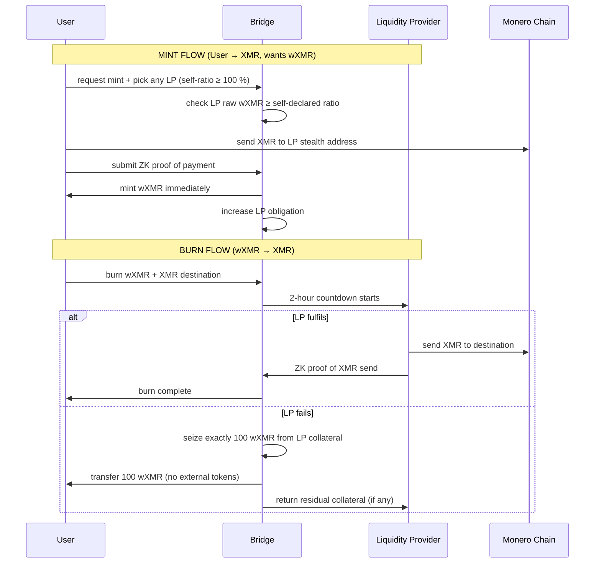

# wXMR Synthwrap Model – Standalone v1.0  
*An immutable Monero ↔ Solana bridge that mints 1:1 wrapped-XMR, collateralised only by itself, with **≥ 100 %** backing and no arbitrary buffers.*

---

## 1.  Mission Statement
Launch **one immutable contract** that mints **1 wXMR for 1 XMR**, collateralised **only by wXMR itself**, with **≥ 100 %** backing and **no external oracles or arbitrary liquidation premiums**.

---

## 2.  v1 Scope (immutable, no external oracles)
- **Collateral**: **raw wXMR only** → **1:1 pricing**, **zero oracle risk**.  
- **Collateral ratio**: **self-declared by each LP** (≥ 100 %, i.e. ≥ parity).  
- **Payout on failure**: **exactly 100 % of burned value** → **paid in wXMR** (no unwrap, no swap).  
- **Code**: **deploy once**, **no admin keys**, **no upgrade proxy**, **no governance**.

---

## 3.  v1 Launch Sequence (one-shot)
1. **Deploy bridge**.  
2. **Deployer deposits 1 real XMR** → **submits ZK proof**.  
3. **Bridge mints 1 wXMR** to deployer.  
4. **Mint authority is permanently disabled** → **supply can never change again**.  
5. **Deployer stakes the 1 wXMR** → **creates initial head-room (0.67 wXMR)**.  
6. **Deployer opens registration** → **anyone can LP**, **no further admin actions**.

---

## 4.  v1 Roles & Rules
| Role | Responsibility | Reward | Risk |
|------|---------------|--------|------|
| **LP** | **Post XMR addresses**, **stake ≥ 100 % self-declared wXMR**, **redeem within 2 h**. | **Mint fee (market-set)** | **Lose exactly 100 % wXMR if fail**. |
| **User** | **Send XMR**, **ZK-proof**, **burn wXMR**, **pick any LP ≥ parity**. | **1 wXMR minted**, **100 % wXMR paid on failure**. | **None** (always ≥ 100 % backed). |
| **Bridge** | **Verify proofs**, **track obligations**, **seize collateral**, **no upgrades**. | **None** (immutable). | **None** (no admin keys). |

------------------------------------------------
### v1 Parameters (hard-coded)
- **Min collateral ratio**: **100 %** (LP can set 100 %, 101 %, 150 %, …).  
- **Liquidation payout**: **exactly 100 % of burn value**.  
- **Countdown**: **2 hours**.  
- **Mint fee**: **LP declares** (basis points).  
- **Registration deposit**: **0.05 SOL** (scales with obligation to deter grief).

------------------------------------------------
### v1 Attack & Mitigation
| Attack | Mitigation |
|--------|------------|
| **Self-mint / self-burn** | **Deposit + mint fee + 2 h lock** → **net loss after gas**. |
| **Race to 100 % → thin buffer** | **Deposit scales with head-room** → **griefing costs money**. |
| **Oracle manipulation** | **None** – **no external price feed**. |

------------------------------------------------
## 5.  v1 Flow (no external oracles)

------------------------------------------------
## 6.  Roadmap (post-v1, optional, non-breaking)

| Version | What Changes | Token Contract | Bridge Code | Risk Surface |
|---------|--------------|----------------|-------------|--------------|
| **v2** | **Tier-2 adapter whitelist** (SOL, hyUSD, BTC, ETH) | **same wXMR-v1 mint** | **new bridge program** (reads adapter registry) | **+ Pyth oracle** |
| **v3** | **Tier-3 adapter whitelist** (LSTs, LP tokens, money-market shares) | **same wXMR-v1 mint** | **same v2 bridge**, **more adapters** | **+ protocol smart-contract risk** |
| **v4+** | **Private collateral** (shielded pool notes, zk-LP) | **same wXMR-v1 mint** | **same v2/v3 bridge**, **zk adapters** | **+ zk-circuit risk** |

**Migration path**: **LPs withdraw from v1**, **deposit into v2/v3** → **1:1 wrap**, **no token change**, **no user friction**.

------------------------------------------------
## 7.  Take-away
- **v1 is done** – **immutable, oracle-free, market-set collateral ratios ≥ parity**, **pays exactly 100 % on failure**.  
- **Future tiers** = **optional adapter programs** that **wrap/unwrap the same wXMR-v1 token**.  
- **Market decides** which tier dominates; **v1 stays live forever** as **the ultra-safe, ultra-simple Monero bridge**.
