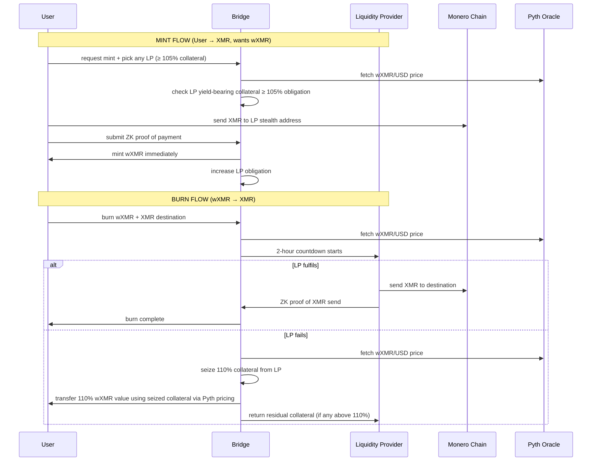

# wXMR Synthwrap Model – Standalone v1.0  
*An immutable Monero ↔ Solana bridge that mints 1:1 wrapped-XMR, collateralised by yield-bearing assets, with **≥ 100 %** backing and rewards for Monero node block header pushers.*

---

## 1.  Mission Statement
Launch **one immutable contract** that mints **1 wXMR for 1 XMR**, collateralised by **yield-bearing stablecoins and yield-bearing native tokens**, with **≥ 100 %** backing and **rewards for Monero node block header pushers** to incentivize data availability.

---

## 2.  v1 Scope 
- **Collateral**: **yield-bearing stablecoins (USX) and yield-bearing native tokens**.  
- **Collateral ratio**: **enforced minimum 110 % overcollateralization** for all LPs.  
- **Position takeover**: **any LP can take over positions below 110%**.  
- **Payout on failure**: **110 % of burned value paid to users from seized collateral**.  
- **Price oracle**: **Pyth oracle used for wXMR price feeds** to prevent on-chain price manipulation.  
- **Block header rewards**: **yield proceeds distributed to Monero node block header pushers**, with **percentage set via wXMR governance voting**.  
- **Governance**: **wXMR token holders set reward percentages and protocol parameters**.

---

## 3.  v1 Launch Sequence (one-shot)
1. **Deploy bridge**.  
2. **Deployer deposits 1 real XMR** → **submits ZK proof**.  
3. **Bridge mints 1 wXMR** to deployer.  
4. **Mint authority is permanently disabled** → **supply can never change again**.  
5. **Deployer stakes the 1 wXMR** → **creates initial head-room (0.67 wXMR)**.  
6. **Deployer opens registration** → **anyone can LP**, **no further admin actions**.

---

## 4.  v1 Roles & Rules
| Role | Responsibility | Reward | Risk |
|------|---------------|--------|------|
| **LP** | **Post XMR addresses**, **stake ≥ 110 % USX/native tokens**, **redeem within 2 h**. | **Mint fee (market-set)** | **Position taken if <110%, lose 110% if fail**. |
| **User** | **Send XMR**, **ZK-proof**, **burn wXMR**, **pick any LP ≥ 110%**. | **1 wXMR minted**, **110 % paid on failure**. | **None** (always ≥ 110 % backed). |
| **Bridge** | **Verify proofs**, **track obligations**, **seize collateral**, **no upgrades**. | **None** (immutable). | **None** (no admin keys). |

------------------------------------------------
### v1 Parameters 
- **Min collateral ratio**: **110 %** (enforced for all LPs, allows position takeover below threshold).  
- **User payout**: **110 % of burned value** → **extra 10% compensation**.  
- **Position takeover**: **any LP can take over positions below 110% collateral**.  
- **Countdown**: **2 hours**.  
- **Mint fee**: **LP declares** (basis points).  
- **Registration deposit**: **0.05 SOL** (scales with obligation to deter grief).
- **Price oracle**: **Pyth oracle for wXMR pricing**.
- **Governance**: **wXMR token voting for reward parameters**.

------------------------------------------------
### v1 Attack & Mitigation
| Attack | Mitigation |
|--------|------------|
| **Self-mint / self-burn** | **Deposit + mint fee + 2 h lock** → **net loss after gas**. |
| **LP undercollateralization** | **110% minimum + position takeover by other LPs** → **collateral always managed**. |
| **On-chain price manipulation** | **Pyth oracle prevents wXMR price manipulation**. |
| **Race to 110% → thin buffer** | **Position takeover mechanism** → **undercollateralized LPs lose positions**. |

------------------------------------------------
## 5.  v1 Flow

------------------------------------------------
## 6.  wXMR Governance Model
- **Governance token**: **wXMR holders vote on protocol parameters**
- **Votable parameters**: **block header pusher reward percentages**, **collateral ratios**, **fees**
- **Yield distribution**: **governance set percentage of yield from collateral goes to block header pushers**
- **Reward mechanism**: **Monero node operators push block headers → receive yield rewards**

------------------------------------------------
## 7.  Take-away
- **Yield-bearing collateral** provides **organic returns** for **block header pushers**.  
- **105% overcollateralization** enforced with **Pyth oracle price feeds**.  
- **wXMR governance** controls **reward allocations** and **protocol evolution**.  
- **Entire collateral seized on failure** → **maximum user protection**.
