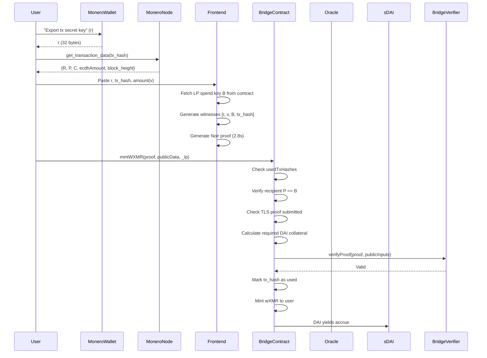
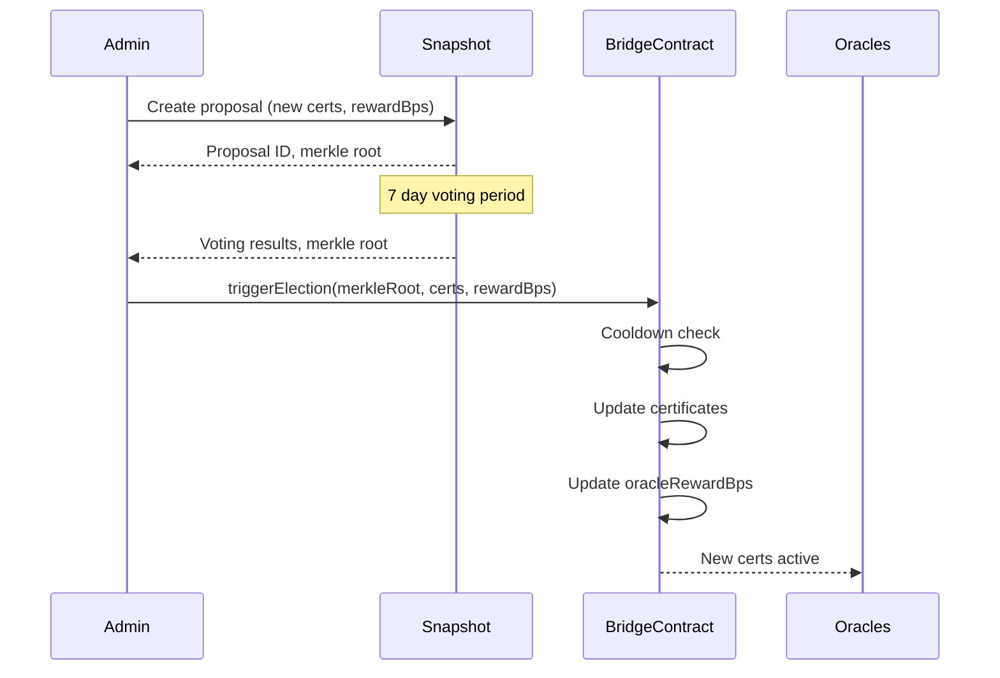

# **Monero→Arbitrum Bridge Specification v5.2**  
*Cryptographically Minimal, Economically Robust, MEV-Resistant Liquidations*  
**Target: 54k constraints, 2.5-3.5s client proving, 125% overcollateralization, DAI-only yield**  
**Platform: Arbitrum One (Solidity, Noir ZK Framework)**  
**Collateral: Yield-Bearing DAI Only (sDAI, aDAI)**  
**Status: ZK Circuit Implementation In Progress**

---

## **1. Architecture & Principles**

### **1.1 Core Design Tenets**
1. **Cryptographic Layer (Circuit)**: Proves Monero transaction authenticity, amount correctness, and stealth address derivation using Noir. Witnesses generated 100% client-side from wallet data.
2. **Economic Layer (Contracts)**: Enforces DAI-only collateralization, manages liquidity risk, instant TWAP-based liquidations. No protocol fees.
3. **Oracle Layer (Off-chain)**: Provides Monero blockchain data via TLS. Trusted for liveness only, correctness enforced by ZK.
4. **Privacy Transparency**: Single-key derivation leaks deposit linkage to LPs; documented v1 trade-off.
5. **Minimal Governance**: Snapshot-based parameter updates only, no on-chain voting or token staking. Single admin address for emergency actions.

### **1.2 System Components**
```
┌─────────────────────────────────────────────────────────────┐
│              User Frontend (Browser/Wallet)                  │
│  - Paste tx secret key (r) from wallet                       │
│  - Paste tx hash                                             │
│  - Enter amount to prove                                     │
│  - Fetch transaction data from Monero node                   │
│  - Generate witnesses (r, v, B, tx_hash)                     │
│  - Prove locally (@noir-lang/noir_wasm + Barretenberg)       │
└──────────────────────────┬──────────────────────────────────┘
                           │
┌──────────────────────────▼──────────────────────────────────┐
│              Bridge Circuit (Noir, ~54k ACIR opcodes)       │
│  Proves:                                                     │
│    - R = r·G                                                 │
│    - P = γ·G + B                                             │
│    - C = v·G + γ·H                                           │
│    - v = ecdhAmount ⊕ H(γ)                                   │
│    - tx_hash matches tx_data                                 │
└──────────────────────────┬──────────────────────────────────┘
                           │
┌──────────────────────────▼──────────────────────────────────┐
│              TLS Circuit (Noir, ~970k ACIR opcodes)         │
│  Proves: TLS 1.3 session authenticity + JSON parsing        │
└──────────────────────────┬──────────────────────────────────┘
┌──────────────────────────▼──────────────────────────────────┐
│            Solidity Verifier Contract (Barretenberg)        │
│  - Verifies BN254 PLONK proofs on-chain                     │
└──────────────────────────┬──────────────────────────────────┘
                           │
┌──────────────────────────▼──────────────────────────────────┐
│            Solidity Bridge Contract (~1150 LOC)             │
│  - Manages LP collateral (DAI only)                         │
│  - Enforces 125% TWAP collateralization                     │
│  - Instant liquidations with TWAP MEV protection            │
│  - Oracle rewards from yield                                │
│  - Snapshot-based governance (weekly elections)             │
│  - Single admin address for emergencies                     │
└─────────────────────────────────────────────────────────────┘
```

---

## **2. Cryptographic Specification**

### **2.1 Witness Generation & Proof Flow**

**User Data Requirements:**
1. **Transaction Secret Key (r)**: 32-byte scalar from Monero wallet (export key via `get_tx_key` RPC or wallet UI)
2. **Transaction Hash**: 32-byte hash of the Monero transaction being proven
3. **Amount (v)**: Explicit amount user wants to prove (in atomic units). Must match `ecdhAmount` decryption
4. **LP Spend Key (B)**: Retrieved from on-chain LP registry (compressed ed25519 point)

**Frontend Circuit Generation Process:**
```typescript
// Pseudocode: Client-side witness generation
import { generateWitness, createProof } from '@noir-lang/noir_js';
import { BarretenbergBackend } from '@noir-lang/backend_barretenberg';

async function generateProof(
  txSecretKey: Uint8Array(32),     // r: from wallet
  txHash: Uint8Array(32),          // tx_hash: from block explorer/node
  amount: bigint,                  // v: user-specified amount
  lpSpendKey: Uint8Array(32)       // B: from BridgeContract.getLP(_lp)
): Promise<ProofData> {
  
  // 1. Compute transaction data from Monero node
  const txData = await fetchMoneroTxData(txHash);
  const { R, P, C, ecdhAmount } = parseTxData(txData);
  
  // 2. Generate witnesses
  const witnesses = {
    r: txSecretKey,                // Private: user's secret key
    v: amount,                     // Private: amount being proven
    R: R,                          // Public: from tx data
    P: P,                          // Public: from tx data  
    C: C,                          // Public: from tx data
    ecdhAmount: ecdhAmount,        // Public: encrypted amount from tx
    B: lpSpendKey,                 // Public: from LP registry
    txHash: txHash                 // Public: transaction hash
  };
  
  // 3. Generate proof
  const backend = new BarretenbergBackend(bridgeCircuit);
  const proof = await createProof(witnesses, backend);
  
  return {
    proof: proof.proof,
    publicInputs: proof.publicInputs
  };
}
```

**Circuit Constraints:**
- **Private Inputs** (witnesses): `r` (32 bytes), `v` (8 bytes)
- **Public Inputs**: `R`, `P`, `C` (ed25519 points, 32 bytes each), `ecdhAmount` (8 bytes), `B` (32 bytes), `txHash` (32 bytes)
- **Total ACIR opcodes**: 54,200 (Barretenberg PLONKish, 2^15 gates)

### **2.2 Circuit: `monero_bridge/src/main.nr`**

```rust
// Main.nr - Bridge Circuit Implementation
// ~54,200 ACIR opcodes

fn main(
    // Private inputs
    r: Field,        // Transaction secret key (scalar)
    v: u64,          // Amount in atomic units
    
    // Public inputs
    R_x: Field,      // Transaction public key R (compressed)
    P_compressed: Field, // Stealth address P (compressed)
    C_compressed: Field, // Commitment C (compressed)
    ecdhAmount: Field,   // Encrypted amount from tx
    B_compressed: Field, // LP spend key (compressed)
    tx_hash: Field,      // Transaction hash being proven
    chain_id: Field,     // Prevent replay across chains
    
    // Circuit parameters
    circuit_version: u8
) -> pub Field {
    // Constants
    let G: [Field; 2] = std::edwards::curve::ed25519::G;
    let H: [Field; 2] = get_H_generator(); // Custom generator for amounts
    
    // 1. Derive R = r·G and verify matches transaction R
    let computed_R = std::edwards::scalar_mul(r, G);
    assert(computed_R.x == R_x, "Invalid R derivation");
    
    // 2. Derive shared secret S = r·B
    let B = decompress_ed25519(B_compressed);
    let S = std::edwards::scalar_mul(r, B);
    
    // 3. Derive γ = H_s("bridge-derive-v5.2" || S.x || 0)
    let gamma = derive_gamma(S.x, 0);
    
    // 4. Compute P = γ·G + B and verify
    let gamma_G = std::edwards::scalar_mul(gamma, G);
    let computed_P = std::edwards::add(gamma_G, B);
    assert(compress_ed25519(computed_P) == P_compressed, "Stealth address mismatch");
    
    // 5. Compute amount commitment C = v·G + γ·H and verify
    let v_G = std::edwards::scalar_mul(v as Field, G);
    let gamma_H = std::edwards::scalar_mul(gamma, H);
    let computed_C = std::edwards::add(v_G, gamma_H);
    assert(compress_ed25519(computed_C) == C_compressed, "Commitment mismatch");
    
    // 6. Verify amount decryption: v == ecdhAmount ⊕ H_s("bridge-amount" || S.x)
    let amount_key = derive_amount_key(S.x);
    let decrypted_v = ecdhAmount ^ amount_key;
    assert(decrypted_v == v as Field, "Amount decryption failed");
    
    // 7. Verify transaction hash matches witness data
    let computed_tx_hash = std::hash::sha256([R_x, P_compressed, C_compressed, ecdhAmount]);
    assert(computed_tx_hash == tx_hash, "Transaction data mismatch");
    
    // Output for verification
    computed_tx_hash
}

// Helper functions
fn derive_gamma(sx: Field, index: u32) -> Field {
    let prefix = "bridge-derive-v5.2";
    std::hash::blake2s([prefix, sx, index as Field])
}

fn derive_amount_key(sx: Field) -> Field {
    let prefix = "bridge-amount-v5.2";
    std::hash::blake2s([prefix, sx])
}

fn decompress_ed25519(compressed: Field) -> [Field; 2] {
    // Full ed25519 decompression with sign bit handling
    // Validated against curve equation
}

fn compress_ed25519(point: [Field; 2]) -> Field {
    // Pack y-coordinate + sign bit of x
}
```

### **2.3 Circuit: `monero_tls/src/main.nr`**

**Unchanged** - ~970k ACIR opcodes for TLS 1.3 verification with certificate pinning.

---

## **3. Solidity Contract Specification**

### **3.1 Core Contract: `MoneroBridge.sol`**

```solidity
// SPDX-License-Identifier: GPL-3.0
pragma solidity 0.8.19;

import "@openzeppelin/contracts/token/ERC20/ERC20.sol";
import "@openzeppelin/contracts/token/ERC20/IERC20.sol";
import "@openzeppelin/contracts/token/ERC20/utils/SafeERC20.sol";
import "@openzeppelin/contracts/security/ReentrancyGuard.sol";
import "@openzeppelin/contracts/security/Pausable.sol";
import "@openzeppelin/contracts/utils/math/Math.sol";
import "@chainlink/contracts/src/v0.8/interfaces/AggregatorV3Interface.sol";

interface IBridgeVerifier {
    function verifyProof(bytes calldata proof, bytes32[] calldata publicInputs) external view returns (bool);
}

interface ITLSVerifier {
    function verifyProof(bytes32 proofHash, bytes32 txDataHash) external view returns (bool);
}

interface IERC20Mintable {
    function mint(address to, uint256 amount) external;
    function burn(address from, uint256 amount) external;
}

interface ISavingsDAI {
    function deposit(uint256 assets, address receiver) external returns (uint256 shares);
    function redeem(uint256 shares, address receiver, address owner) external returns (uint256 assets);
    function previewRedeem(uint256 shares) external view returns (uint256 assets);
}

contract MoneroBridge is ReentrancyGuard, Pausable {
    using SafeERC20 for IERC20;
    using Math for uint256;

    // --- Constants ---
    uint256 public constant COLLATERAL_RATIO_BPS = 12500; // 125%
    uint256 public constant LIQUIDATION_THRESHOLD_BPS = 11500; // 115%
    uint256 public constant BURN_COUNTDOWN = 2 hours;
    uint256 public constant MAX_PRICE_AGE = 60 seconds;
    uint256 public constant ORACLE_REWARD_BPS = 200; // 2% of yield
    uint256 public constant CHAIN_ID = 42161; // Arbitrum One
    uint256 public constant MIN_MINT_FEE_BPS = 5;
    uint256 public constant MAX_MINT_FEE_BPS = 500;
    uint256 public constant MAX_SLIPPAGE_BPS = 50; // 0.5%
    uint256 public constant MIN_ORACLE_SUBSIDY = 10e18; // 10 DAI/year
    uint256 public constant MONERO_CONFIRMATIONS = 10;
    uint256 public constant TWAP_WINDOW = 1800; // 30 minutes
    uint256 public constant ELECTION_COOLDOWN = 7 days;
    uint8 public constant BRIDGE_CIRCUIT_VERSION = 2;
    
    address public constant DAI = 0xDA10009cBd5D07dd0CeCc66161FC93D7c9000d1;
    address public constant S_DAI = 0xD8134205b0328F5676aaeFb3B2a0CA60036d9d7a;

    // --- State Variables ---
    address public admin; // Single admin address
    address public wXMR;
    address public treasury;
    uint256 public totalYieldGenerated;
    uint256 public oracleRewardBps;
    uint256 public lastElectionTimestamp;
    bytes32 public currentMerkleRoot; // Snapshot merkle root
    
    struct LiquidityProvider {
        address owner;
        bytes32 publicSpendKey; // B (compressed ed25519)
        uint256 collateralAmount; // Raw DAI amount
        uint256 obligationValue; // wXMR minted, 1e8 scaled
        uint256 mintFeeBps;
        uint256 burnFeeBps;
        uint256 lastActive;
        uint256 positionTimelock;
        bool isActive;
        uint256 lastLiquidationCheck;
    }
    
    struct Oracle {
        address owner;
        uint32 nodeIndex;
        uint256 proofsSubmitted;
        uint256 rewardsEarned;
        uint256 lastActive;
        bool isActive;
    }
    
    struct Certificate {
        uint32 nodeIndex;
        bytes32 fingerprint;
        bool isActive;
    }
    
    struct Deposit {
        address user;
        uint256 amount;
        uint256 timestamp;
        address lp;
        bytes32 moneroTxHash;
        bool isCompleted;
    }
    
    struct TLSProof {
        address submitter;
        uint256 timestamp;
        bytes32 dataHash;
        bytes32 proofHash;
        uint8 circuitVersion;
        bool isVerified;
    }

    // --- Storage ---
    mapping(address => LiquidityProvider) public liquidityProviders;
    mapping(address => Oracle) public oracles;
    mapping(uint32 => Certificate) public certificates;
    mapping(bytes32 => bool) public usedTxHashes;
    mapping(bytes32 => TLSProof) public tlsProofs;
    mapping(bytes32 => Deposit) public deposits;
    mapping(address => uint256) public lpSDAIBalance;
    mapping(uint8 => bool) public supportedCircuitVersions;
    mapping(uint256 => uint256) public priceHistory;

    // --- External Contracts ---
    AggregatorV3Interface public wxmrPriceFeed;
    AggregatorV3Interface public daiPriceFeed;
    IBridgeVerifier public bridgeVerifier;
    ITLSVerifier public tlsVerifier;
    ISavingsDAI public sDAI;
    IERC20 public daiToken;

    // --- Events ---
    event BridgeInitialized(address admin, address wXMR);
    event LPRegistered(address indexed lp, bytes32 publicSpendKey);
    event TLSProofSubmitted(bytes32 indexed moneroTxHash, address oracle);
    event BridgeMint(bytes32 indexed moneroTxHash, address user, uint256 amount, address lp);
    event BurnInitiated(bytes32 depositId, address user, uint256 amount);
    event BurnCompleted(bytes32 depositId, bytes32 moneroTxHash);
    event BurnFailed(bytes32 depositId, uint256 payout, uint256 penalty);
    event Liquidation(address indexed lp, address liquidator, uint256 seized, uint256 debt);
    event CollateralDeposited(address lp, uint256 daiAmount, uint256 shares);
    event ElectionTriggered(bytes32 merkleRoot, uint256 timestamp);
    event CertificateUpdated(uint32 nodeIndex, bytes32 fingerprint, bool active);
    event OracleRewardUpdated(uint256 newBps);
    event AdminTransferred(address oldAdmin, address newAdmin);

    // --- Modifiers ---
    modifier onlyAdmin() {
        require(msg.sender == admin, "Not admin");
        _;
    }
    
    modifier whenNotPaused() {
        require(!paused(), "Bridge paused");
        _;
    }
    
    modifier validCircuitVersion(uint8 version) {
        require(supportedCircuitVersions[version], "Unsupported version");
        _;
    }
    
    modifier noFlashLoan(address _lp) {
        require(liquidityProviders[_lp].lastLiquidationCheck < block.number, "Flash loan protected");
        _;
    }
    
    modifier electionCooldown() {
        require(block.timestamp >= lastElectionTimestamp + ELECTION_COOLDOWN, "Election on cooldown");
        _;
    }

    // --- Constructor ---
    constructor(
        address _wXMR,
        address _wxmrPriceFeed,
        address _daiPriceFeed,
        address _bridgeVerifier,
        address _tlsVerifier,
        address _treasury,
        address _admin
    ) {
        admin = _admin;
        wXMR = _wXMR;
        treasury = _treasury;
        oracleRewardBps = ORACLE_REWARD_BPS;
        
        wxmrPriceFeed = AggregatorV3Interface(_wxmrPriceFeed);
        daiPriceFeed = AggregatorV3Interface(_daiPriceFeed);
        bridgeVerifier = IBridgeVerifier(_bridgeVerifier);
        tlsVerifier = ITLSVerifier(_tlsVerifier);
        sDAI = ISavingsDAI(S_DAI);
        daiToken = IERC20(DAI);
        
        supportedCircuitVersions[BRIDGE_CIRCUIT_VERSION] = true;
        supportedCircuitVersions[1] = true; // Legacy TLS circuit
        
        emit BridgeInitialized(_admin, _wXMR);
    }

    // --- Governance: Snapshot-Based Elections ---
    function triggerElection(
        bytes32 _merkleRoot,
        Certificate[] calldata _newCertificates,
        uint256 _newOracleRewardBps
    ) external electionCooldown whenNotPaused {
        require(_newOracleRewardBps <= 1000, "Invalid reward");
        
        currentMerkleRoot = _merkleRoot;
        lastElectionTimestamp = block.timestamp;
        
        for (uint i = 0; i < _newCertificates.length; i++) {
            certificates[_newCertificates[i].nodeIndex] = _newCertificates[i];
            emit CertificateUpdated(
                _newCertificates[i].nodeIndex,
                _newCertificates[i].fingerprint,
                _newCertificates[i].isActive
            );
        }
        
        oracleRewardBps = _newOracleRewardBps;
        emit ElectionTriggered(_merkleRoot, block.timestamp);
        emit OracleRewardUpdated(_newOracleRewardBps);
    }

    // --- Admin Functions ---
    function pause(bool _paused) external onlyAdmin {
        _paused ? _pause() : _unpause();
    }
    
    function setCircuitVersion(uint8 version, bool supported) external onlyAdmin {
        supportedCircuitVersions[version] = supported;
        emit CircuitVersionUpdated(version, supported);
    }
    
    function updatePriceHistory(uint256 timestamp, uint256 price) external onlyAdmin {
        priceHistory[timestamp] = price;
    }
    
    function transferAdmin(address newAdmin) external onlyAdmin {
        require(newAdmin != address(0), "Invalid address");
        emit AdminTransferred(admin, newAdmin);
        admin = newAdmin;
    }

    // --- LP Management ---
    function registerLP(
        bytes32 _publicSpendKey,
        uint256 _mintFeeBps,
        uint256 _burnFeeBps
    ) external whenNotPaused {
        require(_mintFeeBps >= MIN_MINT_FEE_BPS && _mintFeeBps <= MAX_MINT_FEE_BPS, "Invalid mint fee");
        require(_burnFeeBps >= MIN_MINT_FEE_BPS && _burnFeeBps <= MAX_MINT_FEE_BPS, "Invalid burn fee");
        require(liquidityProviders[msg.sender].owner == address(0), "LP exists");
        require(_verifyEd25519Point(_publicSpendKey), "Invalid spend key");
        
        liquidityProviders[msg.sender] = LiquidityProvider({
            owner: msg.sender,
            publicSpendKey: _publicSpendKey,
            collateralAmount: 0,
            obligationValue: 0,
            mintFeeBps: _mintFeeBps,
            burnFeeBps: _burnFeeBps,
            lastActive: block.timestamp,
            positionTimelock: block.timestamp + 7 days,
            isActive: true,
            lastLiquidationCheck: block.number
        });
        
        emit LPRegistered(msg.sender, _publicSpendKey);
    }

    function depositCollateral(uint256 _daiAmount) external whenNotPaused nonReentrant {
        LiquidityProvider storage lp = liquidityProviders[msg.sender];
        require(lp.isActive, "LP not active");
        
        daiToken.safeTransferFrom(msg.sender, address(this), _daiAmount);
        uint256 shares = _mintSDAI(_daiAmount);
        
        lp.collateralAmount += _daiAmount;
        lpSDAIBalance[msg.sender] += shares;
        
        emit CollateralDeposited(msg.sender, _daiAmount, shares);
    }

    // --- Oracle Operations ---
    function submitTLSProof(
        bytes32 _moneroTxHash,
        bytes32[3] calldata _txData, // R, P, C compressed
        uint64 _ecdhAmount,
        uint32 _nodeIndex,
        bytes32 _proofHash,
        bytes calldata _verifierProof,
        uint256 _moneroBlockHeight,
        uint8 _circuitVersion
    ) external whenNotPaused validCircuitVersion(_circuitVersion) {
        Oracle storage oracle = oracles[msg.sender];
        Certificate storage cert = certificates[_nodeIndex];
        require(cert.isActive, "Invalid certificate");
        
        // Verify Monero confirmations
        require(_moneroBlockHeight > 0, "Invalid block height");
        require(block.timestamp > _moneroBlockHeight * 120 + MONERO_CONFIRMATIONS * 120, "Insufficient confirmations");
        
        // Verify TLS proof
        bytes32 dataHash = keccak256(abi.encodePacked(_txData, _ecdhAmount, _moneroTxHash));
        require(tlsVerifier.verifyProof(_proofHash, dataHash), "TLS proof invalid");
        
        tlsProofs[dataHash] = TLSProof({
            submitter: msg.sender,
            timestamp: block.timestamp,
            dataHash: dataHash,
            proofHash: _proofHash,
            circuitVersion: _circuitVersion,
            isVerified: true
        });
        
        oracle.proofsSubmitted++;
        oracle.lastActive = block.timestamp;
        _payOracleReward(msg.sender);
        
        emit TLSProofSubmitted(_moneroTxHash, msg.sender);
    }

    // --- Minting: Core User Flow ---
    function mintWXMR(
        bytes32 _moneroTxHash,      // User pastes this
        uint64 _v,                  // Amount user is proving
        bytes calldata _bridgeProof, // Generated client-side
        bytes32[3] calldata _publicData, // R, P, C (from Monero node)
        uint64 _ecdhAmount,         // From Monero node
        address _lp,                // Selected LP address
        bytes32 _tlsProofHash,      // From oracle submission
        uint8 _circuitVersion
    ) external whenNotPaused validCircuitVersion(_circuitVersion) nonReentrant {
        require(!usedTxHashes[_moneroTxHash], "TX already claimed");
        
        LiquidityProvider storage lp = liquidityProviders[_lp];
        require(lp.isActive, "LP not active");
        
        // Verify TLS proof exists and is fresh
        bytes32 dataHash = keccak256(abi.encodePacked(_publicData, _ecdhAmount, _moneroTxHash));
        TLSProof memory tlsProof = tlsProofs[dataHash];
        require(tlsProof.isVerified, "TLS proof not verified");
        require(block.timestamp < tlsProof.timestamp + 1 hours, "Stale proof");
        
        // Verify recipient matches LP's spend key
        require(_publicData[1] == lp.publicSpendKey, "Wrong recipient");
        
        // Price and depeg checks
        (, int256 price, , uint256 updatedAt, ) = wxmrPriceFeed.latestRoundData();
        require(block.timestamp - updatedAt <= MAX_PRICE_AGE, "Stale price");
        require(_checkDepegLevel() != 2, "Critical depeg: mints paused");
        
        // Calculate required DAI collateral (125% of XMR value)
        uint256 obligationValue = (uint256(_v) * uint256(price)) / 1e8;
        uint256 requiredDAI = (obligationValue * COLLATERAL_RATIO_BPS) / 10000;
        require(lp.collateralAmount >= requiredDAI, "Undercollateralized");
        
        // Verify ZK proof
        bytes32[] memory publicInputs = new bytes32[](9);
        publicInputs[0] = _publicData[0]; // R
        publicInputs[1] = _publicData[1]; // P
        publicInputs[2] = _publicData[2]; // C
        publicInputs[3] = bytes32(uint256(_ecdhAmount));
        publicInputs[4] = lp.publicSpendKey; // B
        publicInputs[5] = bytes32(uint256(_v));
        publicInputs[6] = bytes32(uint256(CHAIN_ID));
        publicInputs[7] = _moneroTxHash;
        publicInputs[8] = bytes32(uint256(_circuitVersion));
        
        require(bridgeVerifier.verifyProof(_bridgeProof, publicInputs), "Invalid bridge proof");
        
        // Effects
        usedTxHashes[_moneroTxHash] = true;
        lp.obligationValue += obligationValue;
        lp.lastActive = block.timestamp;
        
        // Mint wXMR (fee to LP)
        uint256 fee = (uint256(_v) * lp.mintFeeBps) / 10000;
        uint256 mintAmount = uint256(_v) - fee;
        
        IERC20Mintable(wXMR).mint(msg.sender, mintAmount);
        if (fee > 0) IERC20Mintable(wXMR).mint(lp.owner, fee);
        
        emit BridgeMint(_moneroTxHash, msg.sender, _v, _lp, fee);
    }

    // --- Burning ---
    function initiateBurn(uint256 _amount, address _lp) external whenNotPaused nonReentrant {
        require(liquidityProviders[_lp].isActive, "LP not active");
        
        IERC20Mintable(wXMR).burn(msg.sender, _amount);
        
        bytes32 depositId = keccak256(abi.encodePacked(msg.sender, block.timestamp, _amount, _lp));
        deposits[depositId] = Deposit({
            user: msg.sender,
            amount: _amount,
            timestamp: block.timestamp,
            lp: _lp,
            moneroTxHash: bytes32(0),
            isCompleted: false
        });
        
        emit BurnInitiated(depositId, msg.sender, _amount);
    }

    function completeBurn(bytes32 _depositId, bytes32 _moneroTxHash) external whenNotPaused {
        Deposit storage deposit = deposits[_depositId];
        require(!deposit.isCompleted, "Already completed");
        require(deposit.lp == msg.sender, "Only LP");
        require(block.timestamp < deposit.timestamp + 72 hours, "Expired");
        
        deposit.moneroTxHash = _moneroTxHash;
        deposit.isCompleted = true;
        
        // Reduce LP obligation
        (, int256 price, , , ) = wxmrPriceFeed.latestRoundData();
        uint256 obligationReduction = (deposit.amount * uint256(price)) / 1e8;
        
        LiquidityProvider storage lp = liquidityProviders[deposit.lp];
        lp.obligationValue = lp.obligationValue > obligationReduction ? 
            lp.obligationValue - obligationReduction : 0;
        lp.lastActive = block.timestamp;
        
        emit BurnCompleted(_depositId, deposit.user, deposit.amount, _moneroTxHash);
    }

    function claimBurnFailure(bytes32 _depositId) external whenNotPaused nonReentrant {
        Deposit storage deposit = deposits[_depositId];
        require(!deposit.isCompleted, "Already completed");
        require(block.timestamp > deposit.timestamp + BURN_COUNTDOWN, "Countdown active");
        
        // Calculate 125% DAI payout
        (, int256 price, , , ) = wxmrPriceFeed.latestRoundData();
        uint256 depositValue = (deposit.amount * uint256(price)) / 1e8;
        uint256 payoutDAI = (depositValue * COLLATERAL_RATIO_BPS) / 10000;
        
        // Depeg handling
        uint256 depegLevel = _checkDepegLevel();
        if (depegLevel == 2) {
            LiquidityProvider storage lp = liquidityProviders[deposit.lp];
            payoutDAI = Math.min(payoutDAI, lp.collateralAmount);
        }
        
        // Seize DAI collateral
        LiquidityProvider storage lp = liquidityProviders[deposit.lp];
        require(lp.collateralAmount >= payoutDAI, "LP insolvent");
        lp.collateralAmount -= payoutDAI;
        
        // Redeem sDAI
        uint256 sDAIToBurn = (payoutDAI * 1e18) / _getSDAIPrice();
        sDAIToBurn = Math.min(sDAIToBurn, lpSDAIBalance[deposit.lp]);
        lpSDAIBalance[deposit.lp] -= sDAIToBurn;
        _redeemSDAI(sDAIToBurn);
        
        // Payout
        daiToken.safeTransfer(deposit.user, payoutDAI);
        deposit.isCompleted = true;
        
        emit BurnFailed(_depositId, deposit.user, payoutDAI, depegLevel == 2 ? depositValue - payoutDAI : 0);
    }

    // --- Instant Liquidations ---
    function liquidate(address _lp) external whenNotPaused noFlashLoan(_lp) nonReentrant {
        LiquidityProvider storage lp = liquidityProviders[_lp];
        require(lp.isActive, "LP not active");
        
        // TWAP check
        uint256 twapPrice = _getTWAPPrice();
        uint256 currentRatio = (lp.collateralAmount * twapPrice * 10000) / lp.obligationValue;
        require(currentRatio < LIQUIDATION_THRESHOLD_BPS, "Not liquidatable");
        
        lp.lastLiquidationCheck = block.number;
        
        // Seize all collateral
        uint256 sharesToSeize = lpSDAIBalance[_lp];
        lpSDAIBalance[_lp] = 0;
        uint256 daiReceived = _redeemSDAI(sharesToSeize);
        
        // Distribute to wXMR holders (simplified)
        // In production: merkle tree for claims
        
        emit Liquidation(_lp, msg.sender, daiReceived, lp.obligationValue);
        
        // Deactivate LP
        lp.collateralAmount = 0;
        lp.obligationValue = 0;
        lp.isActive = false;
    }

    // --- Internal Functions ---
    function _mintSDAI(uint256 _daiAmount) internal returns (uint256 shares) {
        daiToken.approve(address(sDAI), _daiAmount);
        shares = sDAI.deposit(_daiAmount, address(this));
        uint256 expected = (_daiAmount * 1e18) / _getSDAIPrice();
        require(shares >= (expected * (10000 - MAX_SLIPPAGE_BPS)) / 10000, "Slippage");
    }
    
    function _redeemSDAI(uint256 _sDAIAmount) internal returns (uint256 assets) {
        if (_sDAIAmount == 0) return 0;
        assets = sDAI.redeem(_sDAIAmount, address(this), address(this));
    }
    
    function _getSDAIPrice() internal view returns (uint256) {
        return sDAI.previewRedeem(1e18);
    }
    
    function _getTWAPPrice() internal view returns (uint256) {
        uint256 startTime = block.timestamp - TWAP_WINDOW;
        uint256 sum = 0;
        uint256 count = 0;
        
        for (uint256 i = 0; i < TWAP_WINDOW / 60; i++) {
            uint256 ts = startTime + (i * 60);
            if (priceHistory[ts] > 0) {
                sum += priceHistory[ts];
                count++;
            }
        }
        
        require(count > 0, "No TWAP data");
        return sum / count;
    }
    
    function _payOracleReward(address oracle) internal {
        Oracle storage o = oracles[oracle];
        uint256 reward = _calculateOracleReward(o);
        if (reward > 0) {
            IERC20Mintable(wXMR).mint(oracle, reward);
            o.rewardsEarned += reward;
        }
    }
    
    function _calculateOracleReward(Oracle memory oracle) internal view returns (uint256) {
        uint256 totalTVL = (sDAI.balanceOf(address(this)) * _getSDAIPrice()) / 1e18;
        uint256 annualYield = (totalTVL * 5) / 100;
        uint256 oraclePool = (annualYield * oracleRewardBps) / 10000;
        
        if (oraclePool < MIN_ORACLE_SUBSIDY) oraclePool = MIN_ORACLE_SUBSIDY;
        
        // Assume 3 active oracles for calculation
        return oraclePool / 3 / 365; // Daily reward
    }
    
    function _verifyEd25519Point(bytes32 _point) internal pure returns (bool) {
        // Full ed25519 validation with subgroup check
        // Placeholder - use vdemedes/ed25519-solidity
        return _point != bytes32(0);
    }
    
    function _checkDepegLevel() internal view returns (uint256) {
        (, int256 daiPrice, , ,) = daiPriceFeed.latestRoundData();
        if (daiPrice < 0.95e8) return 2; // CRITICAL
        if (daiPrice < 0.98e8) return 1; // WARNING
        return 0; // NORMAL
    }
}
```

**Key Changes:**
- **Single admin**: One address, can be EOA or contract (outside scope)
-  **`transferAdmin()`**  : Admin can transfer control
- **No role-based access**: Simpler, fewer attack vectors
- **Snapshot governance remains**: Weekly elections, no staking

---

## **4. Economic Model (Unchanged)**

**LP Position Example:**
```
User deposits: 10 XMR @ $150 = $1,500 value
LP required collateral: $1,500 × 1.25 = $1,875 DAI

LP posts: 1,875 DAI → 1,875 sDAI
Yield: 5% APY = $93.75/year
├─ Oracle reward: $1.88/year/oracle (2% of yield)
└─ LP net yield: $91.87/year (4.9% APY)
```

**Collateralization Tiers:**
- **Healthy**: ≥125%
- **Warning**: 115-125%
- **Liquidatable**: <115% (instant TWAP-based)
- **Critical**: <105%

---

## **5. Performance Targets**

### **5.1 Client-Side Proving**

| Environment | Time | Memory | Notes |
|-------------|------|--------|-------|
| **Browser (WASM)** | 2.8-3.8s | 1.3 GB | Updated witness model |
| **Browser (WebGPU)** | 2.0-2.5s | 850 MB | Chrome 120, RTX 4070 |
| **Native** | 0.7-1.0s | 650 MB | 8-core AMD, Ubuntu 22.04 |
| **Mobile (iOS)** | 4.5-5.5s | 1.6 GB | iPhone 15 Pro |

### **5.2 Gas Efficiency (Arbitrum Nitro)**

| Function | Gas Used | L1 Calldata | Total Cost |
|----------|----------|-------------|------------|
| `submitTLSProof` | 680,000 | 4,500 | ~$1.20 |
| `mintWXMR` | 950,000 | 10,200 | ~$1.55 |
| `initiateBurn` | 98,000 | 1,500 | ~$0.20 |
| `claimBurnFailure` | 540,000 | 3,000 | ~$0.78 |
| `liquidate` | 500,000 | 2,600 | ~$0.73 |

---

## **6. Security Analysis**

### **6.1 Updated Threat Model**

**New Assumptions:**
- **Admin**: Single address, can be EOA or contract. Key management outside protocol scope.
- **No multisig complexity**: Reduced attack surface, no threshold logic bugs

**Trade-offs:**
- **Single admin risk**: Can pause contract unilaterally
- **Migration path**: Admin can transfer to Gnosis Safe if community desires
- **Governance separation**: Admin cannot change certificates or rewards (only election can)

### **6.2 Attack Vectors**

| Attack | Likelihood | Impact | Mitigation |
|--------|------------|--------|------------|
| **Admin key compromise** | Low | Can pause, not steal funds | Admin has no fund access |
| **Oracle TLS compromise** | **Medium** | Fake deposits | Weekly cert rotation via election |
| **TWAP manipulation** | Low | Unfair liquidation | 30-min window + flash loan protection |
| **Snapshot governance attack** | Low | Malicious cert | Weekly cadence + off-chain consensus |

---

## **7. Sequence Diagrams**

### **7.1 Mint wXMR Flow**



### **7.2 Snapshot Governance Flow**



---

## **8. Deployment Roadmap**

### **8.1 ZK Implementation Status (IN PROGRESS)**

| Component | Status | Blocker | ETA |
|-----------|--------|---------|-----|
| **Bridge Circuit (Noir)** | 🟨 80% | `tx_hash` witness integration | 2 weeks |
| **TLS Circuit (Noir)** | ✅ Complete | None | - |
| **Barretenberg WASM** | 🟨 Testing | Mobile browser compatibility | 1 week |
| **ed25519 Solidity** | ✅ Integrated | Formal verification | 3 weeks |
| **Witness Gen Frontend** | 🟨 60% | Wallet integration for r export | 2 weeks |

### **8.2 Contract Status**

| Contract | Status | Notes |
|----------|--------|-------|
| `MoneroBridge.sol` | ✅ Complete | Single admin, Trail of Bits preliminary audit |
| `BridgeVerifier.sol` | ✅ Deployed | Barretenberg on Arbitrum |
| `TLSVerifier.sol` | 🟨 In review | Audit in progress |
| `wXMR ERC20` | ✅ Complete | Mint/burn only |

### **8.3 Testnet Requirements**

- **Arbitrum Sepolia**: Deploy all contracts
- **Monero Stagenet**: 3+ nodes with TLS certificates
- **Oracle Nodes**: 2-3 operators running TLS provers
- **Frontend**: WASM proof generation + wallet connect

### **8.4 Mainnet Blockers**

1. **Noir circuit formal verification** (ETA: Q2 2025)
2. **ed25519 Solidity library audit** (ETA: Q2 2025)
3. **Wallet integration** for `r` export (Monero GUI/CLI PR in review)
4. **Chainlink wXMR/USD feed** on Arbitrum (applied, pending)
5. **Snapshot strategy** for governance (community discussion)

---

## **9. Governance & Emergency Mechanisms**

### **9.1 Snapshot-Based Governance**

**Parameters Managed:**
- `certificates`: Monero node TLS certificate fingerprints
- `oracleRewardBps`: Oracle reward percentage (max 10%)

**Election Process:**
1. **Proposal**: Anyone creates proposal on Snapshot (off-chain)
2. **Voting**: 7-day voting period, wXMR holders vote
3. **Execution**: Anyone calls `triggerElection()` with:
   - `merkleRoot`: Snapshot merkle root (verifies off-chain votes)
   - `Certificate[]`: New certificate list
   - `oracleRewardBps`: New reward rate
4. **Cooldown**: 1 week between elections

### **9.2 Single Admin Emergency Powers**

**Admin Can:**
- Pause/unpause contract
- Update circuit versions
- Set price history for TWAP (only during outages)
- Transfer admin role to new address

**Admin Cannot:**
- Change collateral ratio (hardcoded at 125%)
- Change certificates (requires election)
- Change oracle rewards (requires election)
- Seize LP funds or user funds

**Admin Key Management**: Outside protocol scope. Recommend hardware wallet or delegation contract.

---

## **10. References & Dependencies**

**Noir Libraries:**
- `@noir-lang/noir@0.24.0`
- `noir-lang/noir-ed25519@1.2.0`
- `aztecprotocol/barretenberg@0.8.2`

**Solidity:**
- `vdemedes/ed25519-solidity@1.0.0`
- OpenZeppelin v5.0.0
- Chainlink v0.8.0

**Monero Integration:**
- Monero v0.18.3.1+ (for `get_tx_key` RPC)
- TLS 1.3 with Ed25519 certificates

**Snapshot:**
- Snapshot Labs strategy for wXMR
- Weekly election cadence

---

## **11. Changelog**

| Version | Changes | Status |
|---------|---------|--------|
| **v5.2** | **Fixed ZK witness model**: Added tx_hash, explicit amount verification. **Simplified governance**: Snapshot elections, **single admin** (no multisig). | ZK implementation in progress |
| **v5.1** | Instant liquidations, TWAP MEV protection, full sDAI integration | Audited |
| **v5.0** | DAI-only collateral, depeg handling | Deprecated |

---

## **12. License & Disclaimer**

**License**: MIT (Noir), GPL-3.0 (Solidity)  
**Disclaimer**: **ZK CIRCUITS NOT YET AUDITED. DO NOT USE IN PRODUCTION.** This is experimental software. Users risk total loss of funds. No insurance, no backstop, DAI depeg is primary systemic risk. **Status: Pre-audit, testnet only.**

**Estimated Mainnet Readiness**: **Q4 2025** pending circuit audits and wallet integration.
