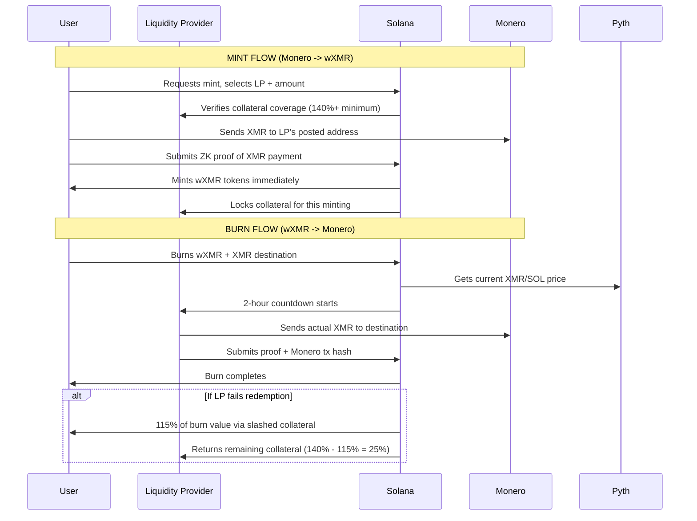

# wXMR Synthwrap Model

## Overview
The synthwrap model enables **Monero → Solana bridging** without atomic swaps. Instead of direct swaps, it uses **overcollateralized liquidity providers** who optimize for yield and accept XMR risk.

## Architecture

### Liquidity Providers (LPs)
- **Register** by posting XMR addresses on-chain
- **Stake** SOL/hyUSD as overcollateralization (150%+ ratio)
- **Monitor** for incoming mint/burn requests
- **Receive** yield from minting fees

### Mint Flow (Monero → wXMR)
1. **User sends XMR** to LP's posted Monero address
2. **User submits ZK proof** of payment on Solana
3. **Auto-mint wXMR** to user's Solana address
4. **LP collateral** covers XMR risk during verification

### Burn Flow (wXMR → Monero)
1. **User burns wXMR** and provides XMR destination address
2. **LP has 2 hours** to send XMR to provided address
3. **ZK proof of XMR send** auto-completes the burn
4. **Collateral slashed** if LP fails to send XMR within deadline

### Key Differences from Atomic Swaps
- **Single party** (LP) handles settlements
- **Collateralized** instead of dual-locked assets
- **Censorship-resistant** via LP competition
- **Scalable** through ZK proof verification

## Flow Diagram

## Liquidation Mechanism (115% Threshold)

### Cross-LP Liquidations
When any LP's collateral ratio drops below 115% (Global Min Health), other LPs can **liquidate each other** to maintain system-wide collateralization:

1. **Health Check**: Continuous monitoring of LP collateral vs minted positions
2. **Liquidation Trigger**: Anyone can call `liquidate_lp()` when health < 115%
3. **Liquidation Process**:
   - Losing LP's wXMR positions get **distributed** to liquidating LPs at 115% value
   - Liquidating LPs take over **mint/burn obligations** for liquidated positions
   - All positions remain **fully collateralized** throughout the process

### Supply Invariants
- **Total wXMR supply ≤ Total valid collateral at 115% liq level**
- **No undercollateralized positions** allowed to exist
- **Automatic rebalancing** via competitive liquidations

## Technical Implementation

### Pyth Integration
- **Real-time XMR pricing** through Pyth oracle
- **Dynamic collateral ratios** based on volatility
- **Accurate slashing amounts** for failed redemptions

### ZK Verification
- **Proof of Monero receipt** without exposing addresses
- **Proof of Monero send** using view keys
- **Zero-knowledge** preserves user privacy

### Collateral Management
- **SOL/hyUSD staking** by LPs
- **Automated slashing** on missed redemptions
- **Yield generation** from minting fees
- **Risk-adjusted** LP selection