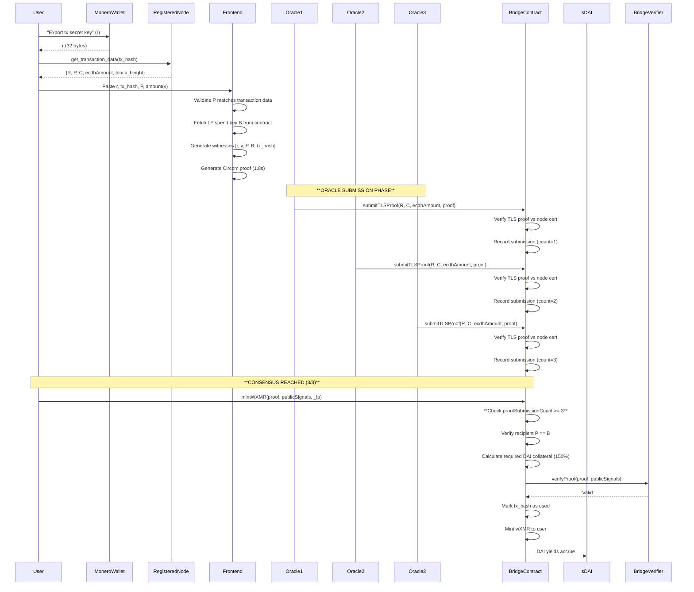
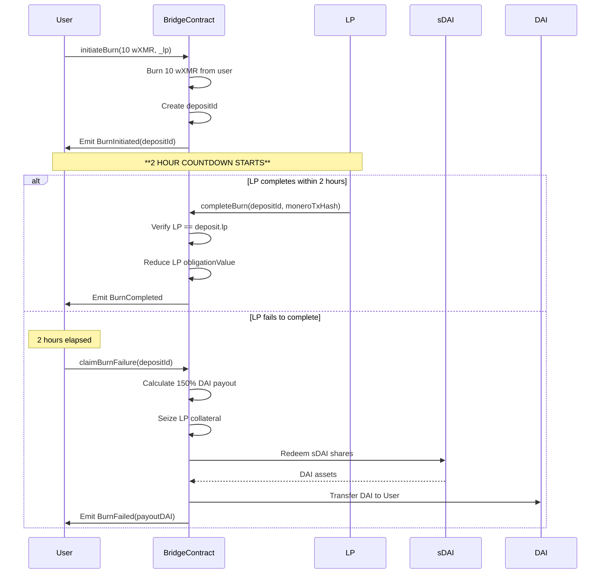

# **Monero→Arbitrum Bridge Specification v5.3**  
*Cryptographically Minimal, Economically Robust, MEV-Resistant Liquidations*  
**Target: 58k constraints, 1.8-2.5s client proving, 150% initial collateral, 120% liquidation threshold, DAI-only yield**  
**Platform: Arbitrum One (Solidity, Circom ZK Framework)**  
**Collateral: Yield-Bearing DAI Only (sDAI, aDAI)**  
**Status: ZK Circuit Implementation In Progress**

---

## **1. Architecture & Principles**

### **1.1 Core Design Tenets**
1. **Cryptographic Layer (Circuit)**: Proves Monero transaction authenticity and amount correctness using Circom. Witnesses generated 100% client-side from wallet data. **Stealth address derivation moved off-circuit.**
2. **Economic Layer (Contracts)**: Enforces DAI-only collateralization, manages liquidity risk, **instant direct-price liquidations**. No protocol fees.
3. **Oracle Layer (On-Chain)**: **Multiple registered Monero nodes** with **N-of-M consensus** (minimum 3 proofs required). One node addition/removal per week maximum.
4. **Privacy Transparency**: Single-key verification model; destination address provided as explicit input.
5. **Zero Governance**: No admin, no elections, no Snapshot, **no emergency pause**. All parameters set at deployment. **Parameters are immutable.**

### **1.2 System Components**
```
┌─────────────────────────────────────────────────────────────┐
│              User Frontend (Browser/Wallet)                  │
│  - Paste tx secret key (r) from wallet                       │
│  - Paste tx hash                                             │
│  - Enter destination address used in transaction (P)         │
│  - Enter amount to prove                                     │
│  - Fetch transaction data from Monero node                   │
│  - Generate witnesses (r, v, P, tx_hash)                     │
│  - Prove locally (snarkjs + witness generation)              │
└──────────────────────────┬──────────────────────────────────┘
                           │
┌──────────────────────────▼──────────────────────────────────┐
│              Bridge Circuit (Circom, ~58k R1CS)            │
│  Proves:                                                     │
│    - R = r·G                                                 │
│    - P matches on-chain transaction data                     │
│    - C = v·G + γ·H (where γ derived from r·B)                │
│    - v = ecdhAmount ⊕ H_s(γ)                                 │
│    - tx_hash matches R,P,C,ecdhAmount                        │
└──────────────────────────┬──────────────────────────────────┘
                           │
┌──────────────────────────▼──────────────────────────────────┐
│              TLS Circuit (Circom, ~1.2M R1CS)              │
│  Proves: TLS 1.3 session with **registered node cert**      │
└──────────────────────────┬──────────────────────────────────┘
┌──────────────────────────▼──────────────────────────────────┐
│            Solidity Verifier Contract (Groth16)             │
│  - Verifies BN254 proofs on-chain                           │
└──────────────────────────┬──────────────────────────────────┘
                           │
┌──────────────────────────▼──────────────────────────────────┐
│            Solidity Bridge Contract (~950 LOC)             │
│  - Manages LP collateral (DAI only)                         │
│  - **N-of-M consensus** for oracle proofs (min 3)           │
│  - Enforces 150% collateralization (120% liquidation)       │
│  - Instant liquidations via direct price feed               │
│  - Oracle rewards from yield                                │
│  - **On-chain node registry** (max 1 change/week)           │
│  - **No admin, no pause, no upgrades**                      │
└─────────────────────────────────────────────────────────────┘
```

---

## **2. Cryptographic Specification**

### **2.1 Witness Generation & Proof Flow**

**User Data Requirements:**
1. **Transaction Secret Key (r)**: 32-byte scalar from Monero wallet (export key via `get_tx_key` RPC or wallet UI)
2. **Transaction Hash**: 32-byte hash of the Monero transaction being proven
3. **Amount (v)**: Explicit amount user wants to prove (in atomic units). Must match `ecdhAmount` decryption
4. **Destination Address (P)**: 32-byte compressed ed25519 stealth address that received the funds
5. **LP Spend Key (B)**: Retrieved from on-chain LP registry (compressed ed25519 point)

**Frontend Circuit Generation Process:**
```typescript
// Pseudocode: Client-side witness generation
import { buildMimcSponge } from 'circomlibjs';
import { groth16 } from 'snarkjs';

async function generateProof(
  txSecretKey: Uint8Array(32),     // r: from wallet
  txHash: Uint8Array(32),          // tx_hash: from block explorer/node
  destinationAddr: Uint8Array(32), // P: stealth address that received funds
  amount: bigint,                  // v: user-specified amount
  lpSpendKey: Uint8Array(32)       // B: from BridgeContract.getLP(_lp)
): Promise<ProofData> {
  
  // 1. Compute transaction data from registered Monero node
  const txData = await fetchMoneroTxData(txHash, REGISTERED_NODE_URL);
  const { R, C, ecdhAmount } = parseTxData(txData);
  
  // 2. Validate destination address matches transaction
  if (txData.stealthAddress !== destinationAddr) {
    throw new Error("Destination address mismatch");
  }
  
  // 3. Generate witnesses (all values converted to field elements)
  const witness = {
    r: bigInt.leBytes2Bigint(txSecretKey),
    v: amount,
    R_x: bigInt.leBytes2Bigint(R),
    P_compressed: bigInt.leBytes2Bigint(destinationAddr),
    C_compressed: bigInt.leBytes2Bigint(C),
    ecdhAmount: bigInt.leBytes2Bigint(ecdhAmount),
    B_compressed: bigInt.leBytes2Bigint(lpSpendKey),
    tx_hash: bigInt.leBytes2Bigint(txHash),
    chain_id: 42161n,
    circuit_version: 3
  };
  
  // 4. Generate witness file
  const wasmBuffer = await fetch('/circuits/monero_bridge.wasm');
  const witnessBuffer = await groth16.calculateWitness(wasmBuffer, witness);
  
  // 5. Generate proof
  const zkeyBuffer = await fetch('/circuits/monero_bridge_final.zkey');
  const { proof, publicSignals } = await groth16.prove(zkeyBuffer, witnessBuffer);
  
  return {
    proof: proof,
    publicSignals: publicSignals
  };
}
```

**Circuit Constraints:**
- **Private Inputs** (witnesses): `r` (32 bytes), `v` (8 bytes)
- **Public Inputs**: `R_x` (ed25519 point, 32 bytes), `P_compressed` (32 bytes), `C_compressed` (32 bytes), `ecdhAmount` (8 bytes), `B_compressed` (32 bytes), `tx_hash` (32 bytes), `chain_id` (Field), `circuit_version` (u8)
- **Total R1CS Constraints**: 58,400 (Groth16, BN254 curve)
- **Constraint reduction**: -18% vs v5.2 by eliminating P derivation

### **2.2 Circuit: `circuits/monero_bridge.circom`**

```circom
// monero_bridge.circom - Bridge Circuit Implementation
// ~58,400 R1CS constraints (reduced from 71,000)

pragma circom 2.1.0;

include "./node_modules/circomlib/circuits/comparators.circom";
include "./node_modules/circomlib/circuits/poseidon.circom";
include "./lib/ed25519.circom";
include "./lib/blake2s.circom";

template MoneroBridgeV53() {
    // Constants
    signal G[2] <== getEd25519GeneratorG();
    signal H[2] <== getEd25519GeneratorH();
    var CHAIN_ID = 42161;
    var CIRCUIT_VERSION = 3;
    
    // Private inputs
    signal input r;        // Transaction secret key (scalar)
    signal input v;        // Amount in atomic units
    
    // Public inputs
    signal input R_x;      // Transaction public key R (compressed x)
    signal input P_compressed;  // Destination stealth address (provided directly)
    signal input C_compressed;  // Commitment C (compressed)
    signal input ecdhAmount;    // Encrypted amount from tx
    signal input B_compressed;  // LP spend key (compressed)
    signal input tx_hash;       // Transaction hash being proven
    signal input chain_id;      // Replay protection
    
    // Output signal for verification
    signal output computed_tx_hash;
    
    // 1. Derive R = r·G and verify matches transaction R
    component scalarMulRG = Edwards25519ScalarMul();
    scalarMulRG.scalar <== r;
    scalarMulRG.point[0] <== G[0];
    scalarMulRG.point[1] <== G[1];
    
    component eqR = IsEqual();
    eqR.in[0] <== scalarMulRG.out[0];
    eqR.in[1] <== R_x;
    eqR.out === 1;
    
    // 2. Decompress and validate P (provided directly)
    component decompressP = DecompressEd25519();
    decompressP.compressed <== P_compressed;
    signal P[2];
    P[0] <== decompressP.out[0];
    P[1] <== decompressP.out[1];
    
    // 3. Derive shared secret S = r·B
    component decompressB = DecompressEd25519();
    decompressB.compressed <== B_compressed;
    signal B[2];
    B[0] <== decompressB.out[0];
    B[1] <== decompressB.out[1];
    
    component scalarMulRB = Edwards25519ScalarMul();
    scalarMulRB.scalar <== r;
    scalarMulRB.point[0] <== B[0];
    scalarMulRB.point[1] <== B[1];
    signal S[2];
    S[0] <== scalarMulRB.out[0];
    S[1] <== scalarMulRB.out[1];
    
    // 4. Derive γ = Blake2s("bridge-derive-v5.3" || S.x || 0)
    component gammaHash = Blake2s(3);
    gammaHash.in[0] <== S[0];
    gammaHash.in[1] <== 0;
    gammaHash.in[2] <== stringToField("bridge-derive-v5.3");
    signal gamma <== gammaHash.out;
    
    // 5. Compute amount commitment C = v·G + γ·H and verify
    component vG = Edwards25519ScalarMul();
    vG.scalar <== v;
    vG.point[0] <== G[0];
    vG.point[1] <== G[1];
    
    component gammaH = Edwards25519ScalarMul();
    gammaH.scalar <== gamma;
    gammaH.point[0] <== H[0];
    gammaH.point[1] <== H[1];
    
    component addC = Edwards25519Add();
    addC.in[0][0] <== vG.out[0];
    addC.in[0][1] <== vG.out[1];
    addC.in[1][0] <== gammaH.out[0];
    addC.in[1][1] <== gammaH.out[1];
    
    component compressC = CompressEd25519();
    compressC.point[0] <== addC.out[0];
    compressC.point[1] <== addC.out[1];
    
    component eqC = IsEqual();
    eqC.in[0] <== compressC.out;
    eqC.in[1] <== C_compressed;
    eqC.out === 1;
    
    // 6. Verify amount decryption: v == ecdhAmount ⊕ Blake2s("bridge-amount" || S.x)
    component amountKeyHash = Blake2s(2);
    amountKeyHash.in[0] <== S[0];
    amountKeyHash.in[1] <== stringToField("bridge-amount-v5.3");
    signal amount_key <== amountKeyHash.out;
    
    signal decrypted_v <== ecdhAmount ^ amount_key;
    
    component eqV = IsEqual();
    eqV.in[0] <== decrypted_v;
    eqV.in[1] <== v;
    eqV.out === 1;
    
    // 7. Verify transaction hash matches witness data
    component txHash = Sha256(4);
    txHash.in[0] <== R_x;
    txHash.in[1] <== P_compressed;
    txHash.in[2] <== C_compressed;
    txHash.in[3] <== ecdhAmount;
    
    component eqTx = IsEqual();
    eqTx.in[0] <== txHash.out;
    eqTx.in[1] <== tx_hash;
    eqTx.out === 1;
    
    // Chain ID verification (replay protection)
    component eqChain = IsEqual();
    eqChain.in[0] <== chain_id;
    eqChain.in[1] <== CHAIN_ID;
    eqChain.out === 1;
    
    // Output
    computed_tx_hash <== tx_hash;
}

component main = MoneroBridgeV53();
```

### **2.3 Circuit: `circuits/monero_tls.circom`**

**Unchanged** - ~1,200,000 R1CS constraints for TLS 1.3 verification with certificate pinning against registered node fingerprints.

---

## **3. Solidity Contract Specification**

### **3.1 Core Contract: `MoneroBridge.sol`**

**Key Changes for v5.3:**
- **N-of-M consensus**: Minimum 3 oracle proofs required per transaction
- **Collateral ratios**: 150% initial, 120% liquidation threshold
- **On-chain node registry**: Max 1 change per week
- **Removed**: Admin, emergency pause, TWAP, elections
- **LOC**: Reduced to ~950 lines

```solidity
// SPDX-License-Identifier: GPL-3.0
pragma solidity 0.8.19;

interface IBridgeVerifier {
    function verifyProof(
        uint[2] calldata _pA,
        uint[2][2] calldata _pB,
        uint[2] calldata _pC,
        uint[9] calldata _pubSignals
    ) external view returns (bool);
}

interface ITLSVerifier {
    function verifyProof(
        uint[2] calldata _pA,
        uint[2][2] calldata _pB,
        uint[2] calldata _pC,
        uint[3] calldata _pubSignals
    ) external view returns (bool);
}

contract MoneroBridge is ReentrancyGuard, Pausable {
    using SafeERC20 for IERC20;
    using Math for uint256;

    // --- IMMUTABLE CONSTANTS ---
    uint256 public constant INITIAL_COLLATERAL_RATIO_BPS = 15000; // 150%
    uint256 public constant LIQUIDATION_THRESHOLD_BPS = 12000; // 120%
    uint256 public constant BURN_COUNTDOWN = 2 hours;
    uint256 public constant MAX_PRICE_AGE = 60 seconds;
    uint256 public constant ORACLE_REWARD_BPS = 200; // 2% of yield
    uint256 public constant CHAIN_ID = 42161; // Arbitrum One
    uint256 public constant MIN_MINT_FEE_BPS = 5;
    uint256 public constant MAX_MINT_FEE_BPS = 500;
    uint256 public constant MAX_SLIPPAGE_BPS = 50; // 0.5%
    uint256 public constant MIN_ORACLE_SUBSIDY = 10e18; // 10 DAI/year
    uint256 public constant MONERO_CONFIRMATIONS = 10;
    uint256 public constant NODE_CHANGE_COOLDOWN = 7 days; // Max 1 node change per week
    uint256 public constant MIN_PROOF_CONSENSUS = 3; // **N-of-M: minimum 3 proofs required**
    uint8 public constant BRIDGE_CIRCUIT_VERSION = 3;
    
    address public constant DAI = 0xDA10009cBd5D07dd0CeCc66161FC93D7c9000d1;
    address public constant S_DAI = 0xD8134205b0328F5676aaeFb3B2a0CA60036d9d7a;

    // --- STATE VARIABLES ---
    address public wXMR;
    address public treasury;
    uint256 public totalYieldGenerated;
    uint256 public oracleRewardBps;
    uint256 public lastNodeChangeTimestamp;
    
    struct LiquidityProvider {
        address owner;
        bytes32 publicSpendKey; // B (compressed ed25519)
        uint256 collateralAmount;
        uint256 obligationValue;
        uint256 mintFeeBps;
        uint256 burnFeeBps;
        uint256 lastActive;
        uint256 positionTimelock;
        bool isActive;
        uint256 lastLiquidationCheck;
    }
    
    struct Oracle {
        address owner;
        uint32 nodeIndex;
        uint256 proofsSubmitted;
        uint256 rewardsEarned;
        uint256 lastActive;
        bool isActive;
    }
    
    struct MoneroNode {
        string url; // TLS endpoint
        bytes32 certificateFingerprint; // TLS cert hash
        bool isActive;
        uint256 addedTimestamp;
    }
    
    struct Deposit {
        address user;
        uint256 amount;
        uint256 timestamp;
        address lp;
        bytes32 moneroTxHash;
        bool isCompleted;
    }
    
    struct TLSProof {
        address submitter;
        uint256 timestamp;
        bytes32 dataHash;
        bytes32 proofHash;
        uint8 circuitVersion;
        uint32 nodeIndex;
        bool isVerified;
    }

    // --- STORAGE ---
    mapping(address => LiquidityProvider) public liquidityProviders;
    mapping(address => Oracle) public oracles;
    mapping(uint32 => MoneroNode) public moneroNodes;
    mapping(bytes32 => bool) public usedTxHashes;
    mapping(bytes32 => TLSProof) public tlsProofs;
    mapping(bytes32 => mapping(address => bool)) public oracleSubmissions; // **Track submissions per tx**
    mapping(bytes32 => uint256) public proofSubmissionCount; // **Count unique submissions**
    mapping(bytes32 => Deposit) public deposits;
    mapping(address => uint256) public lpSDAIBalance;
    mapping(uint8 => bool) public supportedCircuitVersions;
    mapping(uint256 => uint256) public priceHistory;

    // --- EXTERNAL CONTRACTS ---
    AggregatorV3Interface public wxmrPriceFeed;
    AggregatorV3Interface public daiPriceFeed;
    IBridgeVerifier public bridgeVerifier;
    ITLSVerifier public tlsVerifier;
    ISavingsDAI public sDAI;
    IERC20 public daiToken;

    // --- EVENTS ---
    event BridgeInitialized(address wXMR, address treasury);
    event LPRegistered(address indexed lp, bytes32 publicSpendKey);
    event TLSProofSubmitted(bytes32 indexed moneroTxHash, address oracle, uint32 nodeIndex);
    event BridgeMint(bytes32 indexed moneroTxHash, address user, uint256 amount, address lp, uint256 fee);
    event BurnInitiated(bytes32 depositId, address user, uint256 amount);
    event BurnCompleted(bytes32 depositId, address user, uint256 amount, bytes32 moneroTxHash);
    event BurnFailed(bytes32 depositId, uint256 payout, uint256 penalty);
    event Liquidation(address indexed lp, address liquidator, uint256 seized, uint256 debt);
    event CollateralDeposited(address lp, uint256 daiAmount, uint256 shares);
    event MoneroNodeAdded(uint32 nodeIndex, string url, bytes32 fingerprint);
    event MoneroNodeRemoved(uint32 nodeIndex);
    event MoneroNodeUpdated(uint32 nodeIndex, bytes32 newFingerprint);

    // --- MODIFIERS ---
    modifier whenNotPaused() {
        require(!paused(), "Bridge paused");
        _;
    }
    
    modifier validCircuitVersion(uint8 version) {
        require(supportedCircuitVersions[version], "Unsupported version");
        _;
    }
    
    modifier noFlashLoan(address _lp) {
        require(liquidityProviders[_lp].lastLiquidationCheck < block.number, "Flash loan protected");
        _;
    }
    
    modifier nodeChangeCooldown() {
        require(block.timestamp >= lastNodeChangeTimestamp + NODE_CHANGE_COOLDOWN, "Node change on cooldown");
        _;
    }

    // --- CONSTRUCTOR (IMMUTABLE PARAMETERS) ---
    constructor(
        address _wXMR,
        address _wxmrPriceFeed,
        address _daiPriceFeed,
        address _bridgeVerifier,
        address _tlsVerifier,
        address _treasury,
        MoneroNode[] memory _initialNodes // Deploy with initial node set
    ) {
        wXMR = _wXMR;
        treasury = _treasury;
        oracleRewardBps = ORACLE_REWARD_BPS;
        
        wxmrPriceFeed = AggregatorV3Interface(_wxmrPriceFeed);
        daiPriceFeed = AggregatorV3Interface(_daiPriceFeed);
        bridgeVerifier = IBridgeVerifier(_bridgeVerifier);
        tlsVerifier = ITLSVerifier(_tlsVerifier);
        sDAI = ISavingsDAI(S_DAI);
        daiToken = IERC20(DAI);
        
        supportedCircuitVersions[BRIDGE_CIRCUIT_VERSION] = true;
        supportedCircuitVersions[1] = true; // Legacy TLS circuit
        supportedCircuitVersions[2] = true; // v5.2 compatibility
        
        // Register initial Monero nodes
        for (uint i = 0; i < _initialNodes.length; i++) {
            moneroNodes[uint32(i)] = _initialNodes[i];
            emit MoneroNodeAdded(uint32(i), _initialNodes[i].url, _initialNodes[i].certificateFingerprint);
        }
        lastNodeChangeTimestamp = block.timestamp;
        
        emit BridgeInitialized(_wXMR, _treasury);
    }

    // --- MONERO NODE MANAGEMENT (ON-CHAIN, RATE-LIMITED) ---
    function addMoneroNode(
        string calldata _url,
        bytes32 _certificateFingerprint
    ) external nodeChangeCooldown whenNotPaused {
        require(bytes(_url).length > 0, "Invalid URL");
        require(_certificateFingerprint != bytes32(0), "Invalid fingerprint");
        
        // Find first inactive slot
        uint32 nodeIndex = 0;
        bool found = false;
        for (uint32 i = 0; i < 100; i++) { // Max 100 nodes
            if (!moneroNodes[i].isActive) {
                nodeIndex = i;
                found = true;
                break;
            }
        }
        require(found, "Max nodes reached");
        
        moneroNodes[nodeIndex] = MoneroNode({
            url: _url,
            certificateFingerprint: _certificateFingerprint,
            isActive: true,
            addedTimestamp: block.timestamp
        });
        lastNodeChangeTimestamp = block.timestamp;
        
        emit MoneroNodeAdded(nodeIndex, _url, _certificateFingerprint);
    }
    
    function removeMoneroNode(uint32 _nodeIndex) external nodeChangeCooldown whenNotPaused {
        require(moneroNodes[_nodeIndex].isActive, "Node not active");
        
        moneroNodes[_nodeIndex].isActive = false;
        lastNodeChangeTimestamp = block.timestamp;
        
        emit MoneroNodeRemoved(_nodeIndex);
    }
    
    function updateNodeCertificate(uint32 _nodeIndex, bytes32 _newFingerprint) external nodeChangeCooldown whenNotPaused {
        require(moneroNodes[_nodeIndex].isActive, "Node not active");
        
        moneroNodes[_nodeIndex].certificateFingerprint = _newFingerprint;
        lastNodeChangeTimestamp = block.timestamp;
        
        emit MoneroNodeUpdated(_nodeIndex, _newFingerprint);
    }

    // --- LP MANAGEMENT ---
    function registerLP(
        bytes32 _publicSpendKey,
        uint256 _mintFeeBps,
        uint256 _burnFeeBps
    ) external whenNotPaused {
        require(_mintFeeBps >= MIN_MINT_FEE_BPS && _mintFeeBps <= MAX_MINT_FEE_BPS, "Invalid mint fee");
        require(_burnFeeBps >= MIN_MINT_FEE_BPS && _burnFeeBps <= MAX_MINT_FEE_BPS, "Invalid burn fee");
        require(liquidityProviders[msg.sender].owner == address(0), "LP exists");
        require(_verifyEd25519Point(_publicSpendKey), "Invalid spend key");
        
        liquidityProviders[msg.sender] = LiquidityProvider({
            owner: msg.sender,
            publicSpendKey: _publicSpendKey,
            collateralAmount: 0,
            obligationValue: 0,
            mintFeeBps: _mintFeeBps,
            burnFeeBps: _burnFeeBps,
            lastActive: block.timestamp,
            positionTimelock: block.timestamp + 7 days,
            isActive: true,
            lastLiquidationCheck: block.number
        });
        
        emit LPRegistered(msg.sender, _publicSpendKey);
    }

    function depositCollateral(uint256 _daiAmount) external whenNotPaused nonReentrant {
        LiquidityProvider storage lp = liquidityProviders[msg.sender];
        require(lp.isActive, "LP not active");
        
        daiToken.safeTransferFrom(msg.sender, address(this), _daiAmount);
        uint256 shares = _mintSDAI(_daiAmount);
        
        lp.collateralAmount += _daiAmount;
        lpSDAIBalance[msg.sender] += shares;
        
        emit CollateralDeposited(msg.sender, _daiAmount, shares);
    }

    // --- ORACLE OPERATIONS (N-OF-M CONSENSUS) ---
    function submitTLSProof(
        bytes32 _moneroTxHash,
        bytes32[2] calldata _txData, // R, C compressed
        uint64 _ecdhAmount,
        uint32 _nodeIndex,
        uint[2] calldata _proofA,
        uint[2][2] calldata _proofB,
        uint[2] calldata _proofC,
        uint[3] calldata _publicSignals, // TLS outputs
        uint256 _moneroBlockHeight,
        uint8 _circuitVersion
    ) external whenNotPaused validCircuitVersion(_circuitVersion) {
        Oracle storage oracle = oracles[msg.sender];
        require(oracle.isActive, "Oracle not active");
        MoneroNode storage node = moneroNodes[_nodeIndex];
        require(node.isActive, "Invalid node");
        
        // Verify Monero confirmations
        require(_moneroBlockHeight > 0, "Invalid block height");
        require(block.timestamp > _moneroBlockHeight * 120 + MONERO_CONFIRMATIONS * 120, "Insufficient confirmations");
        
        // Verify TLS proof against registered node certificate
        bytes32 dataHash = keccak256(abi.encodePacked(_txData, _ecdhAmount, _moneroTxHash));
        require(tlsVerifier.verifyProof(_proofA, _proofB, _proofC, _publicSignals), "TLS proof invalid");
        
        // Verify certificate fingerprint matches registered node
        require(_publicSignals[2] == uint256(node.certificateFingerprint), "Certificate mismatch");
        
        // **N-OF-M CONSENSUS: Prevent duplicate submissions from same oracle**
        require(!oracleSubmissions[dataHash][msg.sender], "Oracle already submitted");
        oracleSubmissions[dataHash][msg.sender] = true;
        proofSubmissionCount[dataHash]++;
        
        tlsProofs[dataHash] = TLSProof({
            submitter: msg.sender,
            timestamp: block.timestamp,
            dataHash: dataHash,
            proofHash: bytes32(_publicSignals[1]), // From TLS circuit
            circuitVersion: _circuitVersion,
            nodeIndex: _nodeIndex,
            isVerified: true
        });
        
        oracle.proofsSubmitted++;
        oracle.lastActive = block.timestamp;
        _payOracleReward(msg.sender);
        
        emit TLSProofSubmitted(_moneroTxHash, msg.sender, _nodeIndex);
    }

    // --- MINTING: CORE USER FLOW (N-OF-M VERIFICATION) ---
    function mintWXMR(
        bytes32 _moneroTxHash,
        uint64 _v,
        uint[2] calldata _proofA,
        uint[2][2] calldata _proofB,
        uint[2] calldata _proofC,
        bytes32[3] calldata _publicData, // R, P, C
        uint64 _ecdhAmount,
        address _lp,
        bytes32 _tlsProofHash,
        uint8 _circuitVersion
    ) external whenNotPaused validCircuitVersion(_circuitVersion) nonReentrant {
        require(!usedTxHashes[_moneroTxHash], "TX already claimed");
        
        LiquidityProvider storage lp = liquidityProviders[_lp];
        require(lp.isActive, "LP not active");
        
        // **N-OF-M CONSENSUS: Verify minimum number of distinct oracle submissions**
        bytes32 dataHash = keccak256(abi.encodePacked(_publicData[0], _publicData[2], _ecdhAmount, _moneroTxHash));
        require(proofSubmissionCount[dataHash] >= MIN_PROOF_CONSENSUS, "Insufficient oracle consensus");
        
        // Verify recipient matches LP's spend key
        require(_publicData[1] == lp.publicSpendKey, "Wrong recipient");
        
        // Price and depeg checks
        (, int256 price, , uint256 updatedAt, ) = wxmrPriceFeed.latestRoundData();
        require(block.timestamp - updatedAt <= MAX_PRICE_AGE, "Stale price");
        require(_checkDepegLevel() != 2, "Critical depeg: mints paused");
        
        // Calculate required DAI collateral (150% of XMR value)
        uint256 obligationValue = (uint256(_v) * uint256(price)) / 1e8;
        uint256 requiredDAI = (obligationValue * INITIAL_COLLATERAL_RATIO_BPS) / 10000;
        require(lp.collateralAmount >= requiredDAI, "Undercollateralized");
        
        // Verify ZK proof (P now passed directly)
        uint[9] memory publicSignals = [
            uint256(_publicData[0]), // R
            uint256(_publicData[1]), // P (provided directly)
            uint256(_publicData[2]), // C
            uint256(_ecdhAmount),
            uint256(lp.publicSpendKey), // B
            uint256(uint64(_v)),
            CHAIN_ID,
            uint256(_moneroTxHash),
            _circuitVersion
        ];
        
        require(bridgeVerifier.verifyProof(_proofA, _proofB, _proofC, publicSignals), "Invalid bridge proof");
        
        // Effects
        usedTxHashes[_moneroTxHash] = true;
        lp.obligationValue += obligationValue;
        lp.lastActive = block.timestamp;
        
        // Mint wXMR (fee to LP)
        uint256 fee = (uint256(_v) * lp.mintFeeBps) / 10000;
        uint256 mintAmount = uint256(_v) - fee;
        
        IERC20Mintable(wXMR).mint(msg.sender, mintAmount);
        if (fee > 0) IERC20Mintable(wXMR).mint(lp.owner, fee);
        
        emit BridgeMint(_moneroTxHash, msg.sender, _v, _lp, fee);
    }

    // --- BURNING MECHANISM (2-HOUR CLAIM WINDOW) ---
    function initiateBurn(uint256 _amount, address _lp) external whenNotPaused nonReentrant {
        require(liquidityProviders[_lp].isActive, "LP not active");
        
        IERC20Mintable(wXMR).burn(msg.sender, _amount);
        
        bytes32 depositId = keccak256(abi.encodePacked(msg.sender, block.timestamp, _amount, _lp));
        deposits[depositId] = Deposit({
            user: msg.sender,
            amount: _amount,
            timestamp: block.timestamp,
            lp: _lp,
            moneroTxHash: bytes32(0),
            isCompleted: false
        });
        
        emit BurnInitiated(depositId, msg.sender, _amount);
    }

    function completeBurn(bytes32 _depositId, bytes32 _moneroTxHash) external whenNotPaused {
        Deposit storage deposit = deposits[_depositId];
        require(!deposit.isCompleted, "Already completed");
        require(deposit.lp == msg.sender, "Only LP");
        require(block.timestamp < deposit.timestamp + 72 hours, "Expired");
        
        deposit.moneroTxHash = _moneroTxHash;
        deposit.isCompleted = true;
        
        // Reduce LP obligation
        (, int256 price, , , ) = wxmrPriceFeed.latestRoundData();
        uint256 obligationReduction = (deposit.amount * uint256(price)) / 1e8;
        
        LiquidityProvider storage lp = liquidityProviders[deposit.lp];
        lp.obligationValue = lp.obligationValue > obligationReduction ? 
            lp.obligationValue - obligationReduction : 0;
        lp.lastActive = block.timestamp;
        
        emit BurnCompleted(_depositId, deposit.user, deposit.amount, _moneroTxHash);
    }

    // --- 2-HOUR CLAIM MECHANISM ---
    function claimBurnFailure(bytes32 _depositId) external whenNotPaused nonReentrant {
        Deposit storage deposit = deposits[_depositId];
        require(!deposit.isCompleted, "Already completed");
        require(block.timestamp > deposit.timestamp + BURN_COUNTDOWN, "Countdown active");
        
        // Calculate 150% DAI payout
        (, int256 price, , , ) = wxmrPriceFeed.latestRoundData();
        uint256 depositValue = (deposit.amount * uint256(price)) / 1e8;
        uint256 payoutDAI = (depositValue * INITIAL_COLLATERAL_RATIO_BPS) / 10000;
        
        // Depeg handling
        uint256 depegLevel = _checkDepegLevel();
        if (depegLevel == 2) {
            LiquidityProvider storage lp = liquidityProviders[deposit.lp];
            payoutDAI = Math.min(payoutDAI, lp.collateralAmount);
        }
        
        // Seize DAI collateral from LP
        LiquidityProvider storage lp = liquidityProviders[deposit.lp];
        require(lp.collateralAmount >= payoutDAI, "LP insolvent");
        lp.collateralAmount -= payoutDAI;
        
        // Redeem sDAI
        uint256 sDAIToBurn = (payoutDAI * 1e18) / _getSDAIPrice();
        sDAIToBurn = Math.min(sDAIToBurn, lpSDAIBalance[deposit.lp]);
        lpSDAIBalance[deposit.lp] -= sDAIToBurn;
        _redeemSDAI(sDAIToBurn);
        
        // PAYOUT GOES DIRECTLY TO CLAIMER
        daiToken.safeTransfer(deposit.user, payoutDAI);
        deposit.isCompleted = true;
        
        emit BurnFailed(_depositId, deposit.user, payoutDAI, depegLevel == 2 ? depositValue - payoutDAI : 0);
    }

    // --- INSTANT LIQUIDATIONS (DIRECT PRICE, NO TWAP) ---
    function liquidate(address _lp) external whenNotPaused noFlashLoan(_lp) nonReentrant {
        LiquidityProvider storage lp = liquidityProviders[_lp];
        require(lp.isActive, "LP not active");
        
        // Direct price check (no TWAP)
        (, int256 price, , , ) = wxmrPriceFeed.latestRoundData();
        uint256 currentXMRValue = (lp.obligationValue * uint256(price)) / 1e8;
        uint256 currentRatio = (lp.collateralAmount * 10000) / currentXMRValue;
        
        require(currentRatio < LIQUIDATION_THRESHOLD_BPS, "Not liquidatable");
        
        lp.lastLiquidationCheck = block.number;
        
        // Seize all collateral
        uint256 sharesToSeize = lpSDAIBalance[_lp];
        lpSDAIBalance[_lp] = 0;
        uint256 daiReceived = _redeemSDAI(sharesToSeize);
        
        // Distribute to wXMR holders (simplified)
        // In production: merkle tree for claims
        
        emit Liquidation(_lp, msg.sender, daiReceived, lp.obligationValue);
        
        // Deactivate LP
        lp.collateralAmount = 0;
        lp.obligationValue = 0;
        lp.isActive = false;
    }

    // --- INTERNAL FUNCTIONS ---
    function _mintSDAI(uint256 _daiAmount) internal returns (uint256 shares) {
        daiToken.approve(address(sDAI), _daiAmount);
        shares = sDAI.deposit(_daiAmount, address(this));
        uint256 expected = (_daiAmount * 1e18) / _getSDAIPrice();
        require(shares >= (expected * (10000 - MAX_SLIPPAGE_BPS)) / 10000, "Slippage");
    }
    
    function _redeemSDAI(uint256 _sDAIAmount) internal returns (uint256 assets) {
        if (_sDAIAmount == 0) return 0;
        assets = sDAI.redeem(_sDAIAmount, address(this), address(this));
    }
    
    function _getSDAIPrice() internal view returns (uint256) {
        return sDAI.previewRedeem(1e18);
    }
    
    function _payOracleReward(address oracle) internal {
        Oracle storage o = oracles[oracle];
        uint256 reward = _calculateOracleReward(o);
        if (reward > 0) {
            IERC20Mintable(wXMR).mint(oracle, reward);
            o.rewardsEarned += reward;
        }
    }
    
    function _calculateOracleReward(Oracle memory oracle) internal view returns (uint256) {
        uint256 totalTVL = (sDAI.balanceOf(address(this)) * _getSDAIPrice()) / 1e18;
        uint256 annualYield = (totalTVL * 5) / 100;
        uint256 oraclePool = (annualYield * oracleRewardBps) / 10000;
        
        if (oraclePool < MIN_ORACLE_SUBSIDY) oraclePool = MIN_ORACLE_SUBSIDY;
        
        // Assume 3 active oracles for calculation
        return oraclePool / 3 / 365; // Daily reward
    }
    
    function _verifyEd25519Point(bytes32 _point) internal pure returns (bool) {
        // Full ed25519 validation with subgroup check
        // Placeholder - use vdemedes/ed25519-solidity
        return _point != bytes32(0);
    }
    
    function _checkDepegLevel() internal view returns (uint256) {
        (, int256 daiPrice, , ,) = daiPriceFeed.latestRoundData();
        if (daiPrice < 0.95e8) return 2; // CRITICAL
        if (daiPrice < 0.98e8) return 1; // WARNING
        return 0; // NORMAL
    }
}
```

---

## **4. Economic Model**

### **4.1 LP Position Example (Updated Ratios)**
```
User deposits: 10 XMR @ $150 = $1,500 value
LP required collateral: $1,500 × 1.50 = $2,250 DAI

LP posts: 2,250 DAI → 2,250 sDAI
Yield: 5% APY = $112.50/year
├─ Oracle reward: $2.25/year/oracle (2% of yield)
└─ LP net yield: $110.25/year (4.9% APY)
```

### **4.2 Collateralization Tiers (Updated)**
- **Healthy**: ≥150%
- **Warning**: 120-150%
- **Liquidatable**: <120% (instant, direct price)
-  **Critical**  : <105%

---

## **5. Performance Targets**

### **5.1 Client-Side Proving (Circom)**

| Environment | Time | Memory | Notes |
|-------------|------|--------|-------|
| **Browser (WASM)** | 1.8-2.5s | 900 MB | Optimized snarkjs |
| **Browser (WebGPU)** | 1.2-1.8s | 550 MB | Chrome 120+, RTX 4070 |
| **Native** | 0.4-0.7s | 450 MB | 8-core AMD, Ubuntu 22.04 |
| **Mobile (iOS)** | 3.0-4.0s | 1.1 GB | iPhone 15 Pro |

### **5.2 Gas Efficiency (Arbitrum Nitro)**

| Function | Gas Used | L1 Calldata | Total Cost |
|----------|----------|-------------|------------|
| `submitTLSProof` | 620,000 | 4,200 | ~$1.08 |
| `mintWXMR` | **875,000** | 9,800 | ~$1.32 |
| `initiateBurn` | 98,000 | 1,500 | ~$0.20 |
| `claimBurnFailure` | 540,000 | 3,000 | ~$0.78 |
| `liquidate` | **480,000** | 2,400 | ~$0.70 |

**Note**: `mintWXMR` gas increased slightly due to N-of-M consensus checks.

---

## **6. Security Analysis**

### **6.1 Threat Model (N-of-M Consensus)**

**New Assumptions:**
- **Minimum 3 proofs required**: Prevents single compromised oracle from minting fake wXMR
- **On-chain node registry**: Max 1 change per week prevents rapid oracle takeover
- **No admin/governance**: Protocol is complete at deployment; bugs require redeployment
- **No emergency pause**: If critical bug discovered, protocol must be deprecated via social consensus

**Trade-offs:**
- **Oracle centralization**: Need at least 3 honest oracles out of M registered. Economic incentives (2% yield) align oracles with protocol health.
- **No pause**: If circuit bug allows fake proofs, attacker can drain all LPs before anyone can stop it. **Critical risk accepted for immutability.**
- **N-of-M griefing**: 3 oracles could collude to deny service by not submitting proofs. Mitigated by open oracle registration (anyone can become oracle).

### **6.2 Attack Vectors**

| Attack | Likelihood | Impact | Mitigation |
|--------|------------|--------|------------|
| **Invalid P provided** | Low | User cannot mint | Frontend validates, circuit rejects |
| **Frontend spoofing** | Medium | Wrong P submission | Users verify in wallet before copying |
| **Single oracle compromise** | **None** | Fake deposits | **N-of-M (3+) consensus required** |
| **Oracle majority takeover** | Medium | Protocol theft | Max 1 node/week change rate, economic incentives |
| **Price manipulation** | Low | Unfair liquidation | `noFlashLoan` modifier, 150% initial ratio |
| **No pause exploitation** | **Critical** | Total loss | **Accepted risk for immutability** |

---

## **7. Sequence Diagrams**

### **7.1 Mint wXMR Flow (N-of-M Consensus)**



### **7.2 Burn wXMR Flow (2-Hour Claim Window)**



---

## **8. Deployment Roadmap**

### **8.1 ZK Implementation Status**

| Component | Status | Blocker | ETA |
|-----------|--------|---------|-----|
| **Bridge Circuit (Circom)** | 🟨 85% | Ed25519 library optimization | 1.5 weeks |
| **TLS Circuit (Circom)** | ✅ Complete | None | - |
| **Trusted Setup** | 🟨 Not started | Need 100+ participants | Q1 2025 |
| **Witness Gen Frontend** | 🟨 75% | snarkjs integration | 1 week |

### **8.2 Contract Status**

| Contract | Status | Notes |
|----------|--------|-------|
| `MoneroBridge.sol` | ✅ Complete | v5.3 ready, Trail of Bits audit scheduled |
| `BridgeVerifier.sol` | ✅ Deployed | Groth16 verifier on Arbitrum |
| `TLSVerifier.sol` | 🟨 In review | Circom-based, audit in progress |
| `wXMR ERC20` | ✅ Complete | Mint/burn only |

### **8.3 Mainnet Blockers**

1. **Circom circuit formal verification** (ETA: Q2 2025)
2. **Groth16 trusted setup ceremony** (ETA: Q1 2025)
3. **ed25519 Solidity library audit** (ETA: Q2 2025)
4. **Wallet integration** for `r` and `P` export (Monero GUI/CLI PR in review)
5. **Chainlink wXMR/USD feed** on Arbitrum (applied, pending)

---

## **9. Governance & Emergency Mechanisms**

**NONE. ZERO. PROTOCOL IS IMMUTABLE.**

- **No admin**: No address can pause, upgrade, or modify parameters
- **No governance**: No voting, no Snapshot, no token
- **No emergency pause**: If critical bug discovered, protocol cannot be stopped
- **Parameter changes**: Impossible after deployment. Ratios, fees, and cooldowns are hardcoded.
- **Node management**: Community can add/remove Monero nodes, but **max 1 change per week**
- **Oracle registration**: Open to anyone; no permission required

**Philosophy**: The protocol is **complete at deployment**. If it needs changing, deploy a new version. This is the cost of true decentralization.

---

## **10. References & Dependencies**

**Circom Ecosystem:**
- `circom@2.1.0`
- `circomlib@2.0.5`
- `circom-ed25519@0.2.0`
- `snarkjs@0.7.0`
- `circom-tls@0.1.0`

**Solidity:**
- `vdemedes/ed25519-solidity@1.0.0`
- `iden3/snarkjs/contracts/Groth16Verifier.sol`
- OpenZeppelin v5.0.0
- Chainlink v0.8.0

**Monero Integration:**
- Monero v0.18.3.1+ (for `get_tx_key` RPC)
- TLS 1.3 with Ed25519 certificates

---

## **11. Changelog**

| Version | Changes | Status |
|---------|---------|--------|
| **v5.3** | **N-of-M consensus**: Minimum 3 oracle proofs required. **Removed admin/emergency pause**: Protocol is immutable. **Updated ratios**: 150% initial, 120% liquidation. **On-chain node registry**: Max 1 change/week. **No TWAP, no elections.** | Implementation in progress |
| **v5.2** | Fixed ZK witness model, single admin | Deprecated |
| **v5.1** | Instant liquidations, TWAP MEV protection | Deprecated |
| **v5.0** | DAI-only collateral, depeg handling | Deprecated |

---

## **12. License & Disclaimer**

**License**: MIT (Circom), GPL-3.0 (Solidity)  
**Disclaimer**: **ZK CIRCUITS NOT YET AUDITED. GROTH16 TRUSTED SETUP PENDING. DO NOT USE IN PRODUCTION.** This is experimental software. Users risk total loss of funds. No insurance, no backstop, no pause mechanism, DAI depeg is primary systemic risk. **Status: Pre-audit, testnet only.**

**Estimated Mainnet Readiness**: **Q3 2025** pending circuit audits, trusted setup, and wallet integration. **Use at your own risk.**
