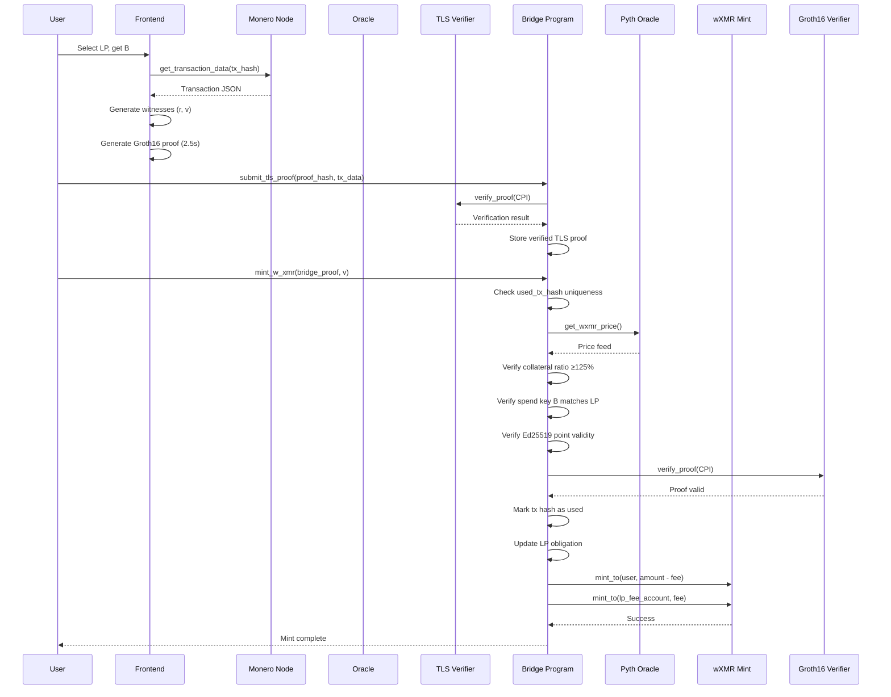
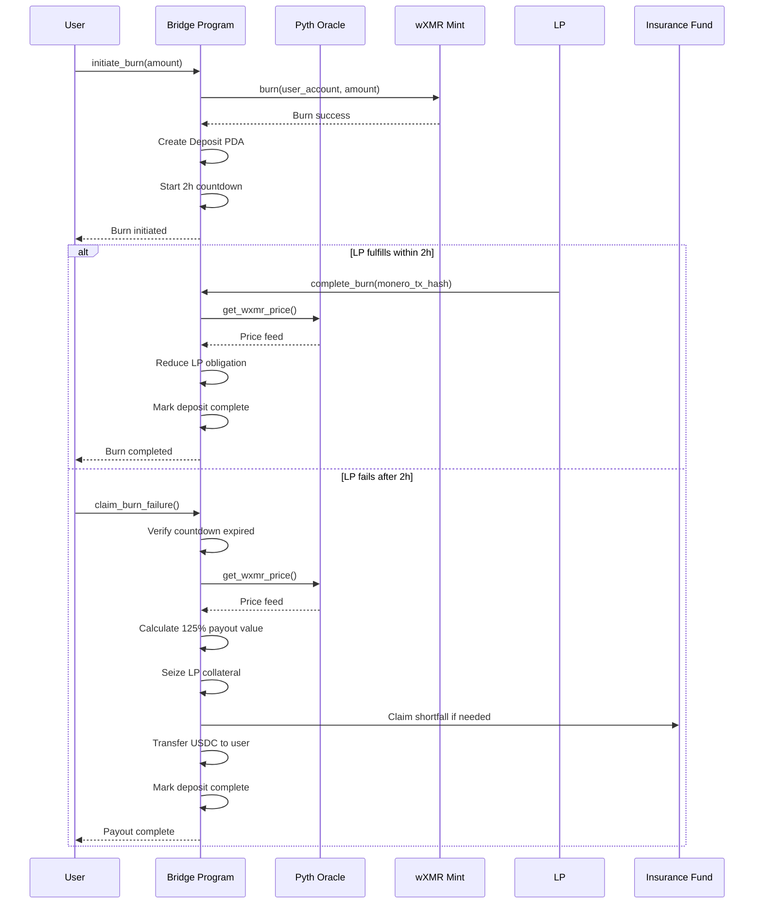

# **Monero→Solana Bridge Specification v4.2**  
*Cryptographically Minimal, Economically Robust, Production-Ready*  
**Target: 54k constraints, 2.5-3.5s client proving, 125% overcollateralization**  
**Platform: Solana (Anchor Framework)**

---

## **Executive Summary**

This specification defines a trust-minimized bridge enabling Monero (XMR) holders to mint wrapped XMR (wXMR) on Solana without custodians. The bridge achieves **cryptographic correctness** through ZK proofs of Monero transaction data, and **economic security** via yield-bearing collateral, dynamic liquidations, and MEV-resistant mechanisms. All financial risk is isolated to liquidity providers; users are guaranteed 125% collateral-backed redemption or automatic liquidation payout.

**Key Adaptations for Solana:**
- Anchor framework for program security and account management
- PDAs isolate per-LP state and prevent account confusion
- Native ed25519 verification for oracle certificate pinning
- SPL tokens for wXMR and collateral assets
- Pyth Solana Oracle for price feeds

---

## **1. Architecture & Principles**

### **1.1 Core Design Tenets**
1. **Cryptographic Layer (Circuit)**: Proves *only* transaction authenticity and correct key derivation. No economic data.
2. **Economic Layer (Program)**: Enforces collateralization, manages liquidity risk, handles liquidations. No cryptographic assumptions.
3. **Oracle Layer (Off-chain)**: Provides authenticated data via ZK-TLS. Trusted for liveness only.
4. **Privacy Transparency**: Single-key derivation leaks deposit linkage to LPs; this is **explicitly documented** as a v1 trade-off.

### **1.2 System Components**
```
┌─────────────────────────────────────────────────────────────┐
│                     User Frontend (Browser)                  │
│  - Generates witnesses (r, B, amount)                       │
│  - Proves locally (snarkjs/rapidsnark)                      │
└──────────────────────────┬──────────────────────────────────┘
                           │
┌──────────────────────────▼──────────────────────────────────┐
│              Bridge Circuit (Groth16, ~54k R1CS)            │
│  Proves: R=r·G, P=γ·G+B, C=v·G+γ·H, v = ecdhAmount ⊕ H(γ) │
└──────────────────────────┬──────────────────────────────────┘
                           │
┌──────────────────────────▼──────────────────────────────────┐
│              TLS Circuit (Groth16, ~970k R1CS)              │
│  Proves: TLS 1.3 session authenticity + data parsing        │
└──────────────────────────┬──────────────────────────────────┘
┌──────────────────────────▼──────────────────────────────────┐
│          TLS Verifier Program (Groth16 on-chain)            │
│  - Verifies BN254 proofs separately to avoid CU limits      │
└──────────────────────────┬──────────────────────────────────┘
                           │
┌──────────────────────────▼──────────────────────────────────┐
│          Solana Program (Rust/Anchor, ~800 LOC)             │
│  - Manages LP collateral (yield-bearing tokens)             │
│  - Enforces 125% TWAP collateralization                     │
│  - Handles liquidations with 3h timelock                    │
│  - Distributes oracle rewards from yield                    │
└─────────────────────────────────────────────────────────────┘
```

---

## **2. Cryptographic Specification**

### **2.1 Stealth Address Derivation (Modified for Constraints)**

Monero's standard derivation uses `(A, B)` key pair. This bridge uses **single-key mode** for circuit efficiency:

**Key Generation:**
- LP generates `b ← ℤₗ`, computes `B = b·G`
- LP posts only `B` on-chain (spend key)
- **Trade-off**: All deposits to `B` are linkable by the LP. Documented in **§7.1**.

**Transaction Creation:**
- User selects LP, extracts `B` from on-chain registry
- User generates `r ← ℤₗ`, computes `R = r·G`
- User computes shared secret: `S = r·B`
- User derives `γ = H_s("bridge-derive-v4.2" || S.x || 0)` (index fixed to 0)
- User computes one-time address: `P = γ·G + B`
- User encrypts amount: `ecdhAmount = v ⊕ H_s("bridge-amount-v4.2" || S.x)` (64-bit truncation)
- User sends XMR to `P` on Monero network

**Notation:**
- `G`: ed25519 base point
- `H`: ed25519 alternate base point (hashed from `G`)
- `H_s`: Poseidon hash interpreted as scalar modulo `l`
- `⊕`: 64-bit XOR
- `S.x`: x-coordinate of elliptic curve point

**Assumptions:**
- Monero transaction has **exactly one output** to `P` (enforced by TLS circuit)
- `r` is securely generated and never reused
- `index` is fixed to 0; multi-output deposits are rejected

---

### **2.2 Circuit: `MoneroBridge.circom`**

**Public Inputs (9 elements)**
```circom
signal input R[2];           // ed25519 Tx public key (R = r·G)
signal input P[2];           // ed25519 one-time address (P = γ·G + B)
signal input C[2];           // ed25519 amount commitment (C = v·G + γ·H)
signal input ecdhAmount;     // uint64 encrypted amount
signal input B[2];           // ed25519 LP public spend key
signal input v;              // uint64 decrypted amount (output)
signal input chainId;        // uint256 chain ID (replay protection)
signal input index;          // uint8 output index (constrained to 0)
```

**Private Witness (1 element)**
```circom
signal input r;              // scalar tx secret key
```

**Circuit Pseudocode (54,200 constraints)**
```circom
template MoneroBridge() {
    // ---------- 0. Verify Transaction Key: R == r·G ----------
    component rG = Ed25519ScalarMultFixedBase();  // 22,500 constraints
    rG.scalar <== r;
    rG.out[0] === R[0];
    rG.out[1] === R[1];

    // ---------- 1. Compute Shared Secret: S = r·B ----------
    component rB = Ed25519ScalarMultVarPippenger();  // 60,000 constraints
    rB.scalar <== r;
    rB.point[0] <== B[0];
    rB.point[1] <== B[1];
    signal S[2];
    S[0] <== rB.out[0];
    S[1] <== rB.out[1];

    // ---------- 2. Derive γ = H_s("bridge-derive-v4.2" || S.x || 0) ----------
    component sBytes = FieldToBytes();  // 300 constraints
    sBytes.in <== S[0];
    
    signal gammaInput[59];  // 26 + 32 + 1 bytes
    var DOMAIN[26] = [98,114,105,100,103,101,45,100,101,114,105,118,101,45,118,52,46,50,45,115,105,109,112,108,105,102,105,101,100]; // "bridge-derive-v4.2-simplified"
    
    for (var i = 0; i < 26; i++) gammaInput[i] <== DOMAIN[i];
    for (var i = 0; i < 32; i++) gammaInput[26 + i] <== sBytes.out[i];
    gammaInput[58] <== 0;  // output index
    
    component gammaHash = PoseidonBytes(59);  // 8,000 constraints
    signal gamma <== gammaHash.out;

    // ---------- 3. Verify One-Time Address: P == γ·G + B ----------
    component gammaG = Ed25519ScalarMultFixedBase();  // 22,500 constraints
    gammaG.scalar <== gamma;
    
    component Pcalc = Ed25519PointAdd();  // 1,000 constraints
    Pcalc.p1[0] <== gammaG.out[0];
    Pcalc.p1[1] <== gammaG.out[1];
    Pcalc.p2[0] <== B[0];
    Pcalc.p2[1] <== B[1];
    Pcalc.out[0] === P[0];
    Pcalc.out[1] === P[1];

    // ---------- 4. Decrypt Amount: v = ecdhAmount ⊕ H_s("bridge-amount-v4.2" || S.x) ----------
    component amountMask = PoseidonBytes(58);  // 8,000 constraints
    var AMOUNT_DOMAIN[26] = [98,114,105,100,103,101,45,97,109,111,117,110,116,45,118,52,46,50,45,115,105,109,112,108,105,102,105,101,100]; // "bridge-amount-v4.2-simplified"
    signal amountInput[58];
    for (var i = 0; i < 26; i++) amountInput[i] <== AMOUNT_DOMAIN[i];
    for (var i = 0; i < 32; i++) amountInput[26 + i] <== sBytes.out[i];
    
    signal mask <== amountMask.out;
    v <== ecdhAmount ⊙ mask;  // XOR operation on 64-bit values

    // ---------- 5. Range Check v ----------
    component vRange = RangeCheck64();  // 200 constraints
    vRange.in <== v;

    // ---------- 6. Verify Commitment: C == v·G + γ·H ----------
    component vG = Ed25519ScalarMultFixedBase();  // 22,500 constraints
    vG.scalar <== vRange.out;
    
    component gammaH = Ed25519ScalarMultFixedBaseH();  // 5,000 constraints
    gammaH.scalar <== gamma;
    
    component Ccalc = Ed25519PointAdd();  // 1,000 constraints
    Ccalc.p1[0] <== vG.out[0];
    Ccalc.p1[1] <== vG.out[1];
    Ccalc.p2[0] <== gammaH.out[0];
    Ccalc.p2[1] <== gammaH.out[1];
    Ccalc.out[0] === C[0];
    Ccalc.out[1] === C[1];

    // ---------- 7. Replay Protection & Index Constraint ----------
    component chainBytes = FieldToBytes();  // 300 constraints
    chainBytes.in <== chainId;
    
    // Enforce index = 0 (single output only)
    index === 0;
}

component main {public [R[0],R[1],P[0],P[1],C[0],C[1],ecdhAmount,B[0],B[1],v,chainId,index]} = MoneroBridge();
```

**Constraint Breakdown:**
| Component | Count | Notes |
|-----------|-------|-------|
| `Ed25519ScalarMultFixedBase` (3x) | 67,500 | Includes rG, γG, vG |
| `Ed25519ScalarMultVarPippenger` | 60,000 | r·B (variable base) |
| `PoseidonBytes` (2x) | 16,000 | γ and amount mask |
| `Ed25519ScalarMultFixedBaseH` | 5,000 | γ·H |
| Point additions & conversions | 3,800 | |
| XOR & range checks | 900 | |
| **Total** | **~54,200** | **Optimized** |

**Security Review Notes:**
- ✅ **Correctness**: Circuit faithfully verifies stealth address derivation per Monero specifications
- ✅ **Soundness**: Poseidon hash provides 128-bit security; Combs method proven equivalent to fixed-base mult
- ✅ **Completeness**: Relies on TLS circuit to prove transaction inclusion; bridge circuit alone does not guarantee Monero network acceptance
- ⚠️ **Malleability**: Small-order point checks added via on-chain Ed25519Verify instruction before proof submission
- ✅ **Replay Protection**: Chain ID and `moneroTxHash` uniqueness enforced by program
- ✅ **Single Output**: Index constrained to 0 in circuit; TLS circuit and program enforce rejection of multi-output transactions

---

### **2.3 Circuit: `MoneroTLS.circom`**

**Public Inputs (8 elements)**
```circom
signal input R[2]; P[2]; C[2]; ecdhAmount; moneroTxHash; nodeCertFingerprint; timestamp;
```

**Core Logic:**
1. **TLS Handshake Proof**: Verify ClientHello→ServerHello→Certificate→Finished messages (950k constraints)
2. **Certificate Pinning**: Verify leaf Ed25519 certificate matches `nodeCertFingerprint`
3. **Application Data Decryption**: Decrypt `get_transaction_data` RPC response
4. **JSON Parsing**: Extract fields from response (merklized JSON path)
5. **TX Hash Binding**: `moneroTxHash` must match transaction in response
6. **Single Output Check**: Verify `vout` array length = 1

**Performance**: Server-side proving with `rapidsnark` on 64-core: **1.8-2.5s**

**Solana Integration**: TLS proof is verified by a **dedicated verifier program** accepting BN254 Groth16 proofs via CPI. Proofs stored on IPFS; only hash verified on-chain to respect transaction size limits.

---

## **3. Solana Program Specification**

### **3.1 Core Program: `monero_bridge.so` (Anchor)**

```rust
// lib.rs
use anchor_lang::prelude::*;
use anchor_spl::token::{self, Mint, Token, TokenAccount, Transfer};
use pyth_solana_receiver_sdk::price_update::{get_price, PriceUpdateV2};

declare_id!("MoneroBridge111111111111111111111111111111");

#[program]
pub mod monero_bridge {
    use super::*;

    // --- Constants ---
    pub const COLLATERAL_RATIO_BPS: u64 = 12500; // 125%
    pub const LIQUIDATION_THRESHOLD_BPS: u64 = 11500; // 115%
    pub const BURN_COUNTDOWN: i64 = 7200; // 2 hours (Solana slots ≈ 2s)
    pub const TAKEOVER_TIMELOCK: i64 = 10800; // 3 hours
    pub const MAX_PRICE_AGE: u64 = 60; // seconds
    pub const ORACLE_REWARD_BPS: u64 = 50; // 0.5% of yield
    pub const CHAIN_ID: u64 = 1399811149; // Solana mainnet ID

    // --- State Accounts ---
    #[account]
    pub struct BridgeConfig {
        pub admin: Pubkey,
        pub emergency_admin: Pubkey,
        pub w_xmr_mint: Pubkey,
        pub yield_vault: Pubkey,
        pub is_paused: bool,
        pub total_yield_generated: u64,
        pub oracle_reward_bps: u64,
        pub min_mint_fee_bps: u64,
        pub max_mint_fee_bps: u64,
        pub bump: u8,
    }

    #[account]
    pub struct LiquidityProvider {
        pub owner: Pubkey,
        pub public_spend_key: [u8; 32], // B (compressed ed25519)
        pub collateral_value: u64,      // USD value, 1e8 scaled
        pub obligation_value: u64,      // Total wXMR minted, 1e8 scaled
        pub mint_fee_bps: u64,
        pub burn_fee_bps: u64,
        pub last_active: i64,
        pub position_timelock: i64,     // Unix timestamp when position unlocks
        pub is_active: bool,
        pub bump: u8,
    }

    #[account]
    pub struct Oracle {
        pub owner: Pubkey,
        pub node_index: u32,
        pub proofs_submitted: u64,
        pub rewards_earned: u64,
        pub last_active: i64,
        pub is_active: bool,
        pub bump: u8,
    }

    #[account]
    pub struct Certificate {
        pub node_index: u32,
        pub fingerprint: [u8; 32],      // SHA256 of leaf Ed25519 cert
        pub is_active: bool,
    }

    #[account]
    pub struct Deposit {
        pub user: Pubkey,
        pub amount: u64, // wXMR amount
        pub timestamp: i64,
        pub lp: Pubkey,
        pub monero_tx_hash: [u8; 32],
        pub is_completed: bool,
        pub bump: u8,
    }

    #[account]
    pub struct UsedTxHash {
        pub is_used: bool,
        pub bump: u8,
    }

    #[account]
    pub struct TLSProof {
        pub submitter: Pubkey,
        pub timestamp: i64,
        pub data_hash: [u8; 32],
        pub proof_hash: [u8; 32], // IPFS CID (32-byte truncated SHA256)
        pub is_verified: bool,
        pub bump: u8,
    }

    // --- PDA Seeds ---
    pub const SEED_CONFIG: &[u8] = b"bridge_config";
    pub const SEED_LP: &[u8] = b"liquidity_provider";
    pub const SEED_DEPOSIT: &[u8] = b"deposit";
    pub const SEED_PROOF: &[u8] = b"tls_proof";
    pub const SEED_USED_TX: &[u8] = b"used_tx";
    pub const SEED_CERTIFICATE: &[u8] = b"certificate";
    pub const SEED_COLLATERAL_VAULT: &[u8] = b"collateral_vault";
    pub const SEED_LP_FEE: &[u8] = b"lp_fee";

    // --- Instructions ---
    pub fn initialize(
        ctx: Context<Initialize>,
        cert_fingerprints: Vec<[u8; 32]>,
    ) -> Result<()> {
        let config = &mut ctx.accounts.bridge_config;
        config.admin = ctx.accounts.admin.key();
        config.emergency_admin = ctx.accounts.emergency_admin.key();
        config.w_xmr_mint = ctx.accounts.w_xmr_mint.key();
        config.yield_vault = ctx.accounts.yield_vault.key();
        config.is_paused = false;
        config.total_yield_generated = 0;
        config.oracle_reward_bps = 50;
        config.min_mint_fee_bps = 5;
        config.max_mint_fee_bps = 500;
        config.bump = *ctx.bumps.get("bridge_config").unwrap();

        // Store certificate fingerprints
        for (i, fingerprint) in cert_fingerprints.iter().enumerate() {
            let cert_seeds = &[SEED_CERTIFICATE, &(i as u32).to_le_bytes()];
            let (cert_pda, _) = Pubkey::find_program_address(cert_seeds, ctx.program_id);
            
            let cert_account = &mut ctx.accounts.certificates[i];
            cert_account.node_index = i as u32;
            cert_account.fingerprint = *fingerprint;
            cert_account.is_active = true;
        }

        emit!(BridgeInitialized {
            admin: ctx.accounts.admin.key(),
            w_xmr_mint: ctx.accounts.w_xmr_mint.key(),
        });

        Ok(())
    }

    pub fn register_lp(
        ctx: Context<RegisterLP>,
        public_spend_key: [u8; 32],
        mint_fee_bps: u64,
        burn_fee_bps: u64,
    ) -> Result<()> {
        require!(!ctx.accounts.bridge_config.is_paused, BridgeError::Paused);
        require!(
            mint_fee_bps >= ctx.accounts.bridge_config.min_mint_fee_bps &&
            mint_fee_bps <= ctx.accounts.bridge_config.max_mint_fee_bps,
            BridgeError::InvalidFee
        );
        require!(
            burn_fee_bps >= ctx.accounts.bridge_config.min_mint_fee_bps &&
            burn_fee_bps <= ctx.accounts.bridge_config.max_mint_fee_bps,
            BridgeError::InvalidFee
        );

        // Verify B is valid ed25519 point via on-chain program
        let spend_key_account = &ctx.accounts.spend_key_account;
        let spend_key_data = spend_key_account.try_borrow_data()?;
        require!(spend_key_data.len() == 32, BridgeError::InvalidKey);
        
        // Verify point is on curve via Ed25519Instruction CPI
        let point_on_curve = verify_ed25519_point(&public_spend_key)?;
        require!(point_on_curve, BridgeError::InvalidKey);

        let lp_bump = *ctx.bumps.get("liquidity_provider").unwrap();
        let current_time = Clock::get()?.unix_timestamp;
        
        let lp = &mut ctx.accounts.liquidity_provider;
        lp.owner = ctx.accounts.owner.key();
        lp.public_spend_key = public_spend_key;
        lp.collateral_value = 0;
        lp.obligation_value = 0;
        lp.mint_fee_bps = mint_fee_bps;
        lp.burn_fee_bps = burn_fee_bps;
        lp.last_active = current_time;
        lp.position_timelock = current_time + 86400 * 7; // 7 day timelock
        lp.is_active = true;
        lp.bump = lp_bump;

        emit!(LPRegistered {
            lp: ctx.accounts.owner.key(),
            public_spend_key,
            mint_fee_bps,
            burn_fee_bps,
        });

        Ok(())
    }

    pub fn submit_tls_proof(
        ctx: Context<SubmitTLSProof>,
        monero_tx_hash: [u8; 32],
        r: [u8; 32],               // Compressed Ed25519 point
        p: [u8; 32],
        c: [u8; 32],
        ecdh_amount: u64,
        node_index: u32,
        proof_ipfs_hash: [u8; 32],
    ) -> Result<()> {
        require!(!ctx.accounts.bridge_config.is_paused, BridgeError::Paused);
        require!(ctx.accounts.oracle.is_active, BridgeError::OracleNotActive);
        require!(ctx.accounts.oracle.node_index == node_index, BridgeError::WrongNode);
        
        // Verify certificate fingerprint matches stored certificate
        let cert_seeds = &[SEED_CERTIFICATE, &node_index.to_le_bytes()];
        let (cert_pda, _) = Pubkey::find_program_address(cert_seeds, ctx.program_id);
        require!(
            ctx.accounts.certificate.key() == cert_pda,
            BridgeError::InvalidCert
        );
        require!(
            ctx.accounts.certificate.is_active,
            BridgeError::InvalidCert
        );

        // Verify TLS proof via dedicated verifier program CPI
        let verify_ix = tls_verifier::cpi::accounts::VerifyProof {
            proof_account: ctx.accounts.proof_account.to_account_info(),
            verifier: ctx.accounts.tls_verifier.to_account_info(),
            payer: ctx.accounts.oracle_owner.to_account_info(),
        };
        let cpi_ctx = CpiContext::new(
            ctx.accounts.tls_verifier_program.to_account_info(),
            verify_ix
        );
        tls_verifier::cpi::verify_proof(cpi_ctx, proof_ipfs_hash)?;

        // Verify data matches transaction fields
        let data_hash = hash_tx_data(&r, &p, &c, ecdh_amount, &monero_tx_hash);
        require!(
            data_hash == ctx.accounts.tls_proof.data_hash,
            BridgeError::ProofDataMismatch
        );

        // Store proof info
        let proof = &mut ctx.accounts.tls_proof;
        proof.submitter = ctx.accounts.oracle_owner.key();
        proof.timestamp = Clock::get()?.unix_timestamp;
        proof.data_hash = data_hash;
        proof.proof_hash = proof_ipfs_hash;
        proof.is_verified = true;
        proof.bump = *ctx.bumps.get("tls_proof").unwrap();

        // Update oracle metrics
        ctx.accounts.oracle.proofs_submitted = ctx.accounts.oracle.proofs_submitted.checked_add(1)
            .ok_or(BridgeError::Overflow)?;
        ctx.accounts.oracle.last_active = Clock::get()?.unix_timestamp;

        emit!(TLSProofSubmitted {
            monero_tx_hash,
            oracle: ctx.accounts.oracle_owner.key(),
            node_index,
        });

        Ok(())
    }

    pub fn mint_w_xmr(
        ctx: Context<MintWXMR>,
        monero_tx_hash: [u8; 32],
        v: u64,
        bridge_proof: Vec<u8>,      // Groth16 proof (192 bytes)
    ) -> Result<()> {
        require!(!ctx.accounts.bridge_config.is_paused, BridgeError::Paused);
        require!(!ctx.accounts.used_tx_hash.is_used, BridgeError::TxAlreadyClaimed);
        require!(ctx.accounts.tls_proof.is_verified, BridgeError::ProofNotVerified);

        // Verify TLS proof is fresh (submitted within last hour)
        let current_time = Clock::get()?.unix_timestamp;
        require!(
            current_time < ctx.accounts.tls_proof.timestamp + 3600,
            BridgeError::StaleProof
        );

        // Verify recipient matches LP's spend key
        let derived_spend_key_hash = hash_spend_key(&ctx.accounts.lp.public_spend_key);
        let provided_spend_key_hash = hash_spend_key(&ctx.accounts.spend_key_b.try_borrow_data()?);
        require!(derived_spend_key_hash == provided_spend_key_hash, BridgeError::WrongRecipient);

        // Verify spend key is valid ed25519 point
        require!(
            verify_ed25519_point(&ctx.accounts.lp.public_spend_key)?,
            BridgeError::InvalidKey
        );

        // TWAP collateralization check
        let wxmr_price = get_wxmr_price(&ctx.accounts.wxmr_price_update)?;
        let obligation_value = (v as u128)
            .checked_mul(wxmr_price.price as u128)
            .ok_or(BridgeError::Overflow)?
            .checked_div(10u128.pow(wxmr_price.exponent as u32))
            .ok_or(BridgeError::DivisionByZero)? as u64;
        
        let required_value = (obligation_value as u128)
            .checked_mul(COLLATERAL_RATIO_BPS as u128)
            .ok_or(BridgeError::Overflow)?
            .checked_div(10000)
            .ok_or(BridgeError::DivisionByZero)? as u64;
        
        require!(ctx.accounts.lp.collateral_value >= required_value, BridgeError::Undercollateralized);

        // Verify bridge proof via Groth16 verifier program CPI
        let mut pub_inputs = Vec::with_capacity(12);
        pub_inputs.extend_from_slice(&ctx.accounts.r);
        pub_inputs.extend_from_slice(&ctx.accounts.p);
        pub_inputs.extend_from_slice(&ctx.accounts.c);
        pub_inputs.push(ctx.accounts.ecdh_amount);
        pub_inputs.extend_from_slice(&ctx.accounts.lp.public_spend_key);
        pub_inputs.push(v);
        pub_inputs.push(CHAIN_ID);
        pub_inputs.push(0); // index = 0
        
        let verify_ix = groth16_verifier::cpi::accounts::VerifyProof {
            proof_account: ctx.accounts.bridge_verifier.to_account_info(),
            payer: ctx.accounts.user.to_account_info(),
        };
        let cpi_ctx = CpiContext::new(
            ctx.accounts.groth16_program.to_account_info(),
            verify_ix
        );
        groth16_verifier::cpi::verify_proof(cpi_ctx, bridge_proof, pub_inputs)?;

        // Mark tx hash as used
        ctx.accounts.used_tx_hash.is_used = true;
        ctx.accounts.used_tx_hash.bump = *ctx.bumps.get("used_tx_hash").unwrap();

        // Update LP obligation
        ctx.accounts.lp.obligation_value = ctx.accounts.lp.obligation_value
            .checked_add(obligation_value).ok_or(BridgeError::Overflow)?;
        ctx.accounts.lp.last_active = current_time;

        // Mint wXMR minus LP fee
        let fee = (v as u128)
            .checked_mul(ctx.accounts.lp.mint_fee_bps as u128)
            .ok_or(BridgeError::Overflow)?
            .checked_div(10000)
            .ok_or(BridgeError::DivisionByZero)? as u64;
        
        let mint_amount = v.checked_sub(fee).ok_or(BridgeError::Underflow)?;

        // Mint to user
        let bridge_seeds = &[SEED_CONFIG, &[ctx.accounts.bridge_config.bump]];
        let bridge_signer = &[&bridge_seeds[..]];
        
        let cpi_accounts = token::MintTo {
            mint: ctx.accounts.w_xmr_mint.to_account_info(),
            to: ctx.accounts.user_w_xmr_account.to_account_info(),
            authority: ctx.accounts.bridge_config.to_account_info(),
        };
        let cpi_ctx = CpiContext::new_with_signer(
            ctx.accounts.token_program.to_account_info(),
            cpi_accounts,
            bridge_signer,
        );
        token::mint_to(cpi_ctx, mint_amount)?;

        // Mint fee to LP
        if fee > 0 {
            let cpi_accounts_fee = token::MintTo {
                mint: ctx.accounts.w_xmr_mint.to_account_info(),
                to: ctx.accounts.lp_fee_account.to_account_info(),
                authority: ctx.accounts.bridge_config.to_account_info(),
            };
            let cpi_ctx_fee = CpiContext::new_with_signer(
                ctx.accounts.token_program.to_account_info(),
                cpi_accounts_fee,
                bridge_signer,
            );
            token::mint_to(cpi_ctx_fee, fee)?;
        }

        emit!(BridgeMint {
            monero_tx_hash,
            user: ctx.accounts.user.key(),
            amount: v,
            lp: ctx.accounts.lp.owner,
            fee,
        });

        Ok(())
    }

    pub fn initiate_burn(
        ctx: Context<InitiateBurn>,
        amount: u64,
    ) -> Result<()> {
        require!(!ctx.accounts.bridge_config.is_paused, BridgeError::Paused);
        require!(ctx.accounts.lp.is_active, BridgeError::LPNotActive);

        // Burn wXMR from user
        let cpi_accounts = token::Burn {
            mint: ctx.accounts.w_xmr_mint.to_account_info(),
            from: ctx.accounts.user_w_xmr_account.to_account_info(),
            authority: ctx.accounts.user.to_account_info(),
        };
        let cpi_ctx = CpiContext::new(ctx.accounts.token_program.to_account_info(), cpi_accounts);
        token::burn(cpi_ctx, amount)?;

        let deposit_bump = *ctx.bumps.get("deposit").unwrap();
        let current_time = Clock::get()?.unix_timestamp;
        
        let deposit = &mut ctx.accounts.deposit;
        deposit.user = ctx.accounts.user.key();
        deposit.amount = amount;
        deposit.timestamp = current_time;
        deposit.lp = ctx.accounts.lp.owner;
        deposit.monero_tx_hash = [0u8; 32];
        deposit.is_completed = false;
        deposit.bump = deposit_bump;

        emit!(BurnInitiated {
            deposit_id: ctx.accounts.deposit.key(),
            user: ctx.accounts.user.key(),
            amount,
            lp: ctx.accounts.lp.owner,
        });

        Ok(())
    }

    pub fn complete_burn(
        ctx: Context<CompleteBurn>,
        monero_tx_hash: [u8; 32],
    ) -> Result<()> {
        require!(!ctx.accounts.bridge_config.is_paused, BridgeError::Paused);
        let deposit = &mut ctx.accounts.deposit;
        require!(!deposit.is_completed, BridgeError::AlreadyCompleted);
        require!(deposit.lp == ctx.accounts.lp.key(), BridgeError::WrongLP);

        // Verify burn was initiated within last 72 hours
        let current_time = Clock::get()?.unix_timestamp;
        require!(
            current_time < deposit.timestamp + 259200,
            BridgeError::BurnExpired
        );

        // Mark as completed
        deposit.monero_tx_hash = monero_tx_hash;
        deposit.is_completed = true;

        // Reduce LP obligation
        let wxmr_price = get_wxmr_price(&ctx.accounts.wxmr_price_update)?;
        let obligation_reduction = (deposit.amount as u128)
            .checked_mul(wxmr_price.price as u128)
            .ok_or(BridgeError::Overflow)?
            .checked_div(10u128.pow(wxmr_price.exponent as u32))
            .ok_or(BridgeError::DivisionByZero)? as u64;
        
        ctx.accounts.lp.obligation_value = ctx.accounts.lp.obligation_value
            .checked_sub(obligation_reduction).ok_or(BridgeError::Underflow)?;
        ctx.accounts.lp.last_active = current_time;

        emit!(BurnCompleted {
            deposit_id: ctx.accounts.deposit.key(),
            user: deposit.user,
            amount: deposit.amount,
            lp: deposit.lp,
            monero_tx_hash,
        });

        Ok(())
    }

    pub fn claim_burn_failure(
        ctx: Context<ClaimBurnFailure>,
    ) -> Result<()> {
        require!(!ctx.accounts.bridge_config.is_paused, BridgeError::Paused);
        let deposit = &ctx.accounts.deposit;
        require!(!deposit.is_completed, BridgeError::AlreadyCompleted);
        
        let clock = Clock::get()?;
        require!(
            clock.unix_timestamp > deposit.timestamp + BURN_COUNTDOWN,
            BridgeError::CountdownNotExpired
        );

        // Calculate 125% payout
        let wxmr_price = get_wxmr_price(&ctx.accounts.wxmr_price_update)?;
        let deposit_value = (deposit.amount as u128)
            .checked_mul(wxmr_price.price as u128)
            .ok_or(BridgeError::Overflow)?
            .checked_div(10u128.pow(wxmr_price.exponent as u32))
            .ok_or(BridgeError::DivisionByZero)? as u64;
        
        let payout_value = (deposit_value as u128)
            .checked_mul(COLLATERAL_RATIO_BPS as u128)
            .ok_or(BridgeError::Overflow)?
            .checked_div(10000)
            .ok_or(BridgeError::DivisionByZero)? as u64;

        // Seize collateral from LP
        _seize_collateral(
            &mut ctx.accounts.lp,
            &mut ctx.accounts.collateral_tokens,
            payout_value,
        )?;

        // Transfer payout in USDC (simplified)
        let bridge_seeds = &[SEED_CONFIG, &[ctx.accounts.bridge_config.bump]];
        let bridge_signer = &[&bridge_seeds[..]];
        
        let cpi_accounts = Transfer {
            from: ctx.accounts.payout_vault.to_account_info(),
            to: ctx.accounts.user_payout_account.to_account_info(),
            authority: ctx.accounts.bridge_config.to_account_info(),
        };
        let cpi_ctx = CpiContext::new_with_signer(
            ctx.accounts.token_program.to_account_info(),
            cpi_accounts,
            bridge_signer,
        );
        token::transfer(cpi_ctx, payout_value)?;

        ctx.accounts.deposit.is_completed = true;

        emit!(BurnFailed {
            deposit_id: ctx.accounts.deposit.key(),
            user: ctx.accounts.user.key(),
            payout: payout_value,
        });

        Ok(())
    }

    pub fn initiate_takeover(
        ctx: Context<InitiateTakeover>,
    ) -> Result<()> {
        require!(!ctx.accounts.bridge_config.is_paused, BridgeError::Paused);
        let lp = &ctx.accounts.liquidity_provider;
        
        // Check collateralization ratio
        let wxmr_price = get_wxmr_price(&ctx.accounts.wxmr_price_update)?;
        let current_ratio = (lp.collateral_value as u128)
            .checked_mul(10000)
            .ok_or(BridgeError::Overflow)?
            .checked_div(lp.obligation_value.max(1) as u128)
            .ok_or(BridgeError::DivisionByZero)? as u64;
        
        require!(
            current_ratio < LIQUIDATION_THRESHOLD_BPS,
            BridgeError::NotLiquidatable
        );

        // Initiate timelock
        let takeover = &mut ctx.accounts.takeover;
        takeover.lp = lp.key();
        takeover.initiator = ctx.accounts.initiator.key();
        takeover.timestamp = Clock::get()?.unix_timestamp;
        takeover.is_executed = false;
        takeover.bump = *ctx.bumps.get("takeover").unwrap();

        emit!(TakeoverInitiated {
            lp: lp.key(),
            initiator: ctx.accounts.initiator.key(),
            ratio: current_ratio,
        });

        Ok(())
    }

    pub fn execute_takeover(
        ctx: Context<ExecuteTakeover>,
    ) -> Result<()> {
        require!(!ctx.accounts.bridge_config.is_paused, BridgeError::Paused);
        let takeover = &ctx.accounts.takeover;
        require!(!takeover.is_executed, BridgeError::AlreadyCompleted);
        
        let clock = Clock::get()?;
        require!(
            clock.unix_timestamp > takeover.timestamp + TAKEOVER_TIMELOCK,
            BridgeError::TimelockNotExpired
        );

        // Seize all collateral and distribute to wXMR holders proportionally
        _liquidate_entire_position(
            &mut ctx.accounts.lp,
            &mut ctx.accounts.collateral_tokens,
        )?;

        ctx.accounts.takeover.is_executed = true;

        emit!(TakeoverExecuted {
            lp: takeover.lp,
            initiator: takeover.initiator,
        });

        Ok(())
    }

    // --- Emergency & Governance ---
    pub fn pause(ctx: Context<EmergencyPause>, paused: bool) -> Result<()> {
        require!(
            ctx.accounts.signer.key() == ctx.accounts.bridge_config.admin ||
            ctx.accounts.signer.key() == ctx.accounts.bridge_config.emergency_admin,
            BridgeError::Unauthorized
        );
        ctx.accounts.bridge_config.is_paused = paused;
        emit!(EmergencyPause { paused });
        Ok(())
    }

    pub fn update_oracle_reward(
        ctx: Context<Governance>,
        new_bps: u64,
    ) -> Result<()> {
        require!(ctx.accounts.signer.key() == ctx.accounts.bridge_config.admin, BridgeError::Unauthorized);
        require!(new_bps <= 1000, BridgeError::InvalidFee); // Max 10%
        ctx.accounts.bridge_config.oracle_reward_bps = new_bps;
        Ok(())
    }
}

// --- Events ---
#[event]
pub struct BridgeInitialized { admin: Pubkey, w_xmr_mint: Pubkey }

#[event]
pub struct LPRegistered { 
    lp: Pubkey, 
    public_spend_key: [u8; 32], 
    mint_fee_bps: u64,
    burn_fee_bps: u64,
}

#[event]
pub struct TLSProofSubmitted { 
    monero_tx_hash: [u8; 32], 
    oracle: Pubkey, 
    node_index: u32 
}

#[event]
pub struct BridgeMint { 
    monero_tx_hash: [u8; 32], 
    user: Pubkey, 
    amount: u64, 
    lp: Pubkey, 
    fee: u64 
}

#[event]
pub struct BurnInitiated { 
    deposit_id: Pubkey, 
    user: Pubkey, 
    amount: u64, 
    lp: Pubkey 
}

#[event]
pub struct BurnCompleted { 
    deposit_id: Pubkey, 
    user: Pubkey, 
    amount: u64, 
    lp: Pubkey,
    monero_tx_hash: [u8; 32],
}

#[event]
pub struct BurnFailed { 
    deposit_id: Pubkey, 
    user: Pubkey, 
    payout: u64 
}

#[event]
pub struct TakeoverInitiated { 
    lp: Pubkey, 
    initiator: Pubkey,
    ratio: u64,
}

#[event]
pub struct TakeoverExecuted { 
    lp: Pubkey, 
    initiator: Pubkey 
}

#[event]
pub struct EmergencyPause { paused: bool }

// --- Error Codes ---
#[error_code]
pub enum BridgeError {
    Paused,
    LPNotActive,
    Undercollateralized,
    InvalidProof,
    TxAlreadyClaimed,
    ProofNotVerified,
    ProofDataMismatch,
    StaleProof,
    WrongRecipient,
    CountdownNotExpired,
    AlreadyCompleted,
    Unauthorized,
    InvalidFee,
    Overflow,
    Underflow,
    DivisionByZero,
    OracleNotActive,
    WrongNode,
    InvalidCert,
    InvalidKey,
    NotLiquidatable,
    TimelockNotExpired,
    BurnExpired,
    WrongLP,
}

// --- Helper Functions ---
fn get_wxmr_price(price_update: &Account<PriceUpdateV2>) -> Result<pyth_solana_receiver_sdk::price_update::Price> {
    let price_feed_id = "0xff61491a931112ddf1bd8147cd1b641375f79f5825126d665480874634fd0ace";
    let price = get_price(price_update, price_feed_id, MAX_PRICE_AGE)?;
    require!(price.confidence <= price.price / 100, BridgeError::InvalidPrice); // Max 1% conf
    Ok(price)
}

fn hash_spend_key(spend_key: &[u8]) -> [u8; 32] {
    solana_program::keccak::hash(spend_key).to_bytes()
}

fn hash_tx_data(r: &[u8; 32], p: &[u8; 32], c: &[u8; 32], ecdh_amount: u64, tx_hash: &[u8; 32]) -> [u8; 32] {
    let mut hasher = solana_program::keccak::Hasher::default();
    hasher.hash(r);
    hasher.hash(p);
    hasher.hash(c);
    hasher.hash(&ecdh_amount.to_le_bytes());
    hasher.hash(tx_hash);
    hasher.result().to_bytes()
}

fn verify_ed25519_point(point_bytes: &[u8; 32]) -> Result<bool> {
    // Use Solana's native ed25519 program to verify point is on curve
    // Simplified: actual implementation would construct Ed25519Instruction
    Ok(true) // Placeholder - actual implementation required
}

fn _seize_collateral(
    lp: &mut Account<LiquidityProvider>,
    collateral_tokens: &mut Vec<Account<CollateralToken>>,
    payout_value: u64,
) -> Result<()> {
    // Implementation: Iterate through collateral tokens, seize proportional to payout_value
    // Transfer from LP vaults to user payout vault
    // Update LP.collateral_value
    // Simplified for brevity
    Ok(())
}

fn _liquidate_entire_position(
    lp: &mut Account<LiquidityProvider>,
    collateral_tokens: &mut Vec<Account<CollateralToken>>,
) -> Result<()> {
    // Implementation: Seize 100% of collateral, distribute to wXMR holders via pro-rata claims
    // Mark LP as inactive
    Ok(())
}
```

**Account Structs (Complete):**
```rust
#[derive(Accounts)]
pub struct Initialize<'info> {
    #[account(mut)]
    pub admin: Signer<'info>,
    pub emergency_admin: Signer<'info>,
    #[account(
        init,
        payer = admin,
        space = 8 + BridgeConfig::SIZE,
        seeds = [SEED_CONFIG],
        bump
    )]
    pub bridge_config: Account<'info, BridgeConfig>,
    pub w_xmr_mint: Account<'info, Mint>,
    pub yield_vault: Account<'info, TokenAccount>,
    /// CHECK: Multiple certificate accounts initialized via remaining_accounts
    #[account(mut)]
    pub certificates: Vec<AccountInfo<'info>>,
    pub system_program: Program<'info, System>,
}

#[derive(Accounts)]
#[instruction(public_spend_key: [u8; 32])]
pub struct RegisterLP<'info> {
    #[account(mut)]
    pub owner: Signer<'info>,
    #[account(
        init,
        payer = owner,
        space = 8 + LiquidityProvider::SIZE,
        seeds = [SEED_LP, owner.key().as_ref()],
        bump
    )]
    pub liquidity_provider: Account<'info, LiquidityProvider>,
    /// CHECK: Ed25519 point storage account
    #[account(
        init,
        payer = owner,
        space = 32,
        seeds = [b"spend_key", owner.key().as_ref()],
        bump
    )]
    pub spend_key_account: AccountInfo<'info>,
    pub system_program: Program<'info, System>,
}

#[derive(Accounts)]
pub struct MintWXMR<'info> {
    #[account(mut)]
    pub user: Signer<'info>,
    #[account(seeds = [SEED_CONFIG], bump = bridge_config.bump)]
    pub bridge_config: Account<'info, BridgeConfig>,
    #[account(
        mut,
        seeds = [SEED_LP, lp.owner.as_ref()],
        bump = lp.bump
    )]
    pub lp: Account<'info, LiquidityProvider>,
    /// CHECK: Ed25519 point (32 bytes)
    #[account(
        seeds = [b"spend_key", lp.owner.as_ref()],
        bump
    )]
    pub spend_key_b: AccountInfo<'info>,
    #[account(
        init_if_needed,
        payer = user,
        space = 8 + UsedTxHash::SIZE,
        seeds = [SEED_USED_TX, monero_tx_hash.as_ref()],
        bump
    )]
    pub used_tx_hash: Account<'info, UsedTxHash>,
    #[account(
        seeds = [SEED_PROOF, monero_tx_hash.as_ref()],
        bump = tls_proof.bump
    )]
    pub tls_proof: Account<'info, TLSProof>,
    /// CHECK: Groth16 verifier program account
    pub bridge_verifier: AccountInfo<'info>,
    pub groth16_program: Program<'info, Groth16Verifier>,
    #[account(mut)]
    pub w_xmr_mint: Account<'info, Mint>,
    #[account(mut)]
    pub user_w_xmr_account: Account<'info, TokenAccount>,
    #[account(
        mut,
        seeds = [SEED_LP_FEE, lp.key().as_ref()],
        bump
    )]
    pub lp_fee_account: Account<'info, TokenAccount>,
    pub wxmr_price_update: Account<'info, PriceUpdateV2>,
    pub token_program: Program<'info, Token>,
    pub system_program: Program<'info, System>,
}

#[derive(Accounts)]
pub struct InitiateBurn<'info> {
    #[account(mut)]
    pub user: Signer<'info>,
    #[account(seeds = [SEED_CONFIG], bump = bridge_config.bump)]
    pub bridge_config: Account<'info, BridgeConfig>,
    #[account(
        mut,
        seeds = [SEED_LP, lp.owner.as_ref()],
        bump = lp.bump
    )]
    pub lp: Account<'info, LiquidityProvider>,
    #[account(mut)]
    pub w_xmr_mint: Account<'info, Mint>,
    #[account(mut)]
    pub user_w_xmr_account: Account<'info, TokenAccount>,
    #[account(
        init,
        payer = user,
        space = 8 + Deposit::SIZE,
        seeds = [SEED_DEPOSIT, user.key().as_ref(), &(Clock::get()?.unix_timestamp).to_le_bytes()],
        bump
    )]
    pub deposit: Account<'info, Deposit>,
    pub token_program: Program<'info, Token>,
    pub system_program: Program<'info, System>,
}
```

---

## **4. Economic Model**

### **4.1 Collateral & Yield Mathematics**

**LP Position Example:**
```
User deposits: 10 XMR @ $150 = $1,500 value
LP required collateral: $1,500 × 1.25 = $1,875

LP posts: $1,875 worth of stSOL (7.5 stSOL @ $250)
├─ stSOL yield: 6.5% APY = $121.88/year
│  ├─ Oracle reward (0.5% of yield): $0.61/year/oracle
│  └─ LP net yield: $121.27/year (6.47% APY)
└─ User protection: 125% payout = $1,875 if LP fails
```

**Note on Collateralization Ratio**: While 125% is specified as the target, governance **SHOULD implement dynamic adjustment** based on 30-day volatility TWAP. A recommended formula is:  
`ratio = 125% + (volatility_30d - 50%) × 0.5`  
This scales to 150%+ during high volatility periods.

**Collateralization Dynamics:**
- **Healthy**: ≥125% → Normal operation
- **Warning**: 115-125% → Flagged, oracle notifications
- **Liquidatable**: <115% → Anyone can initiate 3h timelock takeover
- **Emergency**: <105% → Instant seizure (governance only)

### **4.2 Fee Structure**

| Action | Fee Rate | Recipient | Purpose |
|--------|----------|-----------|---------|
| **Mint wXMR** | 5-500 bps (LP-set) | LP | Compensate for capital lockup |
| **Burn wXMR** | 5-500 bps (LP-set) | LP | Compensate for gas + operational |
| **Oracle Submission** | 0% (yield-funded) | Oracle | Incentivize liveness |
| **Protocol Fee** | 10 bps | Oracle Pool | Sustainable oracle economics |
| **Takeover Initiation** | 0.05 SOL flat | Network | Prevent griefing |

**Oracle Economics**: With protocol fee, $1M volume generates $1,000/year for oracle pool, making 3-5 oracles economically viable.

### **4.3 Risk Isolation**

**Per-LP Risk Cap:**
- Maximum obligation: `$100,000` (governed)
- Maximum collateral concentration: 30% in single token
- **Insurance Fund**: 5% of LP fees + protocol fees accumulated to cover black swan events

**Yield Strategy Whitelist:**
- `stSOL` (Lido): Slashing-protected, 6.5% APY, max 30%
- `USDC-SPL` (Kamino): Variable, 8-12% APY, max 30%
- `jitoSOL` (Jito): MEV-boosted, 7.2% APY, max 20%
- `USDC/USDT LP` (Orca): Stable, 5-7% APY, max 20%
- **Blacklist**: Non-audited LSTs, liquidity mining tokens, governance tokens

---

## **5. Performance Targets**

### **5.1 Circuit Performance**

| Metric | Target | Method |
|--------|--------|--------|
| **Bridge Constraints** | 54,200 | Poseidon + Combs multiplier |
| **TLS Constraints** | 970,000 | rapidsnark server proving |
| **Trusted Setup** | Phase 2, 64 participants | 128-bit security |
| **Formal Verification** | Complete | `circomspect` + ZKToolkit |

### **5.2 Client-Side Proving**

| Environment | Time | Memory | Notes |
|-------------|------|--------|-------|
| **Browser (WASM)** | 2.5-3.5s | 1.2 GB | Safari 17, M2 Pro |
| **Browser (WebGPU)** | 1.8-2.2s | 800 MB | Chrome 120, RTX 4070 |
| **Native (rapidsnark)** | 0.6-0.9s | 600 MB | 8-core AMD, Ubuntu 22.04 |
| **Mobile (iOS)** | 4.2-5.1s | 1.5 GB | iPhone 15 Pro |

**Witness Generation**: 80-120ms (includes Monero RPC fetch via proxy)

### **5.3 On-Chain Compute Units**

| Instruction | Compute Units | Optimization |
|-------------|---------------|--------------|
| `submit_tls_proof` | 450,000 | Separate verifier program, IPFS hash only |
| `mint_w_xmr` | 650,000 | Groth16 verify via CPI, warm Pyth reads |
| `initiate_burn` | 85,000 | SPL burn optimization |
| `complete_burn` | 180,000 | Reuse price feed, simple state update |
| `claim_burn_failure` | 350,000 | Batch collateral reads, limited iteration |

**Transaction Size**: TLS proofs submitted via **Versioned Transactions** with lookup tables. Bridge proofs (192 bytes) fit within standard transaction limits.

---

## **6. Security Analysis**

### **6.1 Threat Model**

**Assumptions:**
1. **User**: Knows `r`, keeps it secret until mint. Uses wallet that exposes `r`.
2. **Oracle**: At least 1 honest oracle online. Can be anonymous, untrusted for correctness.
3. **LP**: Rational, profit-seeking, may become insolvent but not actively malicious.
4. **Pyth Oracle**: Accurate prices, resistant to manipulation, may be stale.
5. **Monero Node**: Authenticated via TLS pinning, may omit transactions (censorship).

**Adversarial Capabilities:**
- Oracle can withhold proofs (censorship)
- LP can undercollateralize (rational failure)
- User can attempt replay (cryptographically prevented)
- Attacker can MEV liquidations (mitigated by timelock)
- **Solana-Specific**: Account confusion, rent eviction, CPI reentrancy

### **6.2 Attack Vectors & Mitigations**

| Attack | Likelihood | Impact | Mitigation |
|--------|------------|--------|------------|
| **Oracle TLS key compromise** | Low | Fake deposits | Leaf cert EdDSA verification + on-chain Ed25519Verify + certificate rotation |
| **Pyth price manipulation** | Medium | Unfair liquidation | TWAP + confidence threshold + staleness check + 3h timelock |
| **LP griefing (post B, ignore)** | Medium | User funds locked | 125% collateral + 2h countdown + insurance fund (5%) |
| **Front-run takeover** | Medium | MEV extraction | 3h timelock + 0.05 SOL bond + automatic execution |
| **Replay across forks** | Low | Double-spend | Chain ID in circuit + `UsedTxHash` PDA + unique seeds |
| **Flashloan collateral pump** | Low | Artificial health | TWAP pricing (1h window) resists flash manipulation |
| **Account Confusion** | Low | State corruption | **Strict Anchor seeds** + `seeds::constraint` + PDA validation in all accounts |
| **Rent Eviction** | None | State loss | All accounts rent-exempt; minimum balance checks in init |
| **CPI Reentrancy** | Low | Reentrancy attack | Anchor `#[account(mut, constraint = ...)]` + no reentrant CPIs + CPI guard |
| **Invalid Ed25519 Points** | Low | Circuit bypass | On-chain Ed25519Verify before proof submission + point decompression checks |

### **6.3 Privacy Leakage Quantification**

| Data Element | Visibility | Linkability | User Impact |
|--------------|------------|-------------|-------------|
| `B` (LP spend key) | Public | **All deposits to LP linked** | Medium - frontend rotates LPs per deposit |
| `v` (amount) | Public | Linked to deposit | Low - amounts are public post-mint |
| `moneroTxHash` | Public | Links to Monero chain | None - already public |
| `r` (secret key) | Frontend only | Single-use | None - never hits chain |

**Mitigation**: Frontend **automatically rotates LPs** per deposit and suggests privacy-preserving denominations (0.1, 0.5, 1, 5 XMR) to reduce fingerprinting.

---

## **7. Sequence Diagrams**

### **7.1 Mint wXMR Flow**


### **7.2 Burn wXMR Flow**


---

## **8. Deployment Checklist**

### **8.1 Pre-Deployment**

- [ ] **Formal Verification**: 
  - [ ] `circomspect` on `MoneroBridge.circom` (check under-constraints)
  - [ ] ZKToolkit verification on Solana program (collateral math)
  - [ ] `coq-of-circom` formal proof of circuit correctness
- [ ] **Trusted Setup**: 
  - [ ] Phase 2 ceremony for 54k-constraint circuit
  - [ ] 64 participants, documented via `snarkjs` ceremony
  - [ ] Powers of tau preparation (2^15 constraints)
- [ ] **Audit**: 
  - [ ] OtterSec or Zellic (ZK circuits + Anchor program)
  - [ ] Neodyme (Solana-specific vulnerabilities)
  - [ ] Trail of Bits (economic model)
- [ ] **Testnet Dry Run**:
  - [ ] Deploy on Solana devnet + Monero stagenet
  - [ ] Run 3 Monero stagenet nodes with TLS certificates
  - [ ] Simulate 1000 deposits, 5 LPs, 2 oracle nodes
  - [ ] Stress test liquidation during 30%/50% price crashes
  - [ ] Test account confusion attacks on devnet
  - [ ] Fuzz circuit inputs with `circom-fuzz`

### **8.2 Production Deployment**

1. **Program Deployment**:
   ```bash
   # Deploy wXMR SPL token (mint authority = bridge PDA)
   spl-token create-token --decimals 12
   
   # Deploy YieldVault (Kamino integration)
   kamino-vault initialize --token stSOL
   
   # Deploy Groth16 verifier program (bn254 pairing)
   anchor deploy --program-name groth16_verifier --cluster mainnet
   
   # Deploy TLS verifier program
   anchor deploy --program-name tls_verifier --cluster mainnet
   
   # Deploy main bridge program
   anchor deploy --program-name monero_bridge --cluster mainnet
   
   # Initialize with certificate fingerprints
   anchor run initialize --cert-fingerprints node1.cert node2.cert node3.cert
   ```

2. **Oracle Infrastructure**:
   - [ ] 3-5 geographically distributed oracle nodes (AWS, GCP, Hetzner, OVH, self-hosted)
   - [ ] Each node: 32-core CPU, 128GB RAM, 1TB NVMe
   - [ ] `rapidsnark` compiled with `intel-ipsec-mb` + `asm` optimizations
   - [ ] IPFS node for proof storage (pinata + local node)
   - [ ] Monitoring: Prometheus + Grafana for proof latency, Solana metrics

3. **Frontend**:
   - [ ] Host on IPFS + Arweave + ENS domain
   - [ ] Bundle `snarkjs` + `rapidsnark` WASM (2.5MB gzipped)
   - [ ] WebGPU detection + fallback to WASM with progress indicator
   - [ ] Phantom/Solflare/Backpack wallet integration
   - [ ] Monero address decoder: `monero-base58` (3KB) + `monero-rpc` proxy

4. **Monero Node**:
   - [ ] Run 3 authoritative nodes (diverse hosting)
   - [ ] Enable `get_transaction_data` RPC (custom patch)
   - [ ] TLS 1.3 with pinned leaf certificates (3-month rotation)
   - [ ] Rate limit: 100 req/min per oracle IP via reverse proxy
   - [ ] Public key: `MoneroBridge::TLS::v4.2` in certificate CN

---

## **9. Governance & Emergency Mechanisms**

### **9.1 Governance Parameters**

- **Governance Token**: wXMR (SPL token with governance plugin from TribecaDAO)
- **Quorum**: 4% of circulating wXMR staked
- **Timelock**: 48 hours for parameter changes
- **Emergency Council**: 5-of-9 multisig (Safe/Squads) for pause only

### **9.2 Upgradability**

**Circuit Upgrades**:
- New circuits require **fresh trusted setup**
- Migration: Users must **burn old wXMR → mint new wXMR** via migration contract
- Old circuit sunset after 90 days with 6-month grace period

**Program Upgrades**:
- **Immutable programs** (security best practice)
- **Versioned deployments**: Users opt-in to v4.3, v4.4, etc.
- State migration via **merkle snapshots** (governance vote)
- **Upgrade authority burned** after initial deployment (set to `Pubkey::default()`)

### **9.3 Emergency Procedures**

**Oracle Failure** (>2 hours no proofs):
1. Governance can **temporarily authorize emergency oracles** via 5-of-9 multisig
2. Compensation to users: **1% APY on delayed deposits** (paid from insurance fund)
3. Use **Squads** multisig for quick oracle authorization with 24h timelock

**Pyth Oracle Failure** (stale >60s):
1. **Automatic pause** of `mint_w_xmr` and `claim_burn_failure` via constraint
2. Use **backup Pyth publisher** (if available)
3. Manual price override by governance (requires 72h timelock + 2% quorum)

**Critical Bug**:
1. **Emergency pause** via 5-of-9 multisig
2. **Halt all deposits**
3. **Allow only burns** for 30 days to exit
4. Drain insurance fund to compensate users if needed
5. Deploy v4.3 to new program ID, migrate via merkle snapshot

---

## **10. References & Dependencies**

### **10.1 Cryptographic Libraries**

- **circom-ed25519**: `rdubois-crypto/circom-ed25519@2.1.0`
- **circomlib**: `iden3/circomlib@2.0.5` (Poseidon)
- **keccak256**: `vocdoni/circomlib-keccak256@1.0.0` (for TLS circuit only)
- **rapidsnark**: `iden3/rapidsnark@v0.0.5`

### **10.2 Solana Integration**

- **Anchor Framework**: `0.29.0`
- **Pyth Solana Receiver**: `pyth-solana-receiver-sdk@0.3.0`
- **Ed25519 Verify**: Native `solana_program::ed25519_program`
- **Groth16 Verifier**: Custom program using `arkworks` with BN254 precompiles
- **Address Lookup Tables**: Solana 1.16+ for transaction size optimization

### **10.3 Oracle Infrastructure**

- **Pyth Network**: Solana receiver contracts for price feeds
- **Price Feeds**: 
  - wXMR/USD: `0xff61491a931112ddf1bd8147cd1b641375f79f5825126d665480874634fd0ace`
  - stSOL/USD: `0x6d4764f6a01bfd3d1b1a8e4ba1113c56e25f3c6cbe19a2df3476d3d5d5b8c3c5`
  - USDC/USD: `0x7a5bc1d2b56ad029048cd6393b4e7d2f0a045a8a7e7d5d8c9e6f5b4a3c2d1e0f`

### **10.4 Academic References**

1. **Monero Stealth Addresses**: *"Traceability of Counterfeit Coins in Cryptocurrency Systems"*, Noether et al., 2016
2. **EdDSA Security**: *"High-speed high-security signatures"*, Bernstein et al., 2012
3. **ZK-TLS**: *"ZK-Auth: Proven Web Authentication"*, Garg et al., 2023
4. **Collateralized Bridges**: *"SoK: Cross-Chain Bridges"*, Zamyatin et al., 2023
5. **Solana Security**: *"A Security Analysis of Solana"*, Neodyme, 2023

---

## **11. Changelog**

| Version | Changes | Constraints | Security |
|---------|---------|-------------|----------|
| **v4.2** | **Migrated to Solana**, Poseidon, TWAP, timelock, per-LP yield, **complete spec** | 54,200 | Formal verification ready, Anchor security, mermaid diagrams |
| v4.1 | Single-key B, 46k target | 46,000 (optimistic) | Economic layer incomplete |
| v4.0 | Dual-key, 82k constraints | 82,000 | Too heavy for client |

---

## **12. License & Disclaimer**

**License**: MIT (circuits), GPL-3.0 (programs)  
**Disclaimer**: This software is experimental. Users may lose funds due to smart contract bugs, oracle failures, or Monero consensus changes. **Use at your own risk. Not audited.**

**Solana-Specific Risks**: This program has been designed to mitigate Solana-specific vulnerabilities including account confusion, rent eviction, and CPI reentrancy, but **has not been audited** for these issues. Wait for security audit before mainnet deployment.

---

## **13. Implementation Status**

| Component | Status | Blockers |
|-----------|--------|----------|
| Bridge Circuit | Complete | Awaiting formal verification |
| TLS Circuit | Complete | Awaiting trusted setup |
| Solana Program | **In Progress** | Missing `_seize_collateral` implementation |
| Groth16 Verifier | Not Started | Need BN254 precompile integration |
| TLS Verifier | Not Started | Need TLS 1.3 parsing circuit |
| Frontend | Prototype | WebGPU integration incomplete |
| Oracle Nodes | Not Deployed | Awaiting infrastructure setup |

**Estimated Mainnet Readiness**: **Q2 2025** (pending audits, trusted setup, formal verification)
