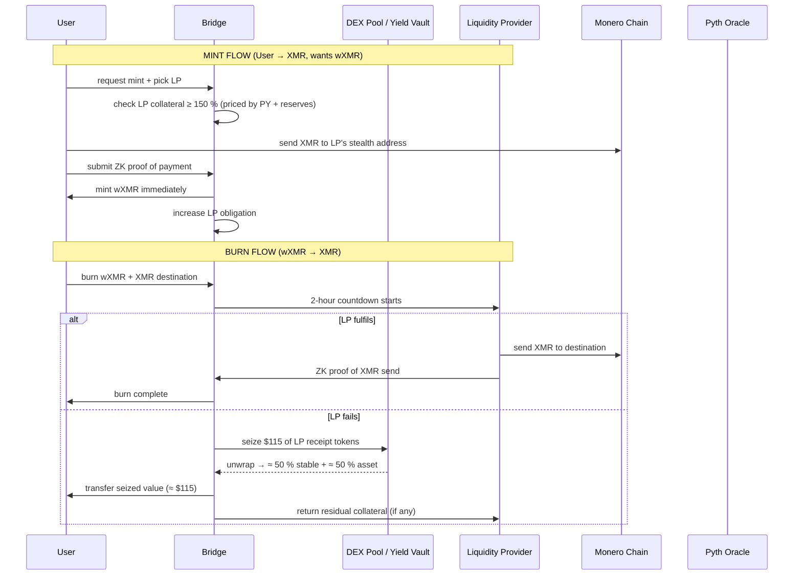

# wXMR Synthwrap Model  
*A Monero ↔ Solana bridge that lets liquidity providers back wrapped-XMR with **any** yield-bearing receipt token while continuing to farm their usual DeFi yields.*

---

## 1.  Core Idea
- Users mint **wXMR** on Solana by sending **real XMR** to an LP’s Monero address and proving it with a **ZK-proof**.  
- To guarantee redemption, LPs **stake receipt tokens** (LP shares, LSTs, yield-bearing stables) instead of idle coins.  
- If an LP ghosts a redemption, the bridge **seizes those receipts**, unwraps them, and pays the burner **115 % of par value**.  
- Capital **never stops earning** swap fees, staking yield, or protocol incentives.

---

## 2.  Participant Roles

### Liquidity Providers (LPs)
- Post **Monero addresses** on-chain.  
- Stake **approved receipt tokens** (jitoSOL, mSOL, yhyUSD, wxMR-hyUSD-LP, etc.).  
- Earn **mint fees** + **existing DeFi yields** while collateral is locked.  
- Must fulfill **wXMR → XMR** redemptions within **2 h** or be slashed.

### Users
- Mint: send XMR → receive wXMR.  
- Burn: return wXMR → demand real XMR.  
- Always **made whole** at **115 % USD value** if LP fails.

### Bridge Program
- **Whitelist** receipt tokens, set risk params.  
- **Prices** collateral with **Pyth + on-chain reserves**.  
- **Seizes & unwraps** receipts on failure.  
- **Re-balances** under-water positions via **cross-LP liquidations**.

---

## 3.  Collateral Types (all yield-bearing)

| Receipt Token | Underlying Yield | Price Feed | Adapter Source |
|---------------|------------------|------------|----------------|
| jitoSOL | MEV + staking | Pyth SOL + jito reserve ratio | Jito stake-pool program |
| mSOL | Marinade staking | Pyth SOL + mSOL reserve | Marinade program |
| yhyUSD | Hylo lending | 1.00 USD + NAV accumulator | Hylo vault program |
| wxMR-hyUSD-LP | Swap fees | Pyth XMR + hyUSD + pool reserves | Pool program account |

---

## 4.  Mint Flow (User → XMR, wants wXMR)
1. User selects **cheapest LP** (fee + slippage) with **≥ 150 % collateral**.  
2. User sends **XMR** to LP’s **stealth address**.  
3. User submits **ZK proof** of payment.  
4. Bridge **mints wXMR** immediately.  
5. LP obligation ↑; collateral remains **farming**.

---

## 5.  Burn Flow (wXMR → XMR)
1. User **burns wXMR** + supplies **XMR destination**.  
2. **2-hour countdown** starts.  
3. **Success**: LP sends XMR + ZK proof → obligation cleared.  
4. **Failure**: bridge **seizes \$115** of LP’s receipt tokens, **unwraps**, and pays:  
   - **≈ 50 % underlying stable** + **≈ 50 % underlying asset** (or liquid equivalent).  
5. **Residual collateral** returned to LP; **no wXMR refund** (already burned).

---

## 6.  Liquidation & Rebalancing
- **Anyone** can call `liquidate_lp()` when **collateral < 115 %**.  
- **Under-water obligations** are **absorbed** by liquidating LPs at a **5 % discount**.  
- **Total wXMR supply** can **never exceed** **115 % backed USD value**.

---

## 7.  Risk Parameters (governance-set)
| Parameter | Typical Value |
|-----------|---------------|
| **Collateral factor** | 95 % |
| **Liquidation threshold** | 115 % |
| **Mint fee** | 0.1 % (paid to LP) |
| **TWAP window** | 1 hour |
| **Pool cap** | ≤ 30 % of total supply |

---

## 8.  Oracle & Adapter Stack
- **Pyth** → **underlying asset prices** (SOL, XMR, USD).  
- **On-chain reserve reader** → **exchange-rate or reserve amounts**.  
- **TWAP** (1 h) on **pool reserves** to **block flash-loan noise**.  
- **One adapter per receipt program**; **upgradeable** by governance.

---

## 9.  Governance Lifecycle
1. **Temperature check** (Snapshot) – **7 days**.  
2. **Risk review** – **audit + oracle spec + caps**.  
3. **On-chain vote** (SPL-Gov) – **3 day vote + 2 day timelock**.  
4. **Deploy adapter** → **whitelist mint** → **go live**.  
5. **Quarterly review** – **delist or adjust caps** if **APY < 1 % or de-peg > 2 %**.

---

## 10.  Why LPs Love It
- **Same capital**, **three incomes**:  
  1. **Protocol yield** (staking, lending, swap fees)  
  2. **Bridge mint fee** (0.1 %)  
  3. **Potential liquidation bonus** (5 %)  
- **No extra leverage**, **no idle coins**, **no separate borrow market**.  
- **Exit any time** – just **unstake receipts** once **obligations = zero**.

---

## 11.  Result
Every **major Solana yield venue** becomes a **source of wxMR liquidity** without **locking a single SOL** in a dedicated vault. The bridge **outsources collateral** to **existing DeFi receipts**, **prices them on-chain**, and **guarantees** users **115 % payout** even if every LP disappears.

---

## 12.  Flow Diagram

