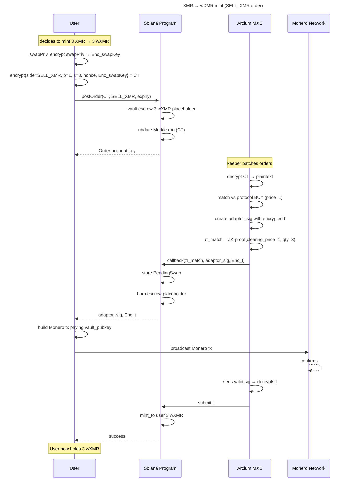
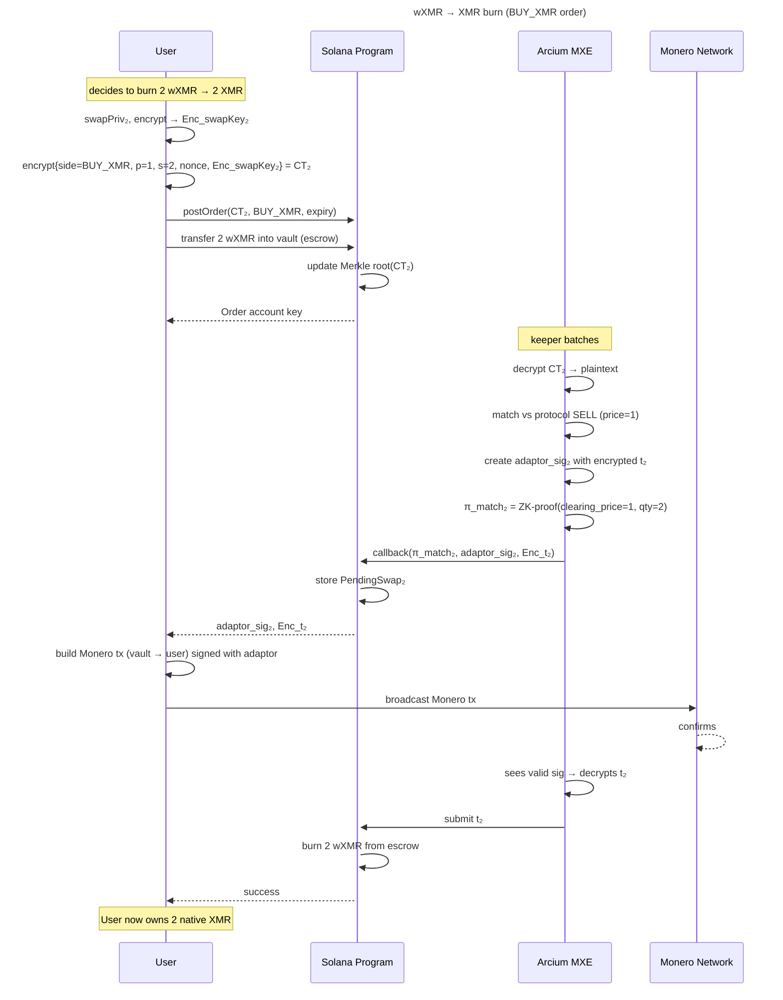

```markdown
# Encrypted-State Order-Book Bridge  
**Monero ⇄ Solana wrapped-XMR (wxMR) via Arcium MXE**

Version 1.0  
Date: 2025-10-31

---

## 0.  Glossary

| Term | Meaning |
|------|---------|
| MXE | Arcium Mainnet eXtended Engine – decentralized MPC cluster |
| wxMR | SPL token minted 1:1 against locked XMR |
| adaptor_sig | ECDSA adaptor signature embedding encrypted scalar `t` |
| CT | Ciphertext produced with MXE public key |
| π_match | Zero-knowledge proof that matching logic ran correctly |

---

## 1.  Goal

- Provide a **central-limit-order-book** (CLOB) style facility on Solana  
- Allow **any user** to mint wxMR (XMR → wxMR) or burn wxMR (wxMR → XMR)  
- Preserve **full privacy** (amounts, prices, addresses hidden)  
- Guarantee **atomicity** without custodians, multisigs, or HTLC scripts on Monero

---

## 2.  System Overview

```
┌------------------┐        encrypted order         ┌------------------┐
│  Monero Network  │<------ adaptor_sig + t --------->│   Arcium MXE     │
└------------------┘                                └---------┬--------┘
       ▲                                                     │
       │        Merkle root, π_match, escrow               │ CPI
       └---------------------┬------------------------------┘
                             ▼
                    ┌------------------┐
                    │ Solana Program   │
                    │   OrderBook      │
                    │   Vault (wxMR)   │
                    └------------------┘
```

---

## 3.  Data Models

### 3.1  `Order` account (on-chain)

| Field | Size | Type | Note |
|-------|------|------|------|
| `owner` | 32 | Pubkey | Solana user |
| `ct` | 256 | [u8; 256] | ciphertext of (side, p, s, nonce, Enc_swapKey) |
| `side` | 1 | u8 | 0 = BUY_XMR, 1 = SELL_XMR |
| `expiry_slot` | 8 | u64 | last valid slot |
| `is_live` | 1 | bool | cancelled/matched = false |

### 3.2  `OrderBook` account

| Field | Size | Type | Note |
|-------|------|------|------|
| `merkle_root` | 32 | [u8; 32] | root of live orders |
| `seq_num` | 8 | u64 | monotonic counter |
| `vault_mint` | 32 | Pubkey | wxMR mint |

### 3.3  `PendingSwap` account (created after match)

| Field | Size | Type | Note |
|-------|------|------|------|
| `owner` | 32 | Pubkey | who must finalise |
| `adaptor_sig` | 130 | [u8; 130] | ECDSA adaptor signature |
| `enc_t` | 32 | [u8; 32] | encrypted scalar |
| `monero_tx_hash` | 32 | [u8; 32] | expected tx id |
| `quantity` | 8 | u64 | atomic units |

---

## 4.  User Procedures

### 4.1  Mint wxMR (XMR → wxMR)

1. Generate `swapPriv`, compute `swapPub = swapPriv·G`  
2. Encrypt `(side=SELL_XMR, p=1, s, nonce, Enc_swapKey)` with MXE public key → CT  
3. Sign `SHA256(CT)` with Solana key  
4. Call `post_order(CT, side=1, expiry)`  
5. Keeper matches → `π_match` posted on-chain  
6. Receive `adaptor_sig` and `enc_t`  
7. Build Monero tx paying protocol vault address, attach adaptor_sig  
8. Broadcast to Monero network  
9. MXE sees valid sig → decrypts `t` → submits to Solana  
10. Program mints wxMR 1:1 to user, burns placeholder escrow  

### 4.2  Burn wxMR (wxMR → XMR)

Same flow with `side=BUY_XMR` and user escrow **wxMR** instead of XMR.  
After step 9 the program **burns** wxMR and the adaptor_sig lets user claim native XMR.

---

## 5.  Protocol Constants

| Name | Value |
|------|-------|
| `DECRYPTION_TIMEOUT` | 200 Solana slots ≈ 80 s |
| `MIN_QUANTITY` | 0.01 XMR |
| `FEE_BPS` | 8 bps (0.08 %) paid in wxMR to keeper pool |
| `MXE_PK` | hard-coded at deployment |

---

## 6.  Keeper Incentives & Slashing

- Must stake ≥ 1000 wxMR  
- Slashed 10 % if `π_match` fails verifier  
- Rewarded pro-rata from `FEE_BPS` pool each epoch

---

## 7.  Security Properties

| Property | Mechanism |
|----------|-----------|
| **Atomicity** | Adaptor signature: `t` released only when Monero tx valid |
| **Privacy** | CT hides price/size; MPC hides internal state |
| **No Custodian** | Protocol vault mint authority held by MXE secret-share |
| **DoS Resistance** | Order posting requires small escrow (0.005 XMR) returned on cancel |
| **Front-running** | Impossible: plaintext unknown until after settlement |

---

## 8.  Mermaid Sequence Diagrams

### 8.1  XMR → wxMR mint



### 8.2  wxMR → XMR burn



---

## 9.  Deployment Checklist

- [ ] Upload MXE bytecode (`verify_adaptor`, `verify_key_image`, `decrypt_scalar`)  
- [ ] Initialise `MarketVault` mint authority = MXE_PDA  
- [ ] Set `MIN_QUANTITY`, `FEE_BPS`, `DECRYPTION_TIMEOUT`  
- [ ] Seed keeper staking pool with initial wxMR  
- [ ] Publish MXE_PK and program-id to registry  
- [ ] Open-source client SDK (`@wxmr/sdk`)  
- [ ] Audit MPC circuits + Solana program (SR Labs / OtterSec)  

---

## 10.  Future Work

- Batched matches (Ring-RTC) for lower gas  
- Cross-chain dark-POOL for BTC, ZEC  
- Limit-order hooks (stop-loss, iceberg) inside encrypted state  
- Governance module to upgrade fees/constants without hard-fork

--------------------------------------------------------
End of Specification
```
